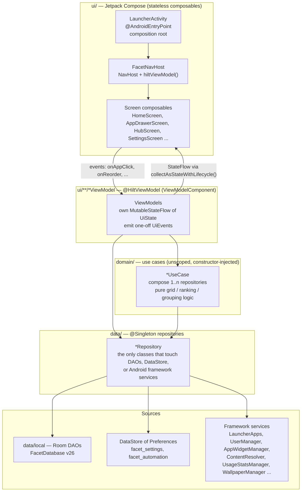
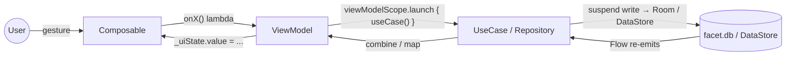
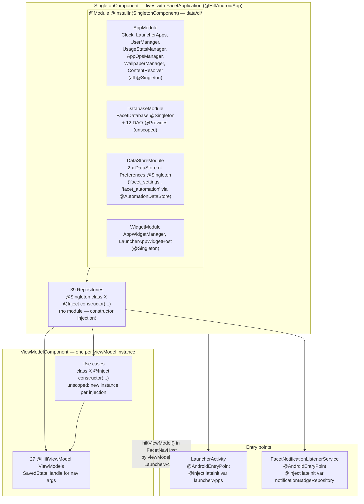

# 01 — High-Level Architecture & Layer Boundaries

Facet is a strictly layered MVVM app. The dependency direction is one-way, top to bottom;
state flows back up as `Flow`/`StateFlow`, never as callbacks or shared mutable objects.

## 1. The layers

### What each layer is allowed to know

| Layer | May depend on | Must not depend on | Verified example |
|---|---|---|---|
| Composables (`ui/**/*Screen.kt`, `ui/components`) | its `UiState`, event lambdas, `data/model` value types, `ui/theme` tokens | Repositories, DAOs, use cases | `HomeScreen(uiState: HomeUiState, onAppClick: ..., ...)` |
| ViewModels | Use cases, Repositories | DAOs, `DataStore`, framework services | `HomeViewModel(ObserveHomeScreenStateUseCase, SettingsRepository, FacetRepository, ...)` |
| Use cases (`domain/`) | Repositories, other use cases, `data/model`, entities as value types | Android framework APIs (see finding F4) | `AddAppToDockUseCase(SettingsRepository, FacetRepository, DockAppRepository, FacetDockAppRepository)` |
| Repositories (`data/`) | DAOs, `DataStore`, framework services, **other repositories** (see F5) | ViewModels, composables | `DockAppRepository(DockAppDao, DockFolderPlacementDao, FolderRepository, AppRepository)` |
| DAOs / entities (`data/local`) | Room, `data/model` enums via `Converters` | anything above | `FavoriteAppDao.observeForFacet(facetId): Flow<List<FavoriteAppEntity>>` |

Boundary check results (grep over `app/src/main`):

- **0** ViewModels import a DAO. ✅
- **0** composables inject or call a Repository. ✅ (Two reference the constant `DockAppRepository.MAX_APPS` — see F3.)
- **1** composable instantiates a use case directly (`AppDrawerScreen` → `remember { RankBySearchRelevanceUseCase() }`) — see F2.
- **4** `domain/` files import `android.*` — see F4.

## 2. Unidirectional data flow, concretely

Concrete conventions the code actually follows:

- **State is a single immutable `data class`** per screen (`HomeUiState`, `HubUiState`,
  `SettingsUiState`, `BackupRestoreUiState`, ...), exposed as `StateFlow<XUiState>` from a private
  `MutableStateFlow`. Most ViewModels build it with
  `combine(...).onEach { _uiState.value = it }.launchIn(viewModelScope)` (e.g. `HomeViewModel`,
  `LauncherViewModel`) rather than `stateIn(WhileSubscribed)` — the upstream flows stay collected for
  the ViewModel's whole lifetime (see F7).
- **Writes are fire-and-forget suspend calls** launched in `viewModelScope`; the UI never awaits
  them — it sees the result when Room/DataStore re-emits.
- **One-off events** use `MutableSharedFlow(extraBufferCapacity = 1)` (e.g.
  `LauncherViewModel.homePressedEvent`, threaded to Home via `CompositionLocal LocalHomePressedEvent`;
  sheets and dialogs subscribe through `DismissOnHomePress` — see `12 §4`).
- **Threading**: Room and DataStore are main-safe; every blocking framework call is wrapped in
  `withContext(Dispatchers.IO)` (ContentResolver queries, file I/O) or `Dispatchers.Default`
  (`LauncherApps.getActivityList` + parallel icon decode via `async`/`awaitAll`).

## 3. Hilt: components, scopes, and modules

### Scope table

| What | Scope | How it's bound | Why it matters |
|---|---|---|---|
| Framework services (`LauncherApps`, `UserManager`, `AppWidgetManager`, ...) | `@Singleton` | `@Provides` in `AppModule` / `WidgetModule`, `?: error(...)` if the service is missing | Repositories get real system services injected, so tests swap them with fakes/Robolectric. |
| `java.time.Clock` | `@Singleton` | `AppModule.provideClock()` | Time-dependent logic (`NextAlarmRepository`) is testable with a fixed clock. |
| `FacetDatabase` | `@Singleton` | `DatabaseModule` — `Room.databaseBuilder(..., "facet.db").addMigrations(*Migrations.ALL).fallbackToDestructiveMigrationOnDowngrade(true)` | One DB instance; **no** destructive fallback on upgrade (a missing migration crashes loudly by design). |
| DAOs (12) | unscoped | `@Provides fun provideXDao(db) = db.xDao()` | Room caches DAO instances internally, so unscoped is free. |
| `DataStore<Preferences>` (2) | `@Singleton` | `DataStoreModule` via `preferencesDataStore(name = "facet_settings")` (unqualified) and `preferencesDataStore(name = "facet_automation")` (`@AutomationDataStore`) delegates | DataStore requires exactly one instance per file. Automation state lives in its own file so it stays out of `LauncherSettings` re-emissions and backups. |
| Repositories (39) | `@Singleton` | Constructor injection, no module | They hold `callbackFlow` registrations and in-memory state (`NotificationBadgeRepository.badgeCounts`); a single instance is required for that state to be shared. |
| Use cases | unscoped | Constructor injection | Stateless by convention; `ObserveHomeScreenStateUseCase` is the one exception (holds a `refreshTrigger` `MutableSharedFlow`) — see F8. |
| ViewModels (27) | `ViewModelComponent` | `@HiltViewModel`, resolved by `hiltViewModel()` per `NavHost` destination or `by viewModels()` in the Activity | Nav-arg-driven screens (`FacetSettingsViewModel`, `FolderDetailViewModel`, ...) read ids from `SavedStateHandle`. |

There are **no interface-to-implementation `@Binds` modules**: every repository is a concrete
`@Singleton class`, and tests substitute them with hand-written DAO fakes (`FolderTestFakes.kt`)
or Mockito 5 mocks of the concrete repository (inline mock maker, so `final` Kotlin classes mock
fine) rather than via Hilt test modules — see [06-testing.md](06-testing.md).

## 4. Composition root and app lifetime

`LauncherActivity.onCreate` → `setContent` renders exactly one of three top-level branches from
`LauncherViewModel.uiState`:

1. `isLoading` → an empty `Box` (wallpaper shows through; avoids a default-themed first frame).
2. `!onboardingCompleted` → `OnboardingScreen`, outside the nav graph.
3. otherwise → `FacetNavHost(apps, onAppClick, launcherViewModel)`.

`LauncherViewModel` is the app-lifetime orchestrator. Its `init` block:

- collects `combine(GetInstalledAppsUseCase.observe(), SettingsRepository.settings, WorkProfileRepository.observeWorkProfiles())` into `LauncherUiState` (theme, font, icon mode, onboarding flag, live app list, work profiles);
- runs `EnsureActiveFacetUseCase` once;
- keeps `CleanUpUninstalledAppsUseCase` collecting for the process lifetime (deletes placement rows on real uninstall broadcasts);
- runs `RepairOrphanedProfileRowsUseCase` once (backfills `userId = -1` rows left by pre-profile schemas);
- runs `SeedDefaultDockUseCase` on fresh installs.

`FacetNavHost` owns 22 string-route destinations (`FacetDestinations`); `Home ⇄ Drawer` is *not* a
nav transition — `HomeDrawerRoute` handles it as a follow-finger gesture inside the `HOME`
destination, while `Hub`/`Facets`/settings screens are ordinary destinations.
