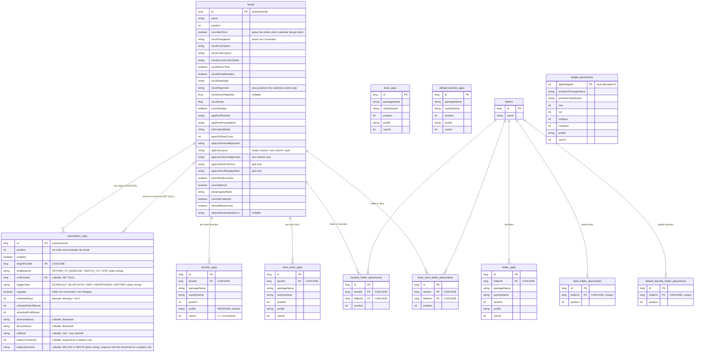
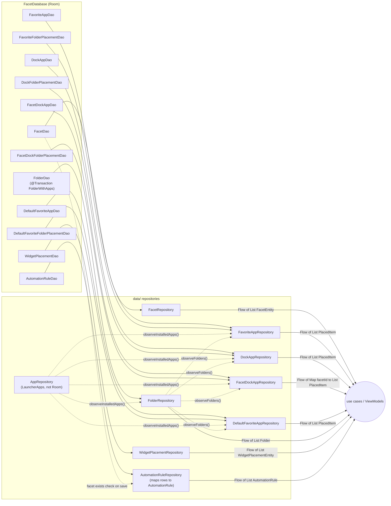

# 02 — Database & Persistence Architecture

## 0. Storage map — everything Facet persists, and where

| Store | Location | What it holds | Written by | Survives |
|---|---|---|---|---|
| Room `FacetDatabase` | `facet.db` (schema **v26**, `exportSchema = true` → `app/schemas/.../1.json … 26.json`) | Facets + every *placement*: favorites, dock, folders, folder membership, widget grid positions, plus the facet automation rules (`automation_rules`) | 7 repositories (§2) | Reinstall-over-upgrade (migrations); **not** downgrade (dropped) |
| `DataStore<Preferences>` | `facet_settings` (`datastore/facet_settings.preferences_pb`) | **All launcher-wide settings and defaults** — clock/app-list/dock design defaults (the calendar events strip has no design defaults of its own — see below), theme, drawer, search, permission-prompt flags, onboarding/seed/coach-mark flags, active facet id — 47 keys (§5) | `SettingsRepository` only | Any upgrade (missing keys fall back to `LauncherSettings()` defaults) |
| `DataStore<Preferences>` | `facet_entitlement` (`datastore/facet_entitlement.preferences_pb`) | The cached Pro state (`pro_purchased`), so Pro works offline and at cold start; debug builds also keep `debug_entitlement_mode` here | `PlayEntitlementRepository`, only from an explicit Google Play answer | Same as `facet_settings`; **not** in the backup file, so a restore can never grant Pro |
| `DataStore<Preferences>` | `facet_automation` (`datastore/facet_automation.preferences_pb`) | Facet-automation bookkeeping: the baseline facet, the ordered active rule ids, the suppressed rule ids (§5.7) | `AutomationStateRepository` (via `ActivateFacetByIdUseCase`) | Same as `facet_settings`; **not** in the backup file |
| System `AppWidgetService` | Android framework, keyed by `HUB_APP_WIDGET_HOST_ID = 1024` | Which `appWidgetId`s are bound to which providers for this host | `LauncherAppWidgetHost` via `AppWidgetRepository` (allocate/bind/delete) | App data clear **does not** clear it → orphan detection in `ObserveHubStateUseCase` |
| Backup file | User-picked SAF `Uri` (`CreateDocument`/`OpenDocument`), JSON via `kotlinx-serialization` | `BackupBundle` v3: settings + facets + placements + folders + widget placements (raw rows, unhydrated) | `BackupRepository` (`ExportBackupUseCase` / `ImportBackupUseCase`) | Whatever the user does with the file — Facet keeps no copy |
| In-memory only | `NotificationBadgeRepository.badgeCounts` (`MutableStateFlow`) | Per-package non-silent notification counts | `FacetNotificationListenerService` | Process lifetime only |

Nothing else is persisted: no `SharedPreferences`, no files in `filesDir`/`cacheDir`, no network.

**Global defaults vs per-facet overrides.** The clock, app-list and dock *defaults* the
user sets in Settings are DataStore keys (`clock_template_id`, `clock_alignment`,
`list_content_mode`, `dock_display_mode`, …). The `facets` table carries the same fields again
as *overrides*, each block gated by a flag (`overrideClock`, `overrideApps`, `overrideDock`,
`overrideCalendar`, `overridingFavorites`); `FacetEntity.resolveOverride(...)` picks the facet
value when its flag is set and the DataStore value otherwise. The ER diagram in §1 is Room only —
the defaults are in §5. The calendar events strip is the one exception to this pattern — it has no
design fields of its own anywhere (Room or DataStore); it reads the global-only
`home_apps_font_weight`/`app_label_color_option` (§5.4 "Home app list") and `launcher_font_option`
(§5.4 "Theme & appearance") keys for font/weight/color, and `clockAlignment` (Room,
facet-overridable) for its position — see chat history: calendar/appearance styling consolidation.

What is **not** persisted: the installed-app list. Room rows reference apps only by
`(packageName, activityName, userId)`; labels, icons and `UserHandle`s are re-resolved live from
`LauncherApps` on every emission (see [03](03-reactive-data-flow.md)).

## 1. Entity-Relationship diagram



### Reading the diagram

- **Two scopes for every placement.** Each of dock and favorites exists twice: a *global default*
  (`dock_apps`, `default_favorite_apps`, `dock_folder_placements`, `default_favorite_folder_placements`)
  and a *per-facet override* (`facet_dock_apps`, `favorite_apps`, `facet_dock_folder_placements`,
  `favorite_folder_placements`). Which one is live for a facet is decided by its `overrideDock` /
  `overridingFavorites` flags via `FacetEntity.resolveOverride(...)`; the use cases
  `Add/RemoveAppTo/FromDock|Favorites` and `Add/RemoveFolder…` route the write to the right table.
- **Apps and folders share a position axis.** `PlacedItem` (`SingleApp` | `FolderItem`) is the
  in-memory union; app rows and folder-placement rows in the same scope are merged and sorted by
  `position` at read time (no cross-table constraint enforces uniqueness of `position`).
- **Uniqueness indices** (all `unique = true`):
  `(packageName, activityName, userId)` on global tables, `(facetId, packageName, activityName, userId)`
  on per-facet tables, `(folderId, packageName, activityName, userId)` on `folder_apps`,
  `(facetId, folderId)` / `(folderId)` on folder placements. `userId` is part of every key so the
  same component can be placed once per profile (personal + work).
- **Profile identity.** `profile` (`AppProfile`: `PERSONAL | WORK | PRIVATE | OTHER`) is a display
  classification; `userId` (`UserHandle.hashCode()`) is the identity. `-1` marks rows written before
  v20 that `RepairOrphanedProfileRowsUseCase` backfills once at startup (`getOrphaned()` DAO queries).
- **Cascades.** Deleting a facet or folder removes all its placement rows in SQLite; the
  repositories never have to clean up children manually.

## 2. DAO → Repository → Flow mapping



### The DAO contract

Every DAO follows the same shape, which is what makes the reactive layer uniform:

| Kind | Signature pattern | Room behaviour |
|---|---|---|
| Observe | `fun observeAll(): Flow<List<Entity>>` / `observeForFacet(facetId)` — always `ORDER BY position ASC` | Cold `Flow`; re-emits after any write to the queried table(s). Main-safe. |
| Write | `suspend fun upsert(entity): Long` with `OnConflictStrategy.REPLACE`; `suspend fun delete…` | Runs on Room's own I/O executor; the caller just `suspend`s. |
| Scoped delete | `deleteByComponent(pkg, activity, userId)`, `deleteByPackage(pkg, userId)`, `deleteByUserId(userId)`, `deleteAllForFacet(facetId)` | Used by `CleanUpUninstalledAppsUseCase` (uninstall), profile-removal handling, facet deletion, and backup restore. |
| Repair | `suspend fun getOrphaned(): List<Entity>` (`WHERE userId = -1`) | One-shot; only `RepairOrphanedProfileRowsUseCase` calls it. |
| Raw export | (repository) `getRawXxx() = dao.observeAll().first()` | Backup export reads *unhydrated* rows so an app that is currently uninstalled still gets backed up. |

### DAO method matrix (every method, every DAO)

| DAO | Observe | Write | Delete | Read one-shot |
|---|---|---|---|---|
| `FacetDao` | `observeAll()` | `insert(facet): Long` (plain `@Insert`, **no** REPLACE — ids are never reused), `update(facet)` | `delete(facet)`, `deleteAll()` | `getById(id)` |
| `FavoriteAppDao` | `observeForFacet(facetId)` | `upsert(entity): Long` (REPLACE) | `delete(entity)`, `deleteByComponent(facetId, pkg, activity, userId)`, `deleteByPackage(pkg, userId)`, `deleteByUserId(userId)`, `deleteAllForFacet(facetId)` | `getOrphaned()` (`userId = -1`) |
| `FacetDockAppDao` | `observeForFacet(facetId)` | `upsert` | same five as `FavoriteAppDao` | `getOrphaned()` |
| `DockAppDao` | `observeAll()` | `upsert` | `delete`, `deleteByComponent(pkg, activity, userId)`, `deleteByPackage`, `deleteByUserId`, `deleteAll()` | `getOrphaned()` |
| `DefaultFavoriteAppDao` | `observeAll()` | `upsert` | same five as `DockAppDao` | `getOrphaned()` |
| `FavoriteFolderPlacementDao` | `observeForFacet(facetId)` | `upsert` | `deleteByFolderId(facetId, folderId)`, `deleteAllForFacet(facetId)`, `deleteAll()` | — |
| `FacetDockFolderPlacementDao` | `observeForFacet(facetId)` | `upsert` | same three | — |
| `DockFolderPlacementDao` | `observeAll()` | `upsert` | `deleteByFolderId(folderId)`, `deleteAll()` | — |
| `DefaultFavoriteFolderPlacementDao` | `observeAll()` | `upsert` | `deleteByFolderId(folderId)`, `deleteAll()` | — |
| `FolderDao` | `observeAllWithApps()` (`@Transaction`, `FolderWithApps`) | `insertFolder(folder): Long`, `renameFolder(id, name)`, `upsertFolderApp(app): Long` | `deleteFolder(id)`, `deleteAllFolders()`, `deleteFolderApp(folderId, pkg, activity, userId)`, `deleteFolderAppsByPackage(pkg, userId)`, `deleteFolderAppsByUserId(userId)` | `getOrphanedFolderApps()` |
| `AutomationRuleDao` | `observeAll()` (`ORDER BY position ASC, id ASC`) | `insert(rule): Long`, `update(rule)`, `setEnabled(id, enabled)` | `deleteById(id)` | `getById(id)`, `maxPosition()` (`-1` when empty) |
| `WidgetPlacementDao` | `observeAll()` (no ORDER BY — grid position is `row`/`col`, not `position`) | `upsert(placement)` (REPLACE on `appWidgetId`) | `deleteById(appWidgetId)`, `delete(placement)` | `getById(appWidgetId)` |

Exceptions to the common shape, all deliberate:

- **`FacetDao.insert` is not an upsert.** Facet ids are referenced by `activeFacetId` in DataStore and by every per-facet placement FK; `restoreFacet` in backup import explicitly copies with `id = 0` to force a fresh id.
- **`FacetDao` has no `deleteByUserId`/`getOrphaned`** — facets are not profile-scoped.
- **Folder placement DAOs have no `getOrphaned`** — they reference folders by id, not apps by component; profile repair happens on `folder_apps` instead.
- **`WidgetPlacementDao` has no profile-scoped deletes.** A removed Work Profile's widgets are handled by `ObserveHubStateUseCase` flagging them `isOrphaned` (provider info gone) rather than a DAO sweep.
- **`AutomationRuleDao` rows are addressed by `id` all the way up.** Rule ids are public: `AutomationState` stores them (`activeRuleIds`, `suppressedRuleIds`) and the evaluator matches on them. `AutomationRuleRepository` also skips rows it can't interpret (unknown `triggerType`, or a missing required parameter) instead of failing the whole list.
- **Every `delete*` for a placement is by component/user, never by row `id`** except `@Delete(entity)` — repositories always resolve the row from an `AppInfo`, so `id` never leaks above `data/`.

`FolderDao` is the one relational DAO: `observeAllWithApps()` is a `@Transaction` query returning
`FolderWithApps(@Embedded folder, @Relation apps)`.

### Room → Flow → UI, step by step

1. A ViewModel launches a write, e.g. `viewModelScope.launch { addAppToDock(app) }`.
2. The use case reads `settings.first()` + `facetRepository.getById(...)` to pick the table, then
   calls `dockAppRepository.addDockApp(app, position)` → `dockAppDao.upsert(DockAppEntity(...))`.
3. Room commits and invalidates the `dock_apps` table tracker.
4. Every live `dockAppDao.observeAll()` collector re-queries and emits the new `List<DockAppEntity>`.
5. `DockAppRepository.observeDockItems()` is a `combine(dao.observeAll(), folderPlacementDao.observeAll(), folderRepository.observeFolders(), appRepository.observeInstalledApps())`; the new entity list is joined against the *latest cached* installed-app list (no `LauncherApps` re-query happens on a Room write) and sorted into `List<PlacedItem>`.
6. `ObserveHomeScreenStateUseCase` combines that with settings/facets/calendar/badges → `HomeScreenState`.
7. `HomeViewModel` maps it into `HomeUiState` and sets `_uiState.value`.
8. `HomeScreen` recomposes from `collectAsStateWithLifecycle()`.

## 3. Type converters

`Converters` maps every enum column on `FacetEntity` (and `profile` on placement rows) to its
`name` string. Each `to*` converter is **lenient**: an unknown stored string falls back to the
enum's default (`ListContentMode.FAVORITES`, `ClockTemplateId.LIGHT_STACK`, `AppProfile.PERSONAL`, …)
instead of returning `null`, because Room's generated code for a `NOT NULL` column crashes on a
null converter result. Renaming an enum constant therefore never needs a migration.

## 4. Migration policy (as configured)

```kotlin
Room.databaseBuilder(context, FacetDatabase::class.java, "facet.db")
    .addMigrations(*Migrations.ALL)                       // 10→11 … 25→26, explicit SQL
    .fallbackToDestructiveMigrationOnDowngrade(dropAllTables = true)
    .build()
```

- **Upgrade without a migration = crash**, deliberately (`IllegalStateException` at open). The
  process documented in `Migrations.kt` is: bump `FacetDatabase.VERSION` → add
  `MIGRATION_<old>_<new>` to `ALL` → add a `FacetDatabaseMigrationTest` case
  (`app/src/androidTest/.../data/local/FacetDatabaseMigrationTest.kt`, built on `MigrationTestHelper`).
- **Downgrade** drops all tables (dev-only scenario).
- Versions 1–9 have exported schemas but no shipped migrations — they predate any production install.

| Step | Change |
|---|---|
| 10→11 | `profiles.selectedCalendarIdsCsv` |
| 11→12 | `profiles.calendarFontWeight` |
| 12→13 | `profiles.appListVerticalAlignment` |
| 13→14 | `profiles.clockAlignment`, `calendarAlignment`, `clockZoneHeightDp` |
| 14→15 | `profiles.clockAccentColorOption`, `clockDateStyle`, `clockScale` |
| 15→16 | `profiles.overrideDock`, `dockDisplayMode`; new `profile_dock_apps` table |
| 16→17 | **Rename** `profiles` → `facets`; rebuild `favorite_apps` / `profile_dock_apps` → `facet_dock_apps` with `facetId` FKs (copy-table pattern) |
| 17→18 | Folders: `folders`, `folder_apps` + the four `*_folder_placements` tables |
| 18→19 | `profile` column on all six app/widget tables |
| 19→20 | `userId` column on the same six tables (backfilled from personal user), unique indices rebuilt to include it |
| 20→21 | `facets.clockWidgetAppWidgetId` (PRD F15) |
| 21→22 | `facets.clockWidgetWidthDp`, `clockWidgetHeightDp` (PRD F15) |
| 22→23 | Recreate `facets` (create-copy-drop-rename, same pattern as 16→17) dropping `calendarFontOption`, `calendarColorOption`, `calendarFontWeight`, `calendarAlignment` — calendar/appearance styling consolidation |
| 23→24 | No column change (`LAUNCHER_DEFAULT` is just a new valid string for the already-`TEXT NOT NULL` `appRowPosition`/`appRowPresentation`/`appListVerticalAlignment`/`dockDisplayMode` columns) — data-only `UPDATE` resetting those four columns to `'LAUNCHER_DEFAULT'` on every facet row where the matching `overrideApps`/`overrideDock` flag is `0` (a stale, previously-unread value would otherwise start "overriding" silently); a row where the flag is `1` keeps its real value untouched |
| 24→25 | `facets.appListLayout`, `appListColumnAlignment`, `appListGridColumns`, `appListGridDisplayMode` — Home app list two-column/grid layouts; brand-new columns (`DEFAULT 'LAUNCHER_DEFAULT'`), no data-reset step needed |
| 25→26 | New table `automation_rules` (facet automation rules) with two foreign keys to `facets` (`targetFacetId` CASCADE, `endFacetId` SET NULL) and an index on each; DDL copied from the exported `26.json`, no data to carry over. Tested by `FacetDatabaseMigrationTest.migration25To26…` (schema validation plus both FK actions) |

## 5. DataStore — `facet_settings` (`SettingsRepository`)

The second store. One `DataStore<Preferences>`, provided by `DataStoreModule`
(`preferencesDataStore(name = "facet_settings")` → `files/datastore/facet_settings.preferences_pb`),
read and written **only** by `SettingsRepository`. It is a flat key–value file: no schema version,
no migrations — evolution is "add a key with a default", and removed keys are simply ignored.

### 5.1 Key diagram — every key, and what it overrides in `facets`

The diagram uses ER notation so it reads alongside §1. `facet_settings` is one logical record
(there is exactly one); each dotted "overridden by" edge means the `facets` column of the same
name replaces the global value whenever the named gate flag on that facet is `true`
(`FacetEntity.resolveOverride`).

```mermaid
erDiagram
    facet_settings {
        string clock_template_id "ClockTemplateId, default LIGHT_STACK"
        string clock_font_option "ClockFontOption, default LAUNCHER_DEFAULT"
        string clock_color_option "ClockColorOption, default THEME"
        string clock_accent_color_option "ClockColorOption, default ACCENT_PRIMARY"
        boolean use_24_hour_time "default false"
        boolean clock_show_meridiem "default false"
        string clock_date_style "ClockDateStyle, default FULL"
        string clock_alignment "ClockAlignment, default LEFT; also positions the calendar events strip"
        float clock_zone_height_dp "nullable, absent = template height"
        float clock_scale "default 0.8"
        boolean show_all_day_events "default true"
        stringset selected_calendar_ids "nullable, absent = all calendars"
        stringset calendar_colors "entries calendarId:colorName"
        string list_content_mode "ListContentMode, default FAVORITES"
        int apps_to_show_count "default AppListLimits.DEFAULT_APPS_TO_SHOW"
        string app_row_position "AppRowPosition, default LEFT"
        string app_row_presentation "AppRowPresentation, default ICON_AND_TEXT"
        string app_list_vertical_alignment "AppListVerticalAlignment, default BOTTOM"
        string home_apps_font_weight "FontWeightOption, default REGULAR"
        string app_label_color_option "ClockColorOption, default THEME"
        string dock_display_mode "DockDisplayMode, default ICONS"
        long active_facet_id "default 0 = NO_ACTIVE_FACET_ID"
        string theme_mode "ThemeMode, default SYSTEM"
        string system_bar_icon_style "SystemBarIconStyle, default MATCH_THEME"
        boolean accent_from_system "default true"
        string custom_accent_swatch "AccentSwatch name, nullable"
        string wallpaper_accent_role "WallpaperAccentRole, default PRIMARY"
        string icon_render_mode "IconRenderMode, default SYSTEM_DEFAULT"
        string icon_shape "IconShape, default SQUIRCLE"
        string launcher_font_option "LauncherFontOption, default SYSTEM"
        string font_scale_option "FontScaleOption, default DEFAULT"
        string drawer_presentation "DrawerPresentation, default LIST"
        string drawer_grid_size "DrawerGridSize, default FIVE_BY_SIX"
        string drawer_list_item_size "DrawerListItemSize, default REGULAR"
        float drawer_opacity "default 0.6"
        boolean show_drawer_icons "default true"
        boolean show_drawer_labels "default true"
        string search_bar_position "SearchBarPosition, default TOP"
        string drawer_folder_display_mode "DrawerFolderDisplayMode, default DO_NOT_SHOW"
        string recently_installed_position "RecentlyInstalledPosition, default SHOW_FIRST"
        boolean search_contacts_enabled "default false"
        boolean search_settings_enabled "default false"
        boolean notification_dots_enabled "default true"
        string notification_badge_style "NotificationBadgeStyle, default DOT"
        boolean calendar_permission_requested "default false"
        boolean contacts_permission_requested "default false"
        boolean bluetooth_permission_requested "default false"
        boolean location_permission_requested "default false"
        boolean onboarding_completed "default false"
        boolean defaults_seeded "default false"
        stringset coach_marks_seen "CoachMarkIds, default empty"
    }

    facets {
        long id PK
        boolean overrideClock "gate: 10 clock design columns (also positions the calendar strip)"
        boolean overrideApps "gate: listContentMode, appsToShowCount (content only now)"
        boolean overridingFavorites "gate: favorite_apps vs default_favorite_apps"
        boolean overrideDock "gate: facet_dock_apps vs dock_apps (content only now)"
        boolean overrideCalendar "gate: showAllDayEvents, selectedCalendarIdsCsv"
    }

    facet_settings ||--o{ facets : "active_facet_id selects one"
    facet_settings }|..|| facets : "clock keys overridden when overrideClock"
    facet_settings }|..|| facets : "list content mode/count overridden when overrideApps"
    facet_settings }|..|| facets : "calendar keys overridden when overrideCalendar"
```



Keys with **no** facet counterpart (always global): `home_apps_font_weight`,
`app_label_color_option`, `launcher_font_option` (all three of which the calendar events strip
reads directly — see §0), `calendar_colors`, everything under Theme, Drawer, Search,
Notifications, Permission bookkeeping, and First-run.

**`appRowPosition`/`appRowPresentation`/`appListVerticalAlignment`/`dockDisplayMode`/`appListLayout`/
`appListColumnAlignment`/`appListGridColumns`/`appListGridDisplayMode` are a third
resolution shape**, distinct from both the boolean-gated fields above and the always-global list —
edited from Settings → Appearance now (moved out of Dock's/Home Apps List's own screens, see chat
history), each resolved via its own `LAUNCHER_DEFAULT` sentinel value (mirroring
`ClockFontOption`'s existing one) rather than a shared override flag:
`facetValue == LAUNCHER_DEFAULT ? globalValue : facetValue`
([`resolveSentinel`](../../app/src/main/kotlin/com/facetlauncher/app/data/local/FacetEntity.kt)),
independently of `overrideApps`/`overrideDock`. `LAUNCHER_DEFAULT` is filtered out of the option
list at global scope (nothing to inherit from there) and is each `FacetEntity` column's own
default value for a newly-created facet.

### 5.2 Read path

```kotlin
val settings: Flow<LauncherSettings> = dataStore.data.map { preferences ->
    val defaults = LauncherSettings()
    LauncherSettings(
        use24HourTime = preferences[Keys.USE_24_HOUR_TIME] ?: defaults.use24HourTime,
        clockTemplateId = preferences[Keys.CLOCK_TEMPLATE_ID]
            ?.let { runCatching { ClockTemplateId.valueOf(it) }.getOrNull() } ?: defaults.clockTemplateId,
        calendarColors = preferences[Keys.CALENDAR_COLORS].orEmpty()
            .mapNotNull { it.split(":", limit = 2).takeIf { p -> p.size == 2 }?.let { p -> p[0] to p[1] } }.toMap(),
        // ... one line per key, always `?: default`
    )
}
```

- One `Flow<LauncherSettings>`; every consumer (`ObserveHomeScreenStateUseCase`,
  `LauncherViewModel`, 20 ViewModels, 11 use cases) `combine`s or `.first()`s it. There is no
  per-key flow.
- Every emission is the **whole** immutable `LauncherSettings` (50 fields); DataStore emits on any
  key change, so a coach-mark write re-emits theme/clock/drawer settings too — consumers rely on
  `combine`/`distinctUntilChanged` in their own graphs to avoid recomposing.
- Defaults come from `LauncherSettings()`'s constructor defaults, which are the single source of
  truth (the table in 5.4 is transcribed from them).
- Enum keys are stored as `Enum.name` strings and parsed leniently — a renamed constant degrades to
  the default instead of crashing, mirroring Room's `Converters`.
- Nullable fields (`selectedCalendarIds`, `customAccentSwatch`, `clockZoneHeightDp`) have no
  default: an absent key **means** null, and null is meaningful ("all calendars", "no custom
  swatch", "template's natural height").

### 5.3 Write path — the complete writer API (51 functions)

Every writer is `suspend`, wraps a single `dataStore.edit { }` and touches exactly one key.
DataStore serialises writes and is main-safe; callers `viewModelScope.launch { }` them.

| Writer | Key | Op | Called from |
|---|---|---|---|
| `setClockTemplateId(ClockTemplateId)` | `clock_template_id` | set | `ClockStyleGalleryViewModel` |
| `setClockFontOption(ClockFontOption)` | `clock_font_option` | set | `ClockStyleGalleryViewModel` |
| `setClockColorOption(ClockColorOption)` | `clock_color_option` | set | `ClockStyleGalleryViewModel` |
| `setClockAccentColorOption(ClockColorOption)` | `clock_accent_color_option` | set | `ClockStyleGalleryViewModel` |
| `setUse24HourTime(Boolean)` | `use_24_hour_time` | set | `ClockStyleGalleryViewModel` |
| `setClockShowMeridiem(Boolean)` | `clock_show_meridiem` | set | `ClockStyleGalleryViewModel` |
| `setClockDateStyle(ClockDateStyle)` | `clock_date_style` | set | `ClockStyleGalleryViewModel` |
| `setClockAlignment(ClockAlignment)` | `clock_alignment` | set | `ClockStyleGalleryViewModel` |
| `setClockZoneHeight(Float)` | `clock_zone_height_dp` | set | `HomeViewModel` (zone drag handle) |
| `resetClockZoneHeight()` | `clock_zone_height_dp` | **remove** | `ClockStyleGalleryViewModel` |
| `setClockScale(Float)` | `clock_scale` | set | `HomeViewModel` (corner handle) |
| `resetClockScale()` | `clock_scale` | **remove** | `ClockStyleGalleryViewModel` |
| `setShowAllDayEvents(Boolean)` | `show_all_day_events` | set | `CalendarSettingsViewModel` |
| `setSelectedCalendarIds(Set<String>)` | `selected_calendar_ids` | set | `CalendarSettingsViewModel` |
| `setCalendarColors(Map<String,String>)` | `calendar_colors` | set (encoded `id:color`) | `CalendarSettingsViewModel` after `AssignCalendarColorsUseCase` |
| `setListContentMode(ListContentMode)` | `list_content_mode` | set | `HomeAppsListSettingsViewModel`, `OnboardingViewModel` |
| `setAppsToShowCount(Int)` | `apps_to_show_count` | set | `HomeAppsListSettingsViewModel`, `OnboardingViewModel` |
| `setAppRowPosition(AppRowPosition)` | `app_row_position` | set | `HomeAppsListSettingsViewModel` |
| `setAppRowPresentation(AppRowPresentation)` | `app_row_presentation` | set | `HomeAppsListSettingsViewModel` |
| `setAppListVerticalAlignment(AppListVerticalAlignment)` | `app_list_vertical_alignment` | set | `HomeAppsListSettingsViewModel` |
| `setHomeAppsFontWeight(FontWeightOption)` | `home_apps_font_weight` | set | `AppearanceSettingsViewModel` |
| `setAppLabelColorOption(ClockColorOption)` | `app_label_color_option` | set | `AppearanceSettingsViewModel` |
| `setDockDisplayMode(DockDisplayMode)` | `dock_display_mode` | set | `DockSettingsViewModel` |
| `setActiveFacetId(Long)` | `active_facet_id` | set | `FacetCarouselViewModel`, `ManageFacetsViewModel`, `EnsureActiveFacetUseCase`, `ImportBackupUseCase` |
| `setThemeMode(ThemeMode)` | `theme_mode` | set | `AppearanceSettingsViewModel` |
| `setSystemBarIconStyle(SystemBarIconStyle)` | `system_bar_icon_style` | set | `AppearanceSettingsViewModel`, `ImportBackupUseCase` |
| `setAccentFromSystem(Boolean)` | `accent_from_system` | set | `AppearanceSettingsViewModel` |
| `setCustomAccentSwatch(String)` | `custom_accent_swatch` | set | `AppearanceSettingsViewModel` |
| `setWallpaperAccentRole(WallpaperAccentRole)` | `wallpaper_accent_role` | set | `AppearanceSettingsViewModel` |
| `setIconRenderMode(IconRenderMode)` | `icon_render_mode` | set | `AppearanceSettingsViewModel` |
| `setIconShape(IconShape)` | `icon_shape` | set | `AppearanceSettingsViewModel`, `ImportBackupUseCase` |
| `setLauncherFontOption(LauncherFontOption)` | `launcher_font_option` | set | `AppearanceSettingsViewModel` |
| `setFontScaleOption(FontScaleOption)` | `font_scale_option` | set | `AppearanceSettingsViewModel` |
| `setDrawerPresentation(DrawerPresentation)` | `drawer_presentation` | set | `AppDrawerSettingsViewModel`, `OnboardingViewModel` |
| `setDrawerGridSize(DrawerGridSize)` | `drawer_grid_size` | set | `AppDrawerSettingsViewModel` |
| `setDrawerListItemSize(DrawerListItemSize)` | `drawer_list_item_size` | set | `AppDrawerSettingsViewModel` |
| `setDrawerOpacity(Float)` | `drawer_opacity` | set | `AppDrawerSettingsViewModel` |
| `setShowDrawerIcons(Boolean)` | `show_drawer_icons` | set | `AppDrawerSettingsViewModel` |
| `setShowDrawerLabels(Boolean)` | `show_drawer_labels` | set | `AppDrawerSettingsViewModel` |
| `setSearchBarPosition(SearchBarPosition)` | `search_bar_position` | set | `AppDrawerSettingsViewModel` |
| `setDrawerFolderDisplayMode(DrawerFolderDisplayMode)` | `drawer_folder_display_mode` | set | `AppDrawerSettingsViewModel` |
| `setRecentlyInstalledPosition(RecentlyInstalledPosition)` | `recently_installed_position` | set | `AppDrawerSettingsViewModel` |
| `setSearchContactsEnabled(Boolean)` | `search_contacts_enabled` | set | `AppDrawerSettingsViewModel`, `DrawerViewModel` (inline prompt) |
| `setSearchSettingsEnabled(Boolean)` | `search_settings_enabled` | set | `AppDrawerSettingsViewModel` |
| `setNotificationDotsEnabled(Boolean)` | `notification_dots_enabled` | set | `NotificationSettingsViewModel`, `NotificationAccessExplanationViewModel` |
| `setNotificationBadgeStyle(NotificationBadgeStyle)` | `notification_badge_style` | set | `NotificationSettingsViewModel` |
| `setCalendarPermissionRequested(Boolean)` | `calendar_permission_requested` | set | `PermissionsViewModel` |
| `setContactsPermissionRequested(Boolean)` | `contacts_permission_requested` | set | `PermissionsViewModel` |
| `setBluetoothPermissionRequested(Boolean)` | `bluetooth_permission_requested` | set | `PermissionsViewModel` |
| `setLocationPermissionRequested(Boolean)` | `location_permission_requested` | set | `PermissionsViewModel` |
| `setOnboardingCompleted(Boolean)` | `onboarding_completed` | set | `LauncherViewModel.completeOnboarding()` |
| `setDefaultsSeeded(Boolean)` | `defaults_seeded` | set | `SeedDefaultDockUseCase` |
| `markCoachMarkSeen(String)` | `coach_marks_seen` | set (union with existing) | `HomeViewModel` |

`ImportBackupUseCase.applySettings()` restores settings by calling these same setters one at a time (30 calls, plus `setActiveFacetId` after facets are re-inserted) —
there is no bulk "replace all preferences" entry point, so a restore is not atomic at the
DataStore level either.

### 5.4 Key registry by section

Same 47 keys, grouped the way Settings screens present them, with the `LauncherSettings` field
each maps to. Defaults are `LauncherSettings()`'s constructor defaults.

#### Clock design (global; overridden per facet when `facets.overrideClock`)

The calendar events strip has no design keys of its own here any more — it reads the global-only
`home_apps_font_weight`/`app_label_color_option` ("Home app list", below) and `launcher_font_option`
("Theme & appearance", below) keys for font/weight/color, and `clock_alignment` in this section for
its position (see chat history: calendar/appearance styling consolidation).

| Key | Type | `LauncherSettings` field | Default | Notes |
|---|---|---|---|---|
| `clock_template_id` | String (enum `ClockTemplateId`) | `clockTemplateId` | `LIGHT_STACK` | |
| `clock_font_option` | String (`ClockFontOption`) | `clockFontOption` | `LAUNCHER_DEFAULT` | |
| `clock_color_option` | String (`ClockColorOption`) | `clockColorOption` | `THEME` | |
| `clock_accent_color_option` | String (`ClockColorOption`) | `clockAccentColorOption` | `ACCENT_PRIMARY` | |
| `use_24_hour_time` | Boolean | `use24HourTime` | `false` | |
| `clock_show_meridiem` | Boolean | `clockShowMeridiem` | `false` | |
| `clock_date_style` | String (`ClockDateStyle`) | `clockDateStyle` | `FULL` | |
| `clock_alignment` | String (`ClockAlignment`) | `clockAlignment` | `LEFT` | also positions the calendar events strip |
| `clock_zone_height_dp` | Float | `clockZoneHeightDp` | `null` (= template's natural height) | nullable — `resetClockZoneHeight()` removes the key |
| `clock_scale` | Float | `clockScale` | `0.8` | `resetClockScale()` removes the key |

#### Calendar selection (global; overridden when `facets.overrideCalendar`)

| Key | Type | Field | Default | Notes |
|---|---|---|---|---|
| `show_all_day_events` | Boolean | `showAllDayEvents` | `true` | |
| `selected_calendar_ids` | Set<String> | `selectedCalendarIds` | `null` (= all calendars) | nullable — absent key means "every calendar" |
| `calendar_colors` | Set<String> encoded `"<calendarId>:<colorName>"` | `calendarColors: Map<String,String>` | `{}` | Assigned by `AssignCalendarColorsUseCase`; entries without a `:` are dropped on read; not facet-overridable |

#### Home app list (global; overridden when `facets.overrideApps` / `overridingFavorites`)

| Key | Type | Field | Default | Notes |
|---|---|---|---|---|
| `list_content_mode` | String (`ListContentMode`) | `listContentMode` | `FAVORITES` | `FAVORITES` / `RECENTS` / `MOST_USED` |
| `apps_to_show_count` | Int | `appsToShowCount` | `AppListLimits.DEFAULT_APPS_TO_SHOW` | |
| `app_row_position` | String (`AppRowPosition`) | `appRowPosition` | `LEFT` | |
| `app_row_presentation` | String (`AppRowPresentation`) | `appRowPresentation` | `ICON_AND_TEXT` | |
| `app_list_vertical_alignment` | String (`AppListVerticalAlignment`) | `appListVerticalAlignment` | `BOTTOM` | |
| `app_list_layout` | String (`AppListLayout`) | `appListLayout` | `SINGLE_COLUMN` | single column / two column / grid |
| `app_list_column_alignment` | String (`AppListColumnAlignment`) | `appListColumnAlignment` | `BOTH_LEFT` | two-column only |
| `app_list_grid_columns` | String (`AppListGridColumns`) | `appListGridColumns` | `FOUR` | grid only — 4/5/6 |
| `app_list_grid_display_mode` | String (`AppListGridDisplayMode`) | `appListGridDisplayMode` | `ICONS` | grid only — icons or text, never both |
| `home_apps_font_weight` | String (`FontWeightOption`) | `homeAppsFontWeight` | `REGULAR` | not facet-overridable; also styles the calendar events strip |
| `app_label_color_option` | String (`ClockColorOption`) | `appLabelColorOption` | `THEME` | not facet-overridable; also styles the calendar events strip |

#### Dock (global; overridden when `facets.overrideDock`)

| Key | Type | Field | Default |
|---|---|---|---|
| `dock_display_mode` | String (`DockDisplayMode`) | `dockDisplayMode` | `ICONS` |

#### Facets

| Key | Type | Field | Default | Notes |
|---|---|---|---|---|
| `active_facet_id` | Long | `activeFacetId` | `NO_ACTIVE_FACET_ID` (`0L`) | Reconciled against the `facets` table by `EnsureActiveFacetUseCase` at startup; backup stores it as an *index* (`activeFacetIndex`) because ids change on restore |

#### Theme & appearance

| Key | Type | Field | Default | Notes |
|---|---|---|---|---|
| `theme_mode` | String (`ThemeMode`) | `themeMode` | `SYSTEM` | |
| `system_bar_icon_style` | String (`SystemBarIconStyle`) | `systemBarIconStyle` | `MATCH_THEME` | status + 3-button nav icon color over the wallpaper; global, not facet-overridable; see 13 §2 |
| `accent_from_system` | Boolean | `accentFromSystem` | `true` | Material You / wallpaper accent when true |
| `custom_accent_swatch` | String (`AccentSwatch.name`) | `customAccentSwatch` | `null` | nullable; parsed to enum in `LauncherActivity` |
| `wallpaper_accent_role` | String (`WallpaperAccentRole`) | `wallpaperAccentRole` | `PRIMARY` | only meaningful when `accent_from_system` |
| `icon_render_mode` | String (`IconRenderMode`) | `iconRenderMode` | `SYSTEM_DEFAULT` | |
| `icon_shape` | String (`IconShape`) | `iconShape` | `SQUIRCLE` | icon outline (Squircle n=4 / Rounded n=2.6 / Circle / Square); global, not facet-overridable; backed up |
| `launcher_font_option` | String (`LauncherFontOption`) | `launcherFontOption` | `SYSTEM` | also styles the calendar events strip |
| `font_scale_option` | String (`FontScaleOption`) | `fontScaleOption` | `DEFAULT` | multiplies every `MaterialTheme.typography` role's `fontSize`/`lineHeight` app-wide except the clock |

#### App drawer

| Key | Type | Field | Default |
|---|---|---|---|
| `drawer_presentation` | String (`DrawerPresentation`) | `drawerPresentation` | `LIST` |
| `drawer_grid_size` | String (`DrawerGridSize`) | `drawerGridSize` | `FIVE_BY_SIX` |
| `drawer_list_item_size` | String (`DrawerListItemSize`) | `drawerListItemSize` | `REGULAR` |
| `drawer_opacity` | Float | `drawerOpacity` | `0.6` |
| `show_drawer_icons` | Boolean | `showDrawerIcons` | `true` |
| `show_drawer_labels` | Boolean | `showDrawerLabels` | `true` |
| `search_bar_position` | String (`SearchBarPosition`) | `searchBarPosition` | `TOP` |
| `drawer_folder_display_mode` | String (`DrawerFolderDisplayMode`) | `drawerFolderDisplayMode` | `DO_NOT_SHOW` |
| `recently_installed_position` | String (`RecentlyInstalledPosition`) | `recentlyInstalledPosition` | `SHOW_FIRST` — the "Recently installed" category's position, also used independently by `PrivateSpaceViewModel` for its own copy |

#### Search

| Key | Type | Field | Default |
|---|---|---|---|
| `search_contacts_enabled` | Boolean | `searchContactsEnabled` | `false` |
| `search_settings_enabled` | Boolean | `searchSettingsEnabled` | `false` |

#### Notifications

| Key | Type | Field | Default |
|---|---|---|---|
| `notification_dots_enabled` | Boolean | `notificationDotsEnabled` | `true` |
| `notification_badge_style` | String (`NotificationBadgeStyle`) | `notificationBadgeStyle` | `DOT` |

#### Permission-prompt bookkeeping

| Key | Type | Field | Default | Notes |
|---|---|---|---|---|
| `calendar_permission_requested` | Boolean | `calendarPermissionRequested` | `false` | "we already asked once" — the grant itself is read live from `CalendarPermissionRepository` |
| `contacts_permission_requested` | Boolean | `contactsPermissionRequested` | `false` | same, for `ContactPermissionRepository` |
| `bluetooth_permission_requested` | Boolean | `bluetoothPermissionRequested` | `false` | same, for `BLUETOOTH_CONNECT` (facet automation); grant read live from `AutomationPermissionRepository` |
| `location_permission_requested` | Boolean | `locationPermissionRequested` | `false` | same, for `ACCESS_FINE_LOCATION` (named Wi-Fi networks) |

#### First-run & coach marks

| Key | Type | Field | Default | Notes |
|---|---|---|---|---|
| `onboarding_completed` | Boolean | `onboardingCompleted` | `false` | Gates `LauncherActivity`'s onboarding branch |
| `defaults_seeded` | Boolean | `defaultsSeeded` | `false` | Set by `SeedDefaultDockUseCase` so the dock is seeded exactly once |
| `coach_marks_seen` | Set<String> | `coachMarksSeen` | `{}` | Ids from `ui/components/CoachMarkIds.kt`: `HOME_GESTURES`, `HOME_SET_DEFAULT_PROMPT`; written via `markCoachMarkSeen(id)` |

### 5.5 What is deliberately *not* in DataStore

Anything per-facet (Room `facets`), anything per-app placement (Room), permission *grants* (read
live from the OS on every check), the installed-app list, and notification counts (in-memory).

### 5.6 Adding a key — the checklist

1. Add the `Keys.X = xPreferencesKey("snake_case")` constant and the `LauncherSettings` field with its default.
2. Add the read line in `settings` (`?: defaults.x`, lenient enum parse) and the `setX()` writer.
3. Decide whether it is facet-overridable; if so, add the `facets` column (+ migration, §4) and the gate.
4. Decide whether it belongs in `BackupSettings` (+ `BackupMapping` both ways). Bump `CURRENT_BACKUP_VERSION` only for a breaking change — a defaulted additive field doesn't need one ([09 §4](09-flow-backup-restore.md)).
5. Add a `SettingsRepositoryTest` case for default + round-trip, and a row in 5.3 and 5.4 here.

### 5.7 `facet_automation` (`AutomationStateRepository`)

A separate DataStore file, provided by `DataStoreModule` under the `@AutomationDataStore` qualifier. It
is not part of `LauncherSettings` (so its writes don't re-emit every settings collector) and not in
`BackupBundle` (automation state is runtime bookkeeping, and facet ids change on import). Read through
`state: Flow<AutomationState>`; written only through `update { }`, an atomic read-modify-write.

| Key | Type | `AutomationState` field | Meaning |
|---|---|---|---|
| `baseline_facet_id` | Long (absent = null) | `baselineFacetId` | The facet the user last chose by hand; what a rule returns to |
| `active_rule_ids` | String (`"10,11"`, activation order) | `activeRuleIds` | The last evaluated set of true rules; the last one wins |
| `suppressed_rule_ids` | Set<String> | `suppressedRuleIds` | Active rules the user overrode; ignored until they stop being true |

Written by `ActivateFacetByIdUseCase` on every manual switch (`AutomationState.afterManualSwitch`), and
by the automation evaluator once it is wired in (see `IMPLEMENTATION_PLAN.md`, "Facet automation rules").
Stale ids are tolerated: the evaluator drops rule ids that no longer exist and falls back when the
baseline facet was deleted.

## 6. Backup file format (`BackupBundle`, `data/model/BackupBundle.kt`)

`CURRENT_BACKUP_VERSION = 3`; `kotlinx-serialization` JSON written/read by `BackupRepository`
through a user-chosen SAF `Uri`. Import refuses `backupVersion > CURRENT_BACKUP_VERSION`, accepts
older (fields added since carry defaults). Contents: `settings: BackupSettings` — 38 of the 54 DataStore keys, with `activeFacetIndex`
instead of `active_facet_id`. **Not backed up** (verified against `BackupSettings`):
`clock_accent_color_option`, `clock_date_style`, `clock_alignment`,
`clock_zone_height_dp`, `clock_scale`, `app_list_vertical_alignment`, `selected_calendar_ids`,
`calendar_colors`, `search_settings_enabled`, all four `*_permission_requested` flags,
`onboarding_completed`, `defaults_seeded`, `coach_marks_seen` — the first six are a real gap
(a restored device loses clock position/scale/date style), the rest are device-local by design.
`BackupFacet` has the same six omissions per facet (`facets.clockAccentColorOption`,
`clockDateStyle`, `clockAlignment`, `clockZoneHeightDp`, `clockScale`,
`appListVerticalAlignment` — every column added in v13–v15 — are not exported). See finding F11.
`appListLayout`/`appListColumnAlignment`/`appListGridColumns`/`appListGridDisplayMode` (added in
v24→25, both `BackupSettings` and `BackupFacet`) **are** exported — new columns don't inherit the
older ones' gap.
Then
`facets: List<BackupFacet>` (each with its own favorites, dock apps, folder placements),
`dockApps`, `defaultFavoriteApps`, `folders` (with members), `dockFolderPlacements`,
`defaultFavoriteFolderPlacements`, and `widgetPlacements` (never auto-restored — re-bound
one-by-one through the picker flow, see [09-flow-backup-restore.md](09-flow-backup-restore.md)).
Folder references are by *index into `folders`*, facet references by *index into `facets`*, because
Room ids are regenerated on restore.

**Automation rules are not exported.** `automation_rules` has no field in `BackupBundle`, and import
calls `deleteAllFacets()` first, so the foreign-key cascade deletes every rule on restore. The
`facet_automation` state is not exported either ([§5.7](#57-facet_automation-automationstaterepository));
it holds stale ids after a restore, which the evaluator tolerates. Backing rules up would need
`BackupBundle` fields (facet references by index, like placements) and a version decision.
