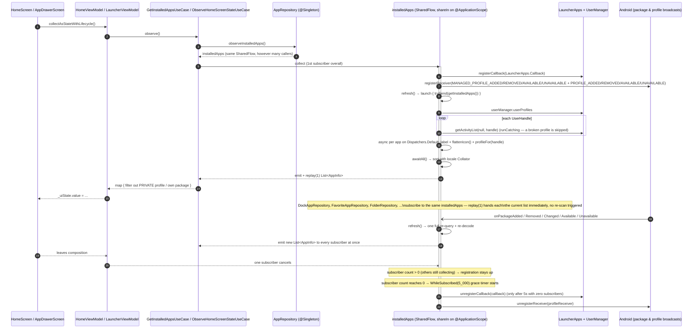
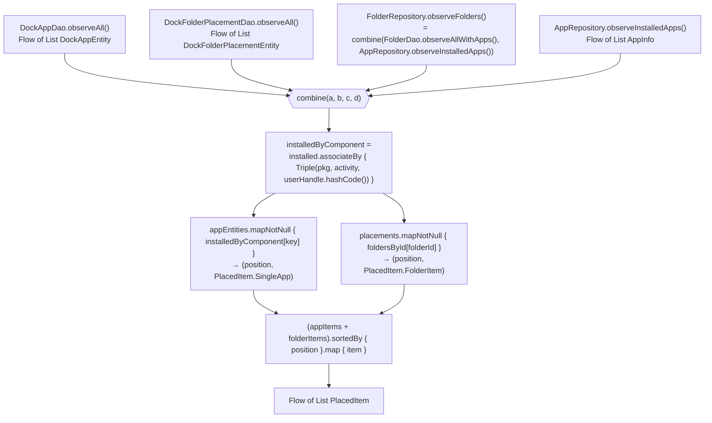
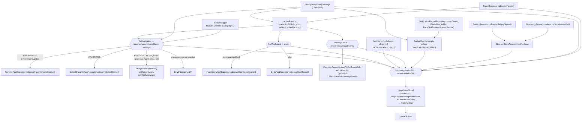
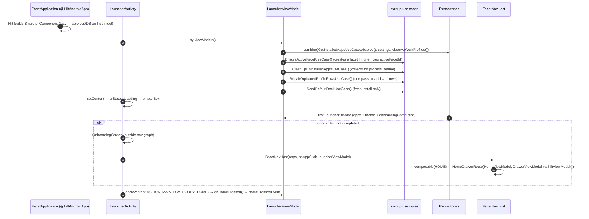

# 03 — Core Reactive & Data Flow

Four flows explain almost everything else in the app: the live installed-app list, how Room
placements are hydrated against it, the Home screen's state graph, and process startup.
Feature-level flows (placements, backup, widgets, profiles, drawer, facets/theme/badges/onboarding)
each have their own doc, `08`–`13`.

## 1. Installed apps: `LauncherApps` → `Flow<List<AppInfo>>`

There is **no Room cache** of installed apps. `AppRepository` re-queries `LauncherApps` on every
package or profile event, but the resulting flow (`installedApps`) is **shared** across every
caller via `shareIn(applicationScope, SharingStarted.WhileSubscribed(5_000), replay = 1)` — one
`LauncherApps.Callback`/`BroadcastReceiver` registration and one profile scan + icon decode per
event, no matter how many repositories are hydrating against it at once (previously ~7 while Home
was showing; this was finding F1, now fixed — see the `git blame` on `AppRepository.kt` for the
change).

Key properties of this flow:

| Property | Value | Consequence |
|---|---|---|
| Source of truth | `LauncherApps.getActivityList()` per `UserManager.userProfiles` handle | Work Profile / Private Space / OEM clone apps arrive in the same list, tagged by `AppInfo.profile` + `userHandle`. Each `AppInfo` also carries `firstInstallTime` (`LauncherActivityInfo.getFirstInstallTime()`, cross-profile safe) and a best-effort `lastUpdateTime` (`PackageManager.getPackageInfo(...).lastUpdateTime`, which only resolves the calling user's own packages — falls back to `firstInstallTime` for a Work Profile app) — feeds the app picker screens' "Installed Date"/"Last updated" sorts (see `SortAppsForPickerUseCase`). |
| Trigger | `LauncherApps.Callback` (5 package events) + 4 `ACTION_MANAGED_PROFILE_*` broadcasts + 4 generic `ACTION_PROFILE_*` broadcasts (the actions Android 15+ Private Space uses, added/removed/available/unavailable) + one initial `refresh()` | Installs, uninstalls, updates and any profile appearing/disappearing/pausing/resuming (Work Profile or Private Space) all propagate without a restart. |
| Work per emission | One full re-list + parallel icon decode of every app, **shared** across every collector | O(apps) per event, but exactly once app-wide, not once per collector. |
| Sharing | `shareIn(@ApplicationScope, SharingStarted.WhileSubscribed(stopTimeoutMillis = 5_000), replay = 1)` | One `LauncherApps` registration for the whole app; survives brief gaps (a Home↔Drawer transition) without re-registering; torn down 5s after the last collector goes away. `replay = 1` gives every new collector (a freshly opened screen) the current list immediately. |
| Profile classification | `profileFor(handle)` via `getLauncherUserInfo().userType` (API 35+), `OTHER` below | Single source of truth reused by `WorkProfileRepository`, `PrivateSpaceRepository`, `AppWidgetRepository`. |
| Companion streams | `observeUninstalledPackages(): Flow<Pair<String, Int>>`, `observeProfileRemoved(): Flow<UserHandle>` | Drive `CleanUpUninstalledAppsUseCase`, which *deletes* placement rows (not just hides them); **not** shared — each is its own unshared `callbackFlow`, cheap enough (`CleanUpUninstalledAppsUseCase` is their only collector) that sharing wasn't worth the complexity. |
| Scope | `@ApplicationScope` `CoroutineScope(SupervisorJob() + Dispatchers.Default)`, provided `@Singleton` from `AppModule` | Lives for the process, like `AppRepository` itself. The constructor parameter defaults to the same expression so the ~90 test call sites that construct `AppRepository` directly keep compiling; a test that actually collects the live flow passes its own `backgroundScope` instead (see `AppRepositoryTest`) so the sharing coroutine is deterministically cancelled with the test rather than leaking a real background collector. |

## 2. Hydrating Room placements against the live list

Every placement repository joins its Room rows with the live app list in memory. `DockAppRepository.observeDockItems()` is representative:

Rules this encodes:

- A placement whose app is **not currently installed is silently dropped** from the emitted list
  (`mapNotNull`) but **kept in Room**. Backup export reads the raw rows, so it survives a
  temporary uninstall; a genuine uninstall broadcast deletes it via `CleanUpUninstalledAppsUseCase`.
- The join key is `(packageName, activityName, userId)` — the same triple that forms every unique
  index — so a personal and a work copy of the same app are distinct placements.
- A Room write re-runs only the join, using `combine`'s cached latest app list; it never re-queries
  `LauncherApps`.
- `FacetDockAppRepository` / `FavoriteAppRepository` also offer `observe…ForFacets(ids)`
  → `Flow<Map<Long, List<PlacedItem>>>` for the facet carousel previews, built the same way.

## 3. The Home screen state graph

`ObserveHomeScreenStateUseCase.invoke()` is the largest reactive composition in the app. It is
the one place that decides *which* Room tables feed Home, based on the active facet's override flags.

Notes:

- The `combine` arity limit (5 in `kotlinx.coroutines`) is worked around with `domain/FlowCombine.kt`
  (6- and 7-ary overloads) and by pairing unrelated flows (`dockAndFavoriteItems`, `badgeCountsAndAccessories`).
- `refreshTrigger` exists because Recents/Most-used and calendar events are **one-shot** reads
  (`flow { emit(...) }`), not live streams; `HomeViewModel` re-emits the trigger on resume.
- `HomeViewModel` seeds `HomeUiState(isLoading = true)` and additionally clears `isLoading`
  after `LOADING_TIMEOUT_MS` so a slow first `LauncherApps` scan can't leave Home blank forever.
- `HomeUiState`'s resolved "look" properties (`activeAppRowPosition`, `activeAppRowPresentation`,
  `activeAppListVerticalAlignment`, `activeAppListLayout`, `activeAppListColumnAlignment`,
  `activeAppListGridColumns`, `activeAppListGridDisplayMode`, `activeDockDisplayMode`) aren't
  separate nodes in this graph — they're derived directly from `S`/`F` (already flowing into `OUT`)
  via each field's own `resolveSentinel`, not through `ObserveHomeScreenStateUseCase` at all. See
  [13-flow-facets-theme-notifications-onboarding.md](13-flow-facets-theme-notifications-onboarding.md)'s
  `LOOK` subgraph for the full list and each field's Settings row.

## 4. Process startup

## 5. Other reactive sources worth knowing

| Source | Mechanism | Consumer |
|---|---|---|
| Notification badges | `FacetNotificationListenerService` (`@AndroidEntryPoint`) pushes `setActiveNotifications()` into `NotificationBadgeRepository`'s `MutableStateFlow` | `ObserveHomeScreenStateUseCase`, `DrawerViewModel` |
| Battery | `callbackFlow` over `ACTION_BATTERY_CHANGED` sticky broadcast | `ObserveClockAccessoriesUseCase` |
| Next alarm | `callbackFlow` over `ACTION_NEXT_ALARM_CLOCK_CHANGED` + injected `Clock` | `ObserveClockAccessoriesUseCase` |
| Widget host | `LauncherAppWidgetHost.providerChanges: SharedFlow<Int>` merged with a `refreshTrigger` in `ObserveHubStateUseCase` | `HubViewModel` |
| Work Profile state | `WorkProfileRepository.observeWorkProfiles()` — `callbackFlow` over profile broadcasts mapped through `UserManager.isQuietModeEnabled` | `LauncherViewModel`, `SettingsViewModel` |
| Private Space | `PrivateSpaceRepository.observePrivateSpaceState()` (sealed `PrivateSpaceState`) + `observePrivateSpaceApps()` (= `observeAppsForProfile(PRIVATE)`) | `PrivateSpaceViewModel`, `DrawerViewModel` |
| Wallpaper | `WallpaperRepository` via `WallpaperManager` | `FacetCarouselViewModel`, `AppearanceSettingsViewModel`, dock/home settings previews |
