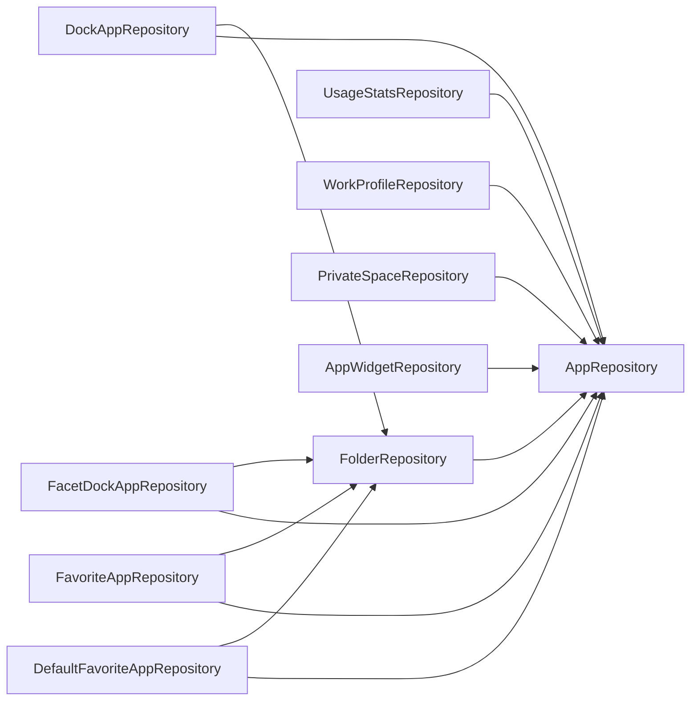

# 05 — Architect's Review: Findings & Recommendations

Overall verdict: the layering described in `CLAUDE.md` is real, not aspirational. ViewModels never
touch DAOs, composables never inject repositories, every repository is a `@Singleton` behind
constructor injection, and the reactive model is consistent (Room/DataStore `Flow` → `combine` →
`StateFlow` → `collectAsStateWithLifecycle`). The findings below are ordered by impact.

Findings are numbered by discovery order, not severity — a gap where a fixed finding was removed
(e.g. no F1 below: `observeInstalledApps()`'s missing `shareIn` was fixed) is expected, not an
error; see this doc's own rule in `CLAUDE.md`'s "Living architecture docs" section.

| # | Finding | Severity | Effort |
|---|---|---|---|
| F2 | Composables construct use cases directly (`AppDrawerScreen`) | Medium (convention) | Small |
| F3 | UI references `DockAppRepository.MAX_APPS` | Low | Trivial |
| F4 | `domain/` imports `android.*` in 4 files | Low–Medium | Small |
| F5 | Repository→repository dependency web (5 placement repos → `FolderRepository` → `AppRepository`) | Medium (design) | Medium |
| F6 | Four structurally identical placement table families | Medium (maintenance) | Large (migration) |
| F7 | ViewModels collect for their whole lifetime (`launchIn(viewModelScope)`, not `stateIn(WhileSubscribed)`) | Low | Small |
| F8 | `ObserveHomeScreenStateUseCase` / `ObserveHubStateUseCase` hold mutable state while unscoped | Low | Trivial |
| F10 | Recents / Most-used / calendar are one-shot reads behind a manual `refreshTrigger` | Low (UX) | Medium |
| F11 | Backup v3 omits every clock/app-list column added in schema v13–v15 (both global and per-facet) | Medium (data loss on restore) | Small |
| F13 | Restored placements are written with `userId = -1` and stay invisible until the next process restart | **High** (visible bug) | Small |
| F12 | `DrawerViewModel` exposes ~8 separate `StateFlow`s instead of one `DrawerUiState`; `AssignCalendarColorsUseCase` is `new`ed in a ViewModel instead of injected | Low (convention) | Small |

---

## F2 — Composables instantiating use cases (Medium)

`ui/drawer/AppDrawerScreen.kt:219` and `:241`:

```kotlin
val rankBySearchRelevance = remember { RankBySearchRelevanceUseCase() }
val groupUseCase = remember { GroupAppsByLetterUseCase() }
```

Both are pure functions with no dependencies, so nothing breaks — but it is the one place a
composable reaches into `domain/`, and `DrawerViewModel` already injects
`RankBySearchRelevanceUseCase`. Move the grouping/ranking into `DrawerViewModel` (emit
`GroupedApps` in `DrawerUiState`) or pass the result in as a parameter. The same
`AppDrawerScreenTest` assertions will still hold.

## F3 — UI reading a repository constant (Low)

`ui/settings/DockSettingsScreen.kt:137` and `ui/onboarding/OnboardingUiState.kt:30` read
`DockAppRepository.MAX_APPS`. `data/model/AppListLimits.kt` already exists for exactly this
(`MAX_FAVORITES`, `DEFAULT_APPS_TO_SHOW`); move `MAX_APPS` there as `AppListLimits.MAX_DOCK_APPS`
and the UI stops importing a repository type.

## F4 — `domain/` touching the Android framework (Low–Medium)

`CLAUDE.md`: "nothing here touches Android framework APIs directly". Four files do:

| File | Import | Assessment |
|---|---|---|
| `HubGridConstants.kt` | `android.content.Context` — `calculateHubCellWidth(context)` reads display metrics | Real violation; belongs in a `HubLayoutRepository` or in `ui/hub` (it is a layout concern) |
| `GroupAppsByLetterUseCase.kt` | `android.icu.text.AlphabeticIndex` | Pragmatic — ICU is the right tool; keep, but its test already needs Robolectric because of it |
| `ExportBackupUseCase.kt`, `ImportBackupUseCase.kt` | `android.net.Uri` as a parameter type | Value type only; acceptable. Could take a `String` and let `BackupRepository` parse |

## F5 — Repositories depending on repositories (Medium, design)



Hydration ("join these Room rows against the live app list and the live folder list") is logic
that spans repositories, which `CLAUDE.md` assigns to `domain/`. Today it lives in each placement
repository's `observe*Items()`. This is not wrong — it keeps the `PlacedItem` union in one layer
and the use cases simple — but it means `AppRepository` is a fan-in for 9 classes and any change to
its emission shape ripples through `data/`. Now that `AppRepository.observeInstalledApps()` is
shared (`shareIn`, fixed — see `03 §1`), the runtime cost of this fan-in is gone; the design
question (whether hydration belongs in `domain/` instead) remains open. Consider a single
`ObservePlacedItemsUseCase(scope: PlacementScope)` that owns the join and lets the repositories go
back to exposing raw entity flows, if the duplication across the five `observe*Items()` methods
becomes a maintenance problem.

## F6 — Four copies of the placement schema (Medium, maintenance)

`dock_apps`, `default_favorite_apps`, `facet_dock_apps`, `favorite_apps` are the same table with
or without a `facetId`; the four `*_folder_placements` tables mirror them. That is 8 entities,
8 DAOs, 4 repositories (~770 lines) and 8 near-identical `Add/Remove…UseCase`s whose only
difference is which pair they route to. Every new column (`profile` in v19, `userId` in v20) had
to be added six times with six index rebuilds.

A future `placements(id, scope TEXT, facetId NULL, kind TEXT, packageName, activityName, folderId NULL, position, profile, userId)`
would collapse this to one entity/DAO/repository and one migration per column. It is a large
migration with real user data behind it, so this is a "when the next schema change is big anyway"
item, not a now item.

## F7 — Lifetime collection in ViewModels (Low)

`HomeViewModel`, `LauncherViewModel`, `DrawerViewModel` etc. use
`combine(...).onEach { _uiState.value = it }.launchIn(viewModelScope)`. Upstream `callbackFlow`s
(LauncherApps, battery, alarm broadcasts) therefore stay registered while the ViewModel exists,
even when its screen is not composed. For the launcher's Home this is arguably desired (instant
return), but for `HubViewModel`/settings ViewModels it keeps widget-host and Room subscriptions
alive on the back stack. `stateIn(viewModelScope, SharingStarted.WhileSubscribed(5_000), initial)`
is the drop-in that fixes it, and pairs naturally with `AppRepository.observeInstalledApps()`'s
own `shareIn` (fixed — see `03 §1`): a ViewModel that stops collecting while backgrounded no
longer keeps a duplicate `LauncherApps` registration alive on its own, since the registration is
shared app-wide regardless of which ViewModels are currently collecting it.

## F8 — Stateful "unscoped" use cases (Low)

`ObserveHomeScreenStateUseCase.refreshTrigger` and `ObserveHubStateUseCase.refreshTrigger` are
`MutableSharedFlow`s on classes Hilt instantiates fresh per injection. It works because each is
injected by exactly one ViewModel, and `refresh()` is called on the same instance — but a second
injector would get a different trigger and silently never refresh. Either annotate them
`@ViewModelScoped` (documents the assumption) or move the trigger into the ViewModel and pass it in.

## F10 — One-shot reads on Home (Low, UX)

Recents / Most-used (`UsageStatsRepository`) and today's calendar events (`CalendarRepository`)
are `flow { emit(...) }` one-shots re-run only when `HomeViewModel.refresh()` fires on
`ON_RESUME` or the active facet/settings change. Usage stats have no change callback, so polling
on resume is reasonable; calendar *does* have one (`ContentResolver.registerContentObserver` on
`CalendarContract.Events.CONTENT_URI`), so an event added while Home is visible won't appear until
the next resume. A `callbackFlow` in `CalendarRepository` would make it live without touching the
use case.

## F11 — Backup misses the newer clock/app-list fields (Medium)

`BackupSettings` and `BackupFacet` (`data/model/BackupBundle.kt`) were last extended for
folders (v3) and never picked up the columns added in schema v13–v15: `clockAccentColorOption`,
`clockDateStyle`, `clockAlignment`, `calendarAlignment`, `clockZoneHeightDp`, `clockScale`,
`appListVerticalAlignment` (plus, globally, `selected_calendar_ids` and `calendar_colors`). A
restore therefore silently resets clock position/scale/date style and the calendar selection on
every facet. Add them to both `@Serializable` classes with defaults (older files keep parsing),
bump `CURRENT_BACKUP_VERSION` to 4, and extend `BackupMapping.kt` both ways. The
`ExportBackupUseCaseTest`/`ImportBackupUseCaseTest` round-trip tests should assert every
`FacetEntity` column, so this can't regress when v21 adds the next one.

## F13 — Backup restore leaves placements invisible until restart (High)

Traced in [09-flow-backup-restore.md §2](09-flow-backup-restore.md). `BackupAppEntry` has no
`userId`; `BackupMapping.to*Entity()` therefore produces rows with the entity default `-1`;
`ImportBackupUseCase` upserts them as-is; the only resolver
(`RepairOrphanedProfileRowsUseCase`) is wired into `LauncherViewModel.init` and nothing
re-runs it after an import. The in-memory join in every `observe*Items()` keys on
`userHandle.hashCode()`, so `-1` rows are dropped by `mapNotNull` — the user sees an empty Home
until they kill and relaunch the launcher (which, for a default launcher, usually means a reboot).

Fix (small): give `ImportBackupUseCase` an `AppRepository` and set
`userId = appRepository.handlesFor(profile).singleOrNull()?.hashCode() ?: -1` in the mapping
step, or simply invoke `RepairOrphanedProfileRowsUseCase` at the end of the import. Add an
`ImportBackupUseCaseTest` case asserting the restored entity's `userId` is resolved, and a
`BackupRestoreScreenTest` case that the dock is visible immediately after import.

## F12 — Two small convention drifts (Low)

- `DrawerViewModel` exposes `badgeCounts`, `contactResults`, `settingsResults`,
  `showContactsPermissionPrompt`, `showContactsSettingPrompt`, … as separate `StateFlow`s and
  `suspend fun getShortcuts()` for the composable to call. Every other screen has one
  `XUiState`; the drawer's composable ends up collecting ~8 flows itself. Folding them into a
  `DrawerUiState` would also make `AppDrawerScreenTest` setups smaller.
- `CalendarSettingsViewModel` does `private val assignCalendarColorsUseCase = AssignCalendarColorsUseCase()`
  instead of constructor-injecting it (it has no dependencies, so Hilt would provide it for free).
  Same category as F2.

---

## What is working well (keep doing this)

- **No `@Binds`/interface indirection.** Concrete `@Singleton` repositories + hand-written fakes at
  the DAO/service seam keep the DI graph readable and tests fast.
- **Lenient converters + inline DataStore defaults.** Enum renames and new preferences never need a
  migration, and Room can never crash on a `NOT NULL` converter result.
- **Migration policy.** Explicit SQL migrations, exported schemas, `MigrationTestHelper` tests, and
  *no* destructive fallback on upgrade is exactly the right posture for an app holding user layout.
- **Profile identity via `userId` in every unique index**, with a one-time repair pass for legacy
  rows, is the correct model for Work Profile / Private Space and was clearly retrofitted carefully.
- **`resolveOverride` on `FacetEntity`** keeps the "facet overrides global" rule in one expression
  instead of scattered `if (facet.overrideX)` checks.
- **Startup orchestration in one ViewModel** (`LauncherViewModel.init`) makes the app-lifetime
  side effects discoverable in a single place.
