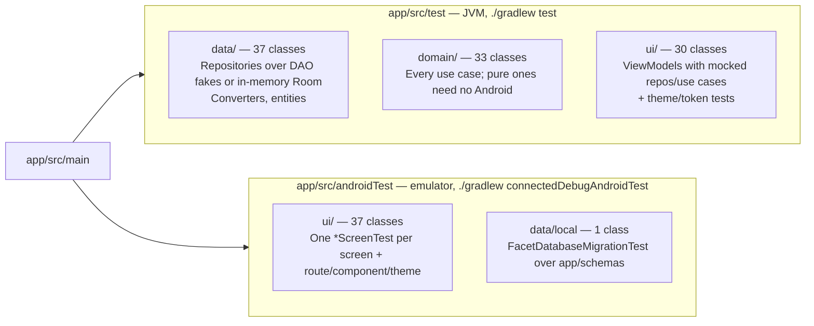

# 06 — Testing Strategy & Practice

The rule from `CLAUDE.md`: **no feature is done until it has tests that would fail if the
behaviour broke.** This doc records how that rule is actually implemented in the tree today —
which tier tests what, the fixtures and harnesses in use, and the conventions every new test
must follow. The per-class inventory is generated: [TEST_REGISTRY.md](TEST_REGISTRY.md).

Current counts (from the registry): **138 test classes, 1144 cases** — 669 unit (100 classes),
475 instrumented (38 classes).

## 1. The two tiers



| | Unit (JVM) | Instrumented |
|---|---|---|
| Runner | JUnit4; `@RunWith(RobolectricTestRunner::class)` on 62 classes that touch `Context`/framework types (`robolectric.properties`: `sdk=31`) | `AndroidJUnitRunner` + **Android Test Orchestrator** (`execution = "ANDROIDX_TEST_ORCHESTRATOR"`, one process per test class) |
| Coroutines | `kotlinx-coroutines-test`: `runTest` (467 uses), `StandardTestDispatcher` + `Dispatchers.setMain/resetMain` in ViewModel tests | Real dispatchers; `composeRule.waitForIdle()` / `waitUntil { }` |
| Doubles | Mockito 5.23 (`mockito-core`, inline mock maker → `final` Kotlin classes are mockable) for repositories/use cases; hand-written `Fake*Dao` classes (`data/FolderTestFakes.kt` + per-test fakes) for Room; `Room.inMemoryDatabaseBuilder` in 9 tests that need real SQL | `mockito-android`; subclass fakes for the three `open` repositories (`ui/settings/Fake{NotificationAccess,CalendarPermission}Repository.kt`, plus an inline `WallpaperRepository` subclass per test that needs one); most screen tests need no doubles — they pass a `UiState` + lambdas |
| Compose | — | `createComposeRule()` (40 uses); content set with `composeRule.setContent { FacetLauncherTheme { XScreen(uiState, on… = {}) } }` |
| Selectors | — | `onNodeWithTag` against 215 `Modifier.testTag(...)` sites in `main` (287 distinct tags referenced by tests), `onNodeWithText`, `onNodeWithContentDescription` |
| Room migrations | — | `MigrationTestHelper` reading `app/schemas/…/<v>.json` (mounted as `androidTest` assets in `build.gradle.kts`) |
| Hilt | Not used in tests — everything is constructed by hand | Not used — no `HiltAndroidRule`; screens are tested below the ViewModel |

## 2. What each layer's tests look like

### Repositories (`data/*RepositoryTest`)

```kotlin
@RunWith(RobolectricTestRunner::class)
class DockAppRepositoryTest {
    private fun repository(
        dao: DockAppDao = FakeDockAppDao(),
        placementDao: DockFolderPlacementDao = FakeDockFolderPlacementDao(),
        folderDao: FolderDao = FakeFolderDao(),
        installed: List<AppInfo> = ...,
    ): DockAppRepository {
        val appRepository = mock(AppRepository::class.java)
        `when`(appRepository.observeInstalledApps()).thenReturn(flowOf(installed))
        ...
    }

    @Test
    fun `an entry whose app is no longer installed is filtered out`() = runTest { ... }
}
```

- A `repository(...)` factory with defaulted fakes is the standard fixture; tests override only
  what they need.
- The DAO fake is a `MutableStateFlow`-backed in-memory list so `observeAll()` really re-emits on
  writes — hydration and ordering are tested end-to-end through real `combine`.
- `AppRepository` is always mocked at this level (its real implementation needs `LauncherApps`);
  `AppRepositoryTest` itself mocks `LauncherApps` and uses Robolectric's `shadowOf(UserManager)`.
- `SettingsRepositoryTest` runs against a real `DataStore` on a temp folder — every key's default
  and round-trip is asserted there.

### Use cases (`domain/*UseCaseTest`)

- Pure use cases (`PlaceWidget`, `ResolveWidgetDrop`, `ResolveWidgetResize`, `CompactWidgets`,
  `RankBySearchRelevance`, `SelectPreviewApps`, `ObserveQuickAddState`) are plain JUnit — no
  runner, no coroutines.
- Repository-composing use cases get Mockito mocks whose `observe*()` return `flowOf(...)` /
  `MutableStateFlow`, and assert with `.first()` inside `runTest`. Write use cases `verify(...)`
  the exact repository call (which table the placement was routed to).
- `ObserveHomeScreenStateUseCaseTest` (12 cases) and `ObserveFacetPreviewsUseCaseTest` (6) pin the
  override-routing matrix (facet flag × settings value → which repository is observed). The
  largest unit classes overall are `TimeInWordsTest` (26) and `FacetSettingsViewModelTest` (21); the
  largest instrumented ones `HomeScreenTest` (45), `ClockBlockTest` (40), `AppDrawerScreenTest` (40).

### ViewModels (`ui/**/*ViewModelTest`)

- `Dispatchers.setMain(StandardTestDispatcher())` in `@Before`, `resetMain()` in `@After`.
- Dependencies are mocks with a `viewModel(...)` factory; state is read with
  `viewModel.uiState.value` after `advanceUntilIdle()`.
- Robolectric only where the ViewModel touches `Uri`/`Intent`/`UserHandle` (`BackupRestoreViewModelTest`, `LauncherViewModelTest`).

### Screens (`androidTest/ui/**/*ScreenTest`)

- Stateless composables are rendered with a literal `UiState` and recording lambdas; the
  assertion is either on rendered nodes or on which lambda fired with what.
- Gestures use `performTouchInput { swipeUp() / swipeDown() / longClick() / swipe(...) }` with the
  thresholds from the design spec (55px, 420ms) — e.g. `AppDrawerScreenTest` asserts swipe-down at
  scroll-top closes the drawer and swipe-down mid-list does not.
- Route-level tests (`HomeDrawerRouteTest`, `KeyboardDismissalTest`) compose the real
  `HomeDrawerRoute` with real ViewModels over mocked repositories to exercise gesture routing
  between Home and Drawer.
- Anything async on top of an animation is awaited with `composeRule.waitUntil(timeoutMillis) { }`
  (155 uses). There is exactly one `Thread.sleep` in the suite
  (`FavoritesPickerScreenTest:175`, deliberately asserting a write did *not* happen).

### Migrations (`androidTest/data/local/FacetDatabaseMigrationTest`)

One test per shipped `Migration` plus two guard tests: `createDatabase(name, old)` → insert rows
with raw SQL → `runMigrationsAndValidate(name, new, true, MIGRATION_old_new)` → assert the rows and
new columns survived. The guard `migratingAnOldSchemaVersionWithNoRegisteredMigrationThrowsInsteadOfSilentlySucceeding`
proves the no-destructive-fallback policy is really in force.

## 3. Conventions (enforced by review)

| Rule | Why |
|---|---|
| Test class mirrors the class under test: `XRepository` → `XRepositoryTest`, same package in `test/` or `androidTest/` | The registry's "no mirrored test" section and the `Subject` column depend on it |
| Method names describe behaviour: `` `swipe down at top closes drawer`() `` (unit) or `swipeDownAtTopClosesDrawer()` (instrumented — 423 of 462 use camelCase; backticked names work but are avoided because `adb`/Orchestrator quoting of spaces is fragile) | The registry lists names verbatim as the behaviour contract |
| Given / When / Then sections (comments or blank lines) in every body | Readability of 900+ cases |
| One behaviour per test; a factory function (`repository(...)`, `viewModel(...)`) with defaulted doubles instead of a shared mutable `@Before` fixture | Overrides stay local and visible |
| Never mock `UserHandle` — build a real one via `Parcel` (see the helper at the top of `AppDrawerScreenTest`) | Mockito bypasses `equals`, producing spurious matches on device |
| Never `Thread.sleep`, never disable animation scales; use `waitForIdle()` / `waitUntil { }` | See `CLAUDE.md` — a disabled animator scale breaks the real app on that device |
| Instrumented runs target the emulator only: `ANDROID_SERIAL=emulator-5554 ./gradlew connectedDebugAndroidTest` when a phone is attached | `connectedAndroidTest` installs/uninstalls on every listed device |
| A new Room migration ships with its `FacetDatabaseMigrationTest` case in the same commit | Untested migrations are the one class of bug that destroys user data |
| After adding/renaming/removing a test: `python3 scripts/gen-test-registry.py` and commit the regenerated `TEST_REGISTRY.md` | The registry is the living index; a stale one is worse than none |

## 4. Running

```bash
./gradlew test                                                        # all unit tests (~2 min)
./gradlew test --tests 'com.facetlauncher.app.data.DockAppRepositoryTest'   # one class
adb devices -l                                                        # check what's attached first
ANDROID_SERIAL=emulator-5554 ./gradlew connectedDebugAndroidTest      # all instrumented, emulator only
ANDROID_SERIAL=emulator-5554 ./gradlew connectedDebugAndroidTest \
  -Pandroid.testInstrumentationRunnerArguments.class=com.facetlauncher.app.ui.drawer.AppDrawerScreenTest
python3 scripts/gen-test-registry.py                                  # refresh TEST_REGISTRY.md
```

Reports: `app/build/reports/tests/testDebugUnitTest/index.html` and
`app/build/reports/androidTests/connected/debug/index.html`.

## 5. Known coverage gaps (from the registry's last section)

Real gaps — no test class references the type at all:

- `ui/settings/FoldersSettingsViewModel`
- `ui/settings/NotificationAccessExplanationViewModel`
- `ui/settings/UsageAccessExplanationViewModel`

Indirect-only coverage (exercised through screen/route tests but without a mirrored unit test —
acceptable for the trivial permission repositories, worth adding for the ViewModels):
`FacetCarouselViewModel`, `PrivateSpaceViewModel`, `ClockWidgetPickerViewModel`,
`NotificationSettingsViewModel`,
`ObserveSettingsScreenStateUseCase`, `RankBySearchRelevanceUseCase`, `WorkProfileRepository`,
`SecureFolderRepository`, `UsageAccessRepository`, `CalendarPermissionRepository`,
`ContactPermissionRepository`, `NotificationAccessRepository`.

`Migrations.kt`, `DefaultFavoriteAppDao`, `WidgetPlacementDao` appear in that list only because
their tests are named differently (`FacetDatabaseMigrationTest`, `*RepositoryTest`) — covered.
