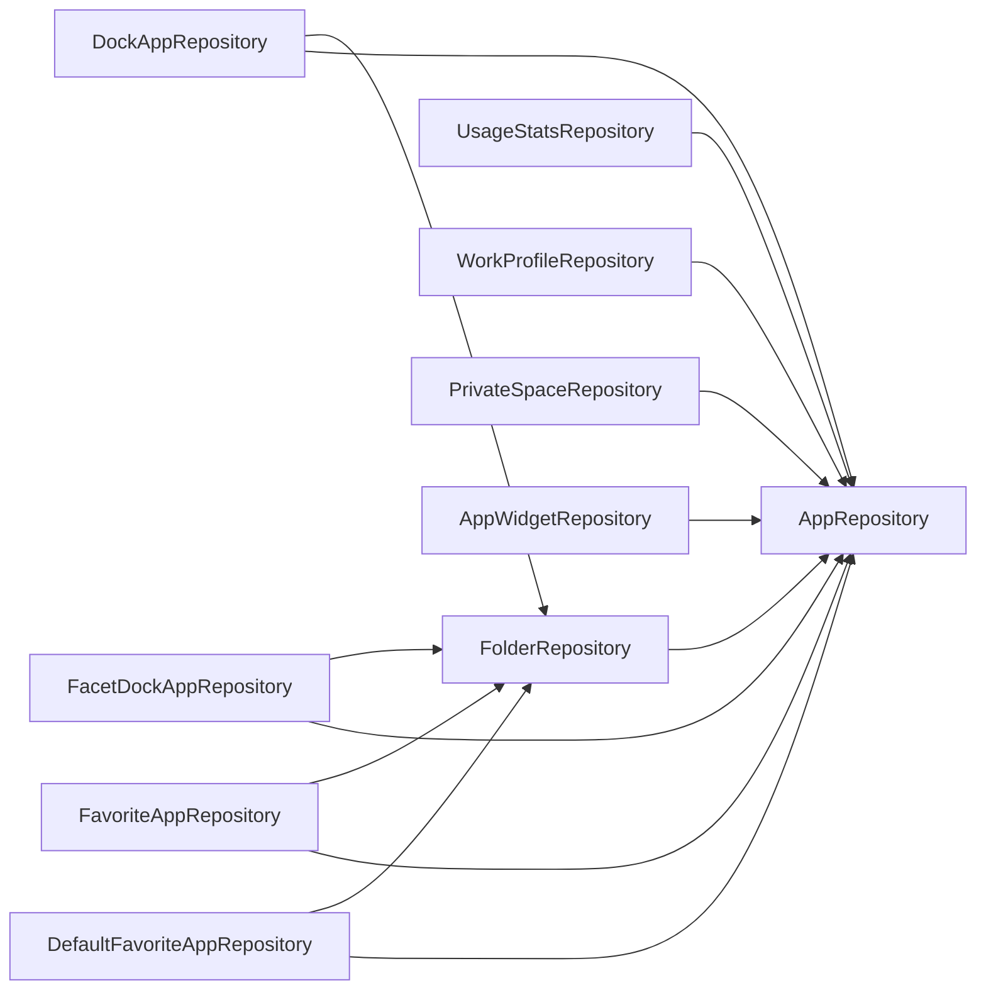

# 07 — Repository & Use Case Registries

Complete inventories of the two injectable layers, generated from constructor signatures and
`@Inject` sites in `app/src/main`. If a class is not in these tables it does not exist; if a
dependency is not listed the class does not have it.

## 1. Repositories (31) — all `@Singleton`, all constructor-injected, no interfaces

| Repository | Wraps (source of truth) | Injects | Public API shape | Injected by |
|---|---|---|---|---|
| `AppRepository` | `LauncherApps` + `UserManager` — installed activities across every profile | `LauncherApps`, `UserManager`, `Context` | `observeInstalledApps()`, `observeAppsForProfile(p)`, `getInstalledApps()` (one-shot), `observeUninstalledPackages()`, `observeProfileRemoved()`, `profileFor(handle)`, `resolveUserHandle(p)`, `handlesFor(p)`, `openAppDetails(app)` | 5 repositories, 3 use cases, `DrawerViewModel`, `BackupRestoreViewModel` |
| `AppShortcutRepository` | `LauncherApps` shortcut queries | `LauncherApps` | `getShortcuts(pkg, handle)`, `launchShortcut(s)` | `DrawerViewModel` |
| `AppWidgetRepository` (`data/widget`) | `AppWidgetManager` + `LauncherAppWidgetHost` | `Context`, `AppWidgetManager`, `LauncherAppWidgetHost`, `UserManager`, `AppRepository` | provider listing, `allocateAppWidgetId`, `bindAppWidgetIdIfAllowed`, `createBindIntent`, `createConfigureIntentSender`, `createHostView`, `updateWidgetSize`, `start/stopListening`, `observeProviderChanges()`, `deleteAppWidgetId` | `HubViewModel`, `HubWidgetPickerViewModel`, `BackupRestoreViewModel`, `ObserveHubStateUseCase`, `DeleteWidgetUseCase` |
| `BackupRepository` | SAF `Uri` file I/O + JSON | `Context` | `writeBackup(uri, bundle)`, `readBackup(uri)` (IO) | `ExportBackupUseCase`, `ImportBackupUseCase` |
| `BatteryRepository` | `ACTION_BATTERY_CHANGED` sticky broadcast | `Context` | `observeBatteryStatus(): Flow` | `ObserveClockAccessoriesUseCase` |
| `CalendarPermissionRepository` (`open`) | `checkSelfPermission(READ_CALENDAR)` | `Context` | `isGranted()` | `ObserveHomeScreenStateUseCase`, `ObserveFacetPreviewsUseCase`, `CalendarSettingsViewModel`, `PermissionsViewModel`, `AppearanceSettingsViewModel` |
| `CalendarRepository` | `CalendarContract` via `ContentResolver` | `ContentResolver` | `getTodayEvents(ids, includeAllDay)` (IO, one-shot), calendar listing | same three + `CalendarSettingsViewModel`, `AppearanceSettingsViewModel` |
| `ContactPermissionRepository` | `checkSelfPermission(READ_CONTACTS)` | `Context` | `isGranted()` | `DrawerViewModel`, `PermissionsViewModel` |
| `ContactRepository` | `ContactsContract` via `ContentResolver` | `ContentResolver`, `Context` | `searchContacts(q, limit)`, `getConnections(contactId)` (IO) | `DrawerViewModel` |
| `DefaultAppRepository` | `PackageManager.resolveActivity` for browser/SMS/camera/mail/phone intents | `Context` | `getDefaultAppPackages()` (IO) | `SeedDefaultDockUseCase`, `HomeAppsListSettingsViewModel` |
| `DefaultFavoriteAppRepository` | Room `default_favorite_apps` + `default_favorite_folder_placements` | 2 DAOs, `FolderRepository`, `AppRepository` | `observeDefaultFavorites()`, `observeDefaultItems()`, add/remove/place/reorder, `removeByPackage/UserId`, raw getters, `restore*`, `getOrphanedRows`, `backfillUserId`, `deleteAll*` | 6 use cases (add/remove favorites, cleanup, repair, export, import), 3 observe use cases, 5 ViewModels |
| `DefaultLauncherRepository` | `RoleManager` / `PackageManager` home-role query | `Context` | `isDefaultLauncher()`, `requestDefaultLauncherIntent()` | `HomeViewModel`, `SettingsViewModel` |
| `DockAppRepository` | Room `dock_apps` + `dock_folder_placements` | 2 DAOs, `FolderRepository`, `AppRepository` | as `DefaultFavoriteAppRepository`, dock-named; `MAX_APPS` constant | 9 use cases, 6 ViewModels |
| `FacetDockAppRepository` | Room `facet_dock_apps` + `facet_dock_folder_placements` | 2 DAOs, `FolderRepository`, `AppRepository` | per-facet variants + `observeDockItemsForFacets(ids)`, `replaceItems(facetId, items)` | 8 use cases, 4 ViewModels |
| `FacetRepository` | Room `facets` | `FacetDao` | `observeFacets()`, `getById`, `addFacet()`, `renameFacet`, 28 per-column `setX(facet, value)` setters, 4 `updateOverridingX(...)` block setters (trimmed — `updateOverridingApps`/`updateOverridingDock` no longer take the look-field params, moved to `AppearanceSettingsViewModel`'s own per-column setters), `deleteFacet`, `deleteAllFacets`, `restoreFacet`, `reorderFacets` | 15 use cases, 9 ViewModels |
| `FacetShortcutRepository` | `ShortcutManagerCompat` dynamic shortcuts | `Context` | `syncShortcuts(facets)` — full atomic replace, one `ShortcutInfoCompat` per facet | `SyncFacetShortcutsUseCase` |
| `FavoriteAppRepository` | Room `favorite_apps` + `favorite_folder_placements` | 2 DAOs, `FolderRepository`, `AppRepository` | per-facet variants + `observeFavoriteItemsForFacets(ids)`, `replaceItems` | 8 use cases, 4 ViewModels |
| `FolderRepository` | Room `folders` + `folder_apps` | `FolderDao`, `AppRepository` | `observeFolders(): Flow<List<Folder>>` (hydrated), create/rename/delete, add/remove/reorder members, `removeByPackage/UserId`, `getRawFolders`, `restoreFolder`, `deleteAllFolders`, orphan repair | 4 placement repositories, 5 use cases, 6 ViewModels |
| `NextAlarmRepository` | `AlarmManager.nextAlarmClock` + `ACTION_NEXT_ALARM_CLOCK_CHANGED` | `Context`, `Clock` | `observeNextAlarmMillis(): Flow<Long?>` | `ObserveClockAccessoriesUseCase` |
| `NotificationAccessRepository` (`open`) | `NotificationManagerCompat.getEnabledListenerPackages` | `Context` | `isGranted()` | `ObserveHomeScreenStateUseCase`, `DrawerViewModel`, 3 settings ViewModels |
| `NotificationBadgeRepository` | in-memory `MutableStateFlow<Map<String, Int>>` | — | `badgeCounts: StateFlow`, `setActiveNotifications(list)` | `FacetNotificationListenerService` (writer), `ObserveHomeScreenStateUseCase`, `DrawerViewModel` |
| `NotificationShadeRepository` | `StatusBarManager.expandNotificationsPanel` (reflection, `EXPAND_STATUS_BAR`) | `Context` | `expand()` | `HomeViewModel` |
| `PrivateSpaceRepository` | `UserManager` quiet-mode + `ACTION_PROFILE_*` broadcasts | `UserManager`, `AppRepository`, `Context` | `observePrivateSpaceState(): Flow<PrivateSpaceState>`, `observePrivateSpaceApps()`, `requestUnlock()` | `DrawerViewModel`, `PrivateSpaceViewModel` |
| `SecureFolderRepository` | `PackageManager.getLaunchIntentForPackage(Samsung Secure Folder)` | `Context` | `launchIntent(): Intent?` | `DrawerViewModel` |
| `SettingsRepository` | `DataStore<Preferences>` `facet_settings` | `DataStore<Preferences>` | `settings: Flow<LauncherSettings>`, 52 `suspend fun set*/reset*/mark*` writers | 12 use cases, 20 ViewModels |
| `SystemSettingsRepository` | Static catalogue of `Settings.ACTION_*` intents + keyword aliases | `Context` | `search(query)` (IO) | `DrawerViewModel` |
| `UsageAccessRepository` | `AppOpsManager.unsafeCheckOpNoThrow(GET_USAGE_STATS)` | `AppOpsManager`, `Context` | `isGranted()` | `ObserveHomeScreenStateUseCase`, `ObserveFacetPreviewsUseCase`, `PermissionsViewModel`, `UsageAccessExplanationViewModel` |
| `UsageStatsRepository` | `UsageStatsManager.queryUsageStats` | `UsageStatsManager`, `AppRepository` | `getRecentApps(limit)`, `getMostUsedApps(limit)` | `ObserveHomeScreenStateUseCase`, `ObserveFacetPreviewsUseCase` |
| `WallpaperRepository` (`open`) | `WallpaperManager.peekDrawable` / `getWallpaperColors` | `WallpaperManager` | `currentHomeWallpaper(): HomeWallpaper` (`Image` / `Tones` / `Unavailable`, downscaled to 1080px) | `FacetCarouselViewModel`, `AppearanceSettingsViewModel`, `DockSettingsViewModel`, `HomeAppsListSettingsViewModel` |
| `WidgetPlacementRepository` | Room `widget_placements` | `WidgetPlacementDao` | `observeAll()`, `getById`, `upsert`, `deleteById` (thin pass-through) | `HubViewModel`, `HubWidgetPickerViewModel`, `BackupRestoreViewModel`, `ObserveHubStateUseCase`, `DeleteWidgetUseCase`, `ExportBackupUseCase` |
| `WorkProfileRepository` | `UserManager.userProfiles` + `isQuietModeEnabled` + `ACTION_MANAGED_PROFILE_*` | `UserManager`, `AppRepository`, `Context` | `observeWorkProfiles(): Flow<List<WorkProfileInfo>>` | `LauncherViewModel`, `SettingsViewModel` |

Three repositories are `open class` with `open fun` (`CalendarPermissionRepository`,
`NotificationAccessRepository`, `WallpaperRepository`) so instrumented tests can subclass them
(`androidTest/.../settings/FakeNotificationAccessRepository.kt`, `FakeCalendarPermissionRepository.kt`)
where `mockito-android` can't intercept a `final` class; every other repository is either
constructed over a hand-written DAO fake or mocked with Mockito 5 on the JVM.

### Repository → repository dependency graph

Every other repository depends only on framework services, DAOs, or `DataStore`. There are no
cycles; `AppRepository` is the single root.

## 2. Use cases (33) — unscoped, constructor-injected unless noted

| Use case | Kind | Injects | Injected by |
|---|---|---|---|
| `ActivateFacetByIdUseCase` | write, no-op guard | `FacetRepository`, `SettingsRepository` | `LauncherViewModel` (deep link/shortcut ingestion, see [14](14-flow-deep-links-and-shortcuts.md)) |
| `AddAppToDockUseCase` | write, routes by `facet.overrideDock` | `SettingsRepository`, `FacetRepository`, `DockAppRepository`, `FacetDockAppRepository` | `DrawerViewModel` |
| `RemoveAppFromDockUseCase` | write | same four | `DrawerViewModel` |
| `AddFolderToDockUseCase` | write | same four | `DrawerViewModel` |
| `RemoveFolderFromDockUseCase` | write | same four | `DrawerViewModel` |
| `AddAppToFavoritesUseCase` | write, routes by `facet.overridingFavorites` | `SettingsRepository`, `FacetRepository`, `FavoriteAppRepository`, `DefaultFavoriteAppRepository` | `DrawerViewModel` |
| `RemoveAppFromFavoritesUseCase` | write | same four | `DrawerViewModel` |
| `AddFolderToFavoritesUseCase` | write | same four | `DrawerViewModel` |
| `RemoveFolderFromFavoritesUseCase` | write | same four | `DrawerViewModel` |
| `AssignCalendarColorsUseCase` | pure | — (**constructed with `new` in `CalendarSettingsViewModel`**, see F12) | `CalendarSettingsViewModel` |
| `CleanUpUninstalledAppsUseCase` | long-running collector | `AppRepository`, `DockAppRepository`, `FacetDockAppRepository`, `FavoriteAppRepository`, `DefaultFavoriteAppRepository`, `FolderRepository` | `LauncherViewModel` |
| `CompactWidgetsUseCase` | pure grid | — | `HubViewModel` |
| `DeleteWidgetUseCase` | write | `WidgetPlacementRepository`, `AppWidgetRepository` | `HubViewModel` |
| `EnsureActiveFacetUseCase` | startup write | `FacetRepository`, `SettingsRepository` | `LauncherViewModel` |
| `ExportBackupUseCase` | one-shot read + file write | `SettingsRepository`, `FacetRepository`, `FavoriteAppRepository`, `DockAppRepository`, `FacetDockAppRepository`, `DefaultFavoriteAppRepository`, `WidgetPlacementRepository`, `FolderRepository`, `BackupRepository` | `BackupRestoreViewModel` |
| `GetInstalledAppsUseCase` | read (`invoke()` one-shot / `observe()` live) | `AppRepository` | `LauncherViewModel`, 4 picker/settings ViewModels, `SeedDefaultDockUseCase` |
| `GroupAppsByLetterUseCase` | pure (ICU `AlphabeticIndex`) | — (**constructed in `AppDrawerScreen` composable**, see F2) | `AppDrawerScreen` |
| `ImportBackupUseCase` | destructive full-replace restore | `BackupRepository`, `SettingsRepository`, `FacetRepository`, `FavoriteAppRepository`, `DockAppRepository`, `FacetDockAppRepository`, `DefaultFavoriteAppRepository`, `FolderRepository` | `BackupRestoreViewModel` |
| `ObserveClockAccessoriesUseCase` | observe | `BatteryRepository`, `NextAlarmRepository` | `ObserveHomeScreenStateUseCase` |
| `ObserveFacetPreviewsUseCase` | observe (`Flow<Map<Long, FacetPreviewData>>`) | `FacetRepository`, `SettingsRepository`, `FavoriteAppRepository`, `DefaultFavoriteAppRepository`, `FacetDockAppRepository`, `DockAppRepository`, `UsageStatsRepository`, `UsageAccessRepository`, `CalendarPermissionRepository`, `CalendarRepository` | `FacetCarouselViewModel` |
| `ObserveHomeScreenStateUseCase` | observe (holds `refreshTrigger`, see F8) | 12 repositories + `ObserveClockAccessoriesUseCase` | `HomeViewModel` |
| `ObserveHubStateUseCase` | observe (holds `refreshTrigger`) | `WidgetPlacementRepository`, `AppWidgetRepository` | `HubViewModel` |
| `ObserveQuickAddStateUseCase` | pure (`forApp` / `forFolder`) | — | `HomeViewModel` |
| `ObserveSettingsScreenStateUseCase` | observe | `SettingsRepository`, `DockAppRepository`, `DefaultFavoriteAppRepository`, `FolderRepository` | `SettingsViewModel` |
| `PlaceWidgetUseCase` | pure grid (`Placed` / `HubFull`) | — | `HubWidgetPickerViewModel`, `BackupRestoreViewModel` |
| `RankBySearchRelevanceUseCase` | pure | — | `DrawerViewModel`, `PrivateSpaceViewModel` (+ `AppDrawerScreen`, F2) |
| `RepairOrphanedProfileRowsUseCase` | startup one-shot write | `AppRepository` + 5 placement/folder repositories | `LauncherViewModel` |
| `ResolveWidgetDropUseCase` | pure grid | — | `HubViewModel` |
| `ResolveWidgetResizeUseCase` | pure grid | — | `HubViewModel` |
| `SeedDefaultDockUseCase` | startup write (once, `defaults_seeded`) | `SettingsRepository`, `DefaultAppRepository`, `DockAppRepository`, `GetInstalledAppsUseCase` | `LauncherViewModel` |
| `SelectPreviewAppsUseCase` | pure | — | `HomeAppsListSettingsViewModel` |
| `SortAppsForPickerUseCase` | pure + read (`LAST_USED` only) | `UsageStatsRepository` | `FavoritesPickerViewModel`, `DockAppPickerViewModel`, `FolderAppPickerViewModel` |
| `SyncFacetShortcutsUseCase` | long-running collector | `FacetRepository`, `FacetShortcutRepository` | `LauncherViewModel` (see [14](14-flow-deep-links-and-shortcuts.md)) |

Non-use-case files in `domain/`: `FlowCombine.kt` (6/7-ary `combine`), `HubGridConstants.kt`
(`HUB_COLUMNS`, `HUB_MAX_ROWS`, `HUB_MAX_WIDGETS`, `calculateHubCellWidth(context)` — see F4),
`BackupMapping.kt` (entity ⇄ `Backup*` DTO extension functions).

## 3. ViewModels (27) — `@HiltViewModel`, one per screen

| ViewModel | Screen / surface | Nav arg (`SavedStateHandle`) |
|---|---|---|
| `LauncherViewModel` | `LauncherActivity` (app lifetime) | — |
| `HomeViewModel` | `HomeScreen` | — |
| `DrawerViewModel` | `AppDrawerScreen` | — |
| `PrivateSpaceViewModel` | `PrivateSpaceScreen` | — |
| `HubViewModel` | `HubScreen` | — |
| `HubWidgetPickerViewModel` | `HubWidgetPickerScreen` | — |
| `FacetCarouselViewModel` | `FacetCarouselScreen` | — |
| `ManageFacetsViewModel` | `ManageFacetsScreen` | — |
| `FacetSettingsViewModel` | `FacetSettingsScreen` | `facetId` |
| `FavoritesPickerViewModel` | `FavoritesPickerScreen` | `facetId?` |
| `DockAppPickerViewModel` | `DockAppPickerScreen` | `facetId?` |
| `ClockStyleGalleryViewModel` | `ClockStyleGalleryScreen` | `facetId?` |
| `OnboardingViewModel` | `OnboardingScreen` | — |
| `SettingsViewModel` | `SettingsScreen` | — |
| `AppearanceSettingsViewModel` | `AppearanceSettingsScreen` | `facetId?` |
| `AppDrawerSettingsViewModel` | `AppDrawerSettingsScreen` | — |
| `DockSettingsViewModel` | `DockSettingsScreen` | `facetId?` |
| `HomeAppsListSettingsViewModel` | `HomeAppsListSettingsScreen` | `facetId?` |
| `CalendarSettingsViewModel` | `CalendarSettingsScreen` | `facetId?` |
| `NotificationSettingsViewModel` | `NotificationSettingsScreen` | — |
| `NotificationAccessExplanationViewModel` | `NotificationAccessExplanationScreen` | — |
| `UsageAccessExplanationViewModel` | `UsageAccessExplanationScreen` | — |
| `PermissionsViewModel` | `PermissionsScreen` | — |
| `FoldersSettingsViewModel` | `FoldersSettingsScreen` | — |
| `FolderDetailViewModel` | `FolderDetailScreen` | `folderId` |
| `FolderAppPickerViewModel` | `FolderAppPickerScreen` | `folderId` |
| `BackupRestoreViewModel` | `BackupRestoreScreen` | — |
