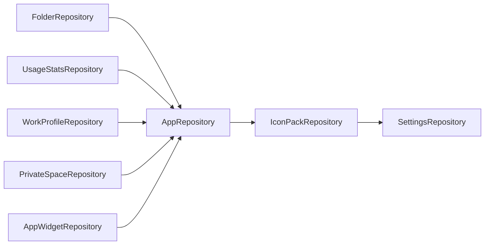

# 07 — Repository & Use Case Registries

Complete inventories of the two injectable layers, generated from constructor signatures and
`@Inject` sites in `app/src/main`. If a class is not in these tables it does not exist; if a
dependency is not listed the class does not have it.

## 1. Repositories and data singletons (57: the 56 `@Singleton` classes in `data/` plus the `EntitlementRepository` interface) — all constructor-injected; `EntitlementRepository` and the weather seams (`WeatherApi`, `WeatherStore`, `PlaceGeocoder`) are the only interfaces

| Repository | Wraps (source of truth) | Injects | Public API shape | Injected by |
|---|---|---|---|---|
| `AppRepository` | `LauncherApps` + `UserManager` — installed activities across every profile, wearing the applied icon pack's icons | `LauncherApps`, `UserManager`, `Context`, `IconPackRepository` (defaulted to none), `Clock` (dates pack calendar icons) | `observeInstalledApps()`, `observeAppsForProfile(p)`, `getInstalledApps()` (one-shot), `withOwnIcon(app)`, `recheckDate()`, `observeUninstalledPackages()`, `observeProfileRemoved()`, `profileFor(handle)`, `resolveUserHandle(p)`, `handlesFor(p)`, `openAppDetails(app)` | 5 repositories, 5 use cases, `DrawerViewModel`, `BackupRestoreViewModel`, `AppDrawerSettingsViewModel`, `OnboardingViewModel` (the drawer previews' real apps) |
| `AppWidgetRepository` (`data/widget`) | `AppWidgetManager` + `LauncherAppWidgetHost` | `Context`, `AppWidgetManager`, `LauncherAppWidgetHost`, `UserManager`, `AppRepository` | provider listing, `allocateAppWidgetId`, `bindAppWidgetIdIfAllowed`, `createBindIntent`, `createConfigureIntent`, `startConfigureActivity`, `createHostView`, `updateWidgetSize`, `start/stopListening`, `observeProviderChanges()`, `deleteAppWidgetId` | `HubViewModel`, `HubWidgetPickerViewModel`, `BackupRestoreViewModel`, `ObserveHubStateUseCase`, `DeleteWidgetUseCase`, `ClockStackViewModel`, `ClockWidgetHostController`, `ClockWidgetPickerViewModel`, `CopyFacetWidgetsUseCase`, `DeleteFacetUseCase`, `RemoveClockStackItemUseCase`, `ReplaceClockStackItemUseCase`, `WidgetConfigureActivity` |
| `AutomationPermissionRepository` (`open`) | `checkSelfPermission` for `BLUETOOTH_CONNECT` and `ACCESS_FINE_LOCATION` | `Context` | `isGranted(permission)`, `isUsable(trigger)` | `RefreshAutomationStateUseCase`, `ObserveFacetAutomationUseCase`, `PermissionsViewModel`, `RuleEditorViewModel` |
| `AutomationRuleRepository` | Room `automation_rules` | `AutomationRuleDao`, `FacetDao` (existence check on save) | `observeRules(): Flow<List<AutomationRule>>` (skips uninterpretable rows), `getRules()`, `getById(id)`, `save(rule): SaveRuleResult` (`Saved(id)`, inserting at the end or updating in place; `Invalid(errors)` or `FacetMissing` with nothing written), `setEnabled`, `delete` | `RefreshAutomationStateUseCase`, `RunFacetAutomationUseCase`, `ObserveFacetAutomationUseCase`, `SaveAutomationRuleUseCase`, `FacetAutomationViewModel`, `RuleEditorViewModel` (list, open, delete), `SettingsViewModel` (rule count), `DeviceStateRepository`, `ManageFacetsViewModel` |
| `AutomationStateRepository` | `DataStore<Preferences>` `facet_automation` (`@AutomationDataStore`) | `DataStore<Preferences>` | `state: Flow<AutomationState>`, `get()`, `update(transform)` (atomic read-modify-write) | `ActivateFacetByIdUseCase`, `RefreshAutomationStateUseCase`, `ObserveFacetAutomationUseCase` |
| `BluetoothRepository` | `ACTION_ACL_*` and `ACTION_STATE_CHANGED` broadcasts + A2DP/headset profile proxies + GATT; `BluetoothAdapter.bondedDevices` | `Context` | `observeConnectedAddresses(): Flow<Set<String>?>` (null = unknown), `suspend pairedDevices()` (IO) | `DeviceStateRepository`, `RuleEditorViewModel` |
| `BackupRepository` | SAF `Uri` file I/O + JSON | `Context` | `writeBackup(uri, bundle)`, `readBackup(uri)` (IO) | `ExportBackupUseCase`, `ImportBackupUseCase` |
| `BatteryRepository` | `ACTION_BATTERY_CHANGED` sticky broadcast | `Context` | `observeBatteryStatus(): Flow` | `ObserveClockAccessoriesUseCase`, `DeviceStateRepository` |
| `CalendarPermissionRepository` (`open`) | `checkSelfPermission(READ_CALENDAR)` | `Context` | `isGranted()` | `ObserveHomeScreenStateUseCase`, `ObserveFacetPreviewsUseCase`, `CalendarSettingsViewModel`, `PermissionsViewModel`, `AppearanceSettingsViewModel`, `EnsureCalendarColorsUseCase`, `NativeWidgetAccessViewModel`, `NativeWidgetConfigViewModel`, `NativeWidgetOverrideResolver` |
| `CalendarRepository` | `CalendarContract` via `ContentResolver` | `ContentResolver` | `getUpcomingEvents(ids, includeAllDay)` (IO, one-shot: midnight to noon tomorrow) and `getAgendaEvents(...)` (the Agenda widget: seven days), calendar listing (`getSelectableCalendars`, `getWorkCalendars`), `observeCalendarChanges()` (`callbackFlow` over a `ContentObserver` on the personal and Work Profile calendar URIs) | `AppearanceSettingsViewModel`, `CalendarSettingsViewModel`, `EnsureCalendarColorsUseCase`, `NativeWidgetConfigViewModel`, `NativeWidgetOverrideResolver`, `ObserveFacetPreviewsUseCase`, `ObserveHomeScreenStateUseCase` |
| `ContactPermissionRepository` | `checkSelfPermission(READ_CONTACTS)` | `Context` | `isGranted()` | `DrawerViewModel`, `PermissionsViewModel` |
| `ContactRepository` | `ContactsContract` via `ContentResolver` | `ContentResolver`, `Context` | `searchContacts(q, limit)`, `getConnections(contactId)` (IO) | `DrawerViewModel` |
| `DefaultAppRepository` | `PackageManager.resolveActivity` for browser/SMS/camera/mail/phone intents | `Context` | `getDefaultAppPackages()` (IO) | `SeedFacetDefaultsUseCase`, `ObserveIconPickerUseCase`, `HomeAppsListSettingsViewModel`, `NotificationSettingsViewModel` |
| `DefaultLauncherRepository` | `RoleManager` / `PackageManager` home-role query | `Context` | `isDefaultLauncher()`, `requestDefaultLauncherIntent()` | `HomeViewModel`, `SettingsViewModel` |
| `DeviceStateRepository` | combines battery, headphones, Wi-Fi and Bluetooth into one hot `StateFlow<DeviceState>`, subscribing each source only while an enabled rule reads it | `BatteryRepository`, `HeadphonesRepository`, `WifiRepository`, `AutomationRuleRepository`, `BluetoothRepository`, `@ApplicationScope CoroutineScope` | `deviceState`, `current()`, `onPermissionsChanged()` | `RefreshAutomationStateUseCase`, `RunFacetAutomationUseCase`, `PermissionsViewModel`, `RuleEditorViewModel` |
| `EntitlementRepository` (`open`) | the Pro seam: the base class is "everyone is Pro" (tests, previews); the app injects `PlayEntitlementRepository` via `EntitlementModule` | — | `isPro: StateFlow<Boolean>`, `awaitLoaded()`, `suspend refresh(): ProQueryResult` (what Play said, so Restore can report it) | `RefreshAutomationStateUseCase`, `RunFacetAutomationUseCase`, `ObserveFacetAutomationUseCase`, `SelectableFacetsUseCase`, `AddFacetUseCase`, `RuleEditorViewModel`, `ManageFacetsViewModel`, `FacetCarouselViewModel`, `LauncherActivity` (refresh on resume), `FacetProViewModel`, `SettingsViewModel`, `AddClockStackItemUseCase`, `ClockStackViewModel`, `ClockWidgetFacetController`, `CopyFacetWidgetsUseCase`, `HomeViewModel` |
| `PlacementRepository` | Room `app_placements` + `folder_placements` — every facet's Dock and Favorites list; a `PlacementTarget(list, facetId)` names one | `AppPlacementDao`, `FolderPlacementDao` | raw reads `observeAppEntities` / `observeFolderPlacements(target)` and their batched `…ForFacets(list, ids)` forms (hydration lives in `ObservePlacedItemsUseCase`), `addApp`, `removeApp`, `placeFolder`, `removeFolderPlacement`, `replaceItems`, `copyList(source, target)`, `reorderItems`, `observeGridCells` / `saveGridCells(target, landscape, cells)` (a grid list's saved cells per orientation), `deleteAll(target)`, `removeByPackage/UserId` (every list), raw getters, `restoreApp` / `restoreFolderPlacement` / `restoreFolderCells`, `getOrphanedRows`, `backfillUserId` | 10 use cases, 5 ViewModels |
| `PlayEntitlementRepository` | Pro from Google Play, cached in the `facet_entitlement` DataStore; only an explicit "owned" or "no purchase" answer changes it (a pending purchase or an unreachable Play keeps the last value) | `BillingRepository`, `@EntitlementDataStore DataStore<Preferences>`, `@ApplicationScope CoroutineScope` | overrides `isPro`, `awaitLoaded()`, `refresh()`; applies an optional debug `EntitlementOverride` on top of Play's answer (the cache keeps Play's answer only) | `EntitlementModule` (bound as `EntitlementRepository`) |
| `BillingRepository` (`open`) | Google Play Billing client over IPC, the one-time `facet_pro` product; no network permission needed | `Context`, `@ApplicationScope CoroutineScope` | `suspend queryPro(): ProQueryResult`, `suspend priceText()`, `suspend launchPurchase(activity)`, `updates: Flow<ProQueryResult>`; acknowledges purchases | `PlayEntitlementRepository`, `FacetProViewModel` (price, purchase flow, pending updates) |
| `FacetRepository` | Room `facets`, plus each facet's `clock_stack_items` (read only, so a `Facet` comes with its `clockStack`) | `FacetDao`, `ClockStackItemDao` | `observeFacets()` (re-emits when either table changes), `getById`, `addFacet()`, `renameFacet`, 13 per-column `setX(facetId, value)` setters (`setAllowLandscape`, `setListContentMode`, `setAppsToShowCount`, `setDockDisplayMode`, the app-list layout/alignment/grid ones, `setClockPlacement`), `updateLandscape(facetId, transform)`, `resetClockPosition`, the three default appliers `applyAppsContentDefaults` / `applyDockDefaults` / `applyLookDefaults(facetId, settings)` (a new or reset facet takes the launcher's values; there are no override flags), `copyDockSettings` / `copyAppsListSettings` / `copyClockPlacement(sourceId, targetId)`, `deleteFacet`, `deleteAllFacets`, `restoreFacet`, `reorderFacets` | 18 use-case files, 14 ViewModels |
| `FacetShortcutRepository` | `ShortcutManagerCompat` dynamic shortcuts | `Context` | `syncShortcuts(facets)` — full atomic replace, one `ShortcutInfoCompat` per facet | `SyncFacetShortcutsUseCase` |
| `FolderRepository` | Room `folders` + `folder_apps` | `FolderDao`, `AppRepository` | `observeFolders(): Flow<List<Folder>>` (hydrated), create/rename/delete, add/remove/reorder members, `removeByPackage/UserId`, `getRawFolders`, `restoreFolder`, `deleteAllFolders`, orphan repair | 6 use cases, 6 ViewModels |
| `HeadphonesRepository` | `AudioManager` output devices + `AudioDeviceCallback` | `Context` | `observeHeadphonesPluggedIn(): Flow<Boolean>` | `DeviceStateRepository` |
| `IconPackRepository` (`data/iconpack`, `open`) | `PackageManager` (packs found by the launcher-theme intents in `ICON_PACK_ACTIONS`) + each pack's `appfilter.xml` (asset first, else XML resource) and drawables | `Context`, `SettingsRepository` | `selection: Flow<IconPackSelection?>`, `getInstalledPacks()` (IO), `load(pkg, installedPackages)` (cached by pack version + installed set, up to 4 packs), `loadApplied(selection, installedPackages)` (clears an uninstalled pack), `open(pkg)` | `AppRepository`, `ObserveIconPickerUseCase`, `IconsViewModel` |
| `LocationRepository` | `LocationManager`: one approximate fix (network provider's current location, else the last known), `ACCESS_COARSE_LOCATION` or fine | `Context`, `@IoDispatcher` | `isPermissionGranted()`, `currentLocation(): DeviceLocation?` (10-second timeout; an altitude of exactly 0 counts as unknown). Never continuous and never in the background | `RefreshWeatherUseCase`, `ClockAccessoriesViewModel`, `NativeWidgetAccessViewModel`, `NativeWidgetOverrideResolver`, `UnitsAndLocationViewModel`, `WeatherLocationViewModel` |
| `MediaSessionRepository` (`open`) | `MediaSessionManager.getActiveSessions` via the notification-listener grant, `MediaController` callbacks and transport controls; sessions only count while `NotificationBadgeRepository.mediaNotificationPackages` has their package; art falls back to a `content:`/`file:` art URI decoded off the main thread | `Context`, `NotificationBadgeRepository` | `observe(): Flow<MediaPlayerState?>` (cold), `skipToPrevious()`, `togglePlayPause()`, `skipToNext()`, `openPlayer()` | `ObserveHomeScreenStateUseCase`, `HomeViewModel` |
| `ReleaseNotesRepository` (`open`) | bundled `assets/whats_new/<version>.md` (user-facing New/Improved bullets per release, drafted and signed off by `scripts/release.sh` before the build); `ReleaseNotesParser` parses each file (a bullet may hold `**bold**` runs, which `WhatsNewScreen` draws bold through `boldMarkdown`) | `Context` | `releases(): List<ReleaseNotes>` (IO, one-shot, newest first) | `WhatsNewViewModel`, `WhatsNewPillViewModel` |
| `LicenseRepository` (`open`) | bundled `assets/licenses/*.txt` (Apache 2.0, CC BY 4.0 and each font's own OFL file, as published); `LicenseCatalog` (`data/model`) lists the entries and their files | `Context` | `sections(info): List<LicenseSection>` (IO, one-shot, in file order) | `LicenseTextViewModel` |
| `AppVersion` (`open`) | `BuildConfig.VERSION_NAME`, behind a class so tests can supply their own | — | `name` | `WhatsNewPillViewModel`, `WhatsNewViewModel` |
| `NextAlarmRepository` | `AlarmManager.nextAlarmClock` + `ACTION_NEXT_ALARM_CLOCK_CHANGED` | `Context`, `Clock` | `observeNextAlarmMillis(): Flow<Long?>` | `ObserveClockAccessoriesUseCase` |
| `NotificationActionController` | the connected `FacetNotificationListenerService`, which attaches a `cancelNotifications` lambda while bound | — | `attach(canceller)`, `detach()`, `dismiss(keys): Boolean` | `DrawerViewModel` (callers); `FacetNotificationListenerService` (attach/detach) |
| `NotificationAccessRepository` (`open`) | `NotificationManagerCompat.getEnabledListenerPackages` | `Context` | `isGranted()` | `AppearanceSettingsViewModel`, `DrawerViewModel`, `NotificationAccessExplanationViewModel`, `NotificationSettingsViewModel`, `ObserveAppNotificationsUseCase`, `ObserveHomeScreenStateUseCase`, `PermissionsViewModel`, `SettingsViewModel` |
| `LockScreenController` | the connected `FacetAccessibilityService`, which attaches a `performGlobalAction(GLOBAL_ACTION_LOCK_SCREEN)` lambda while bound | — | `attach(locker)`, `detach()`, `lock(): Boolean` | `HomeViewModel` (injected for `onEmptySpaceDoubleTap`, whose call is commented out for now: F20 in `05`); `FacetAccessibilityService` (attach/detach) |
| `AccessibilityAccessRepository` (`open`) | whether `FacetAccessibilityService` is in `Settings.Secure.ENABLED_ACCESSIBILITY_SERVICES` | `Context` | `isGranted()` | `GesturesViewModel`, `AccessibilityAccessExplanationViewModel`, `PermissionsViewModel` |
| `NotificationBadgeRepository` | in-memory `MutableStateFlow`s: counts by package, media packages, and the listable notifications | — | `badgeCounts: StateFlow`, `mediaNotificationPackages`, `notificationsFor(pkg, handle): Flow<List<NotificationInfo>>`, `setActiveNotifications(list)` | `FacetNotificationListenerService` (writer), `ObserveHomeScreenStateUseCase`, `DrawerViewModel`, `MediaSessionRepository`, `ObserveAppNotificationsUseCase` |
| `NotificationOpener` | `PendingIntent.send` of another app's notification content intent (with the background-start opt-in on API 34+) | `Context` | `open(contentIntent): Boolean` | `DrawerViewModel` |
| `CityRepository` (`data/places`) | `assets/cities.tsv` read once into a `CityList` (empty when the asset is missing) | `Context`, `@IoDispatcher` | `search(query, limit)`, `nearest(lat, lon, countryCode?, maxKm?)` | `ResolvePlaceUseCase`, `SearchPlacesUseCase` |
| `NotificationShadeRepository` | `StatusBarManager.expandNotificationsPanel` (reflection, `EXPAND_STATUS_BAR`) | `Context` | `expand()` | `HomeViewModel` |
| `PrivateSpaceRepository` | `UserManager` quiet-mode + `ACTION_PROFILE_*` broadcasts | `UserManager`, `AppRepository`, `Context` | `observePrivateSpaceState(): Flow<PrivateSpaceState>`, `observePrivateSpaceApps()`, `requestUnlock()` | `DrawerViewModel`, `PrivateSpaceViewModel` |
| `SecureFolderRepository` | `PackageManager.getLaunchIntentForPackage(Samsung Secure Folder)` | `Context` | `launchIntent(): Intent?` | `DrawerViewModel` |
| `SettingsRepository` | `DataStore<Preferences>` `facet_settings` | `DataStore<Preferences>` | `settings: Flow<LauncherSettings>`, 84 `suspend fun set*/reset*/mark*/update*/choose*/remove*` writers | 25 use cases, 29 ViewModels, `IconPackRepository` |
| `SystemSettingsRepository` | Static catalogue of `Settings.ACTION_*` intents + keyword aliases | `Context` | `search(query)` (IO) | `DrawerViewModel` |
| `UsageAccessRepository` | `AppOpsManager.unsafeCheckOpNoThrow(GET_USAGE_STATS)` | `AppOpsManager`, `Context` | `isGranted()` | `ObserveHomeScreenStateUseCase`, `ObserveFacetPreviewsUseCase`, `PermissionsViewModel`, `UsageAccessExplanationViewModel`, `DrawerViewModel`, `DockAppPickerViewModel`, `FavoritesPickerViewModel`, `FolderAppPickerViewModel` |
| `UsageStatsRepository` | `UsageStatsManager.queryUsageStats` | `UsageStatsManager`, `AppRepository` | `getRecentApps(limit)`, `getMostUsedApps(limit)` | `ObserveHomeScreenStateUseCase`, `ObserveFacetPreviewsUseCase`, `DrawerViewModel`, `SortAppsForPickerUseCase` |
| `WifiRepository` | `ConnectivityManager` Wi-Fi network callbacks (location info only for a named-network rule) + `WifiManager.scanResults` | `Context` | `observeWifiState(includeSsid): Flow<WifiState>`, `suspend nearbyNetworkNames(current)` (IO) | `DeviceStateRepository`, `RuleEditorViewModel` |
| `WakeEventsRepository` | System broadcasts `ACTION_SCREEN_ON`, `ACTION_USER_PRESENT`, `ACTION_TIME_CHANGED`, `ACTION_TIMEZONE_CHANGED` (`RECEIVER_NOT_EXPORTED`) | `Context` | `observeWakeEvents(): Flow<Unit>` | `RunFacetAutomationUseCase` |
| `WallpaperRepository` (`open`) | `WallpaperManager.peekDrawable` / `getWallpaperColors` | `WallpaperManager` | `currentHomeWallpaper(): HomeWallpaper` (`Image` (rare: `peekDrawable` needs storage access) / `Tones` (the primary colour, washing toward a 40% blend of the secondary; brightness is set per theme in `WallpaperBackground`) / `Unavailable`, downscaled to 1080px) | `FacetCarouselViewModel`, `AppearanceSettingsViewModel`, `AppDrawerSettingsViewModel`, `DockSettingsViewModel`, `HomeAppsListSettingsViewModel`, `NotificationSettingsViewModel` |
| `WallpaperCopyRepository` (`open`) | the glass wallpaper copy: `wallpaper_copy.png` in `filesDir`; the system wallpaper through `WallpaperManager` (`setBitmap`, `getWallpaperId`) | `Context`, `WallpaperManager`, `@IoDispatcher` | `copy: Flow<Bitmap?>` (read once, on first collection), `save(bitmap)` (a temp file, then renamed), `remove()`, `decodePicked(uri, maxSide)` (`ImageDecoder`, upright, shrunk), `setSystemWallpaper(bitmap, includeLock): Int` (the new id or `NO_WALLPAPER_ID`), `currentSystemWallpaperId()`, `portraitScreenSize()` | `WallpaperBackdropViewModel`, `WallpaperViewModel`, `SetWallpaperFromPhotoUseCase`, `RemoveWallpaperCopyUseCase` |
| `AndroidPlaceGeocoder` (`data/places`, bound as `PlaceGeocoder`) | `android.location.Geocoder` (the listener API from Android 13, the blocking one before); empty answers when it is missing or fails | `Context`, `@IoDispatcher` | `reverse(lat, lon, locale)`, `search(query, locale, max)` | `ResolvePlaceUseCase`, `SearchPlacesUseCase` |
| `WeatherRepository` (`data/weather`) | The forecast: stored hourly rows and the fetch state, refreshed from MET Norway | `WeatherApi`, `WeatherStore`, `Clock` | `observeHours()`, `observeState()`, `refresh(place): RefreshOutcome` (one refresh at a time, through `WeatherRefreshPolicy`: never before `Expires`, never twice within 10 minutes, nothing while a 429 is being waited out; nothing is retried) | `RefreshWeatherUseCase`, `ObserveWeatherUseCase`, `NativeWidgetOverrideResolver`, `WeatherLocationViewModel` |
| `ClockStackRepository` (`data/`) | A facet's clock stack: the native clock and up to 5 hosted widgets in swipe order; per-item size and alignment, portrait and landscape | `FacetDatabase`, `ClockStackItemDao` | `observe(facetId)`, `getAll`, `setConfig(itemId, NativeWidgetConfig)`, `addWidget`, `addClock` (once, `false` when full), `replaceWithWidget(itemId, id)` and `replaceWithClock(itemId)` (in place, keep the position and alignment, reset the sizes, return a `ReplacedItem` with the id to release), `remove(itemId)` (returns the widget id to release), `clear(facetId)`, `appendCopy(facetId, page, appWidgetId, limit)` (a page with its size, alignment and settings, for Copy from facet), `reorder`, `setSize`, `setLandscapeSize`, `setAlignment`, `setLandscapeAlignment` | `ReplaceClockStackItemUseCase`, `ClockWidgetFacetController`, `AddClockStackItemUseCase`, `ClockStackViewModel`, `CopyFacetWidgetsUseCase`, `ImportBackupUseCase`, `ObserveNativeWidgetOverridesUseCase`, `ObserveNativeWidgetSettingsUseCase`, `RemoveClockStackItemUseCase`, `SetNativeWidgetConfigUseCase`, `UpdateClockConfigUseCase` |
| `StyledIconCache` (`data/icon`) | The glyph-only or outline picture of each app icon, made off the main thread and held weakly per icon bitmap (only the applied picture is kept) | none | `get`/`cached`/`warm`/`clear` | `LauncherActivity` (provided as `LocalStyledIconCache`) |
| `MetWeatherApi` (`data/weather`, bound as `WeatherApi`) | HTTPS to `api.met.no` Locationforecast 2.0 `compact` | `Clock`, `@IoDispatcher` | `fetch(place, ifModifiedSince): WeatherApiResult` — the only code in the app that opens a connection | `WeatherRepository` |
| `RoomWeatherStore` (`data/weather`, bound as `WeatherStore`) | Room `weather_hours`, `weather_meta` | `FacetDatabase`, `WeatherDao` | `observeHours()`, `observeState()`, `readHours()`, `readState()`, `replaceHours(list)` (one transaction), `writeState(state)` | `WeatherRepository` |
| `WidgetWeatherRepository` (`data/weather`) | Forecasts for the places Hub Weather widgets are set to, kept in memory one per place | `WeatherApi`, `Clock` | `refresh(place): WidgetForecast?` (through `WeatherRefreshPolicy`, so widgets on one place share one request), `setPlaceName` | `NativeWidgetOverrideResolver` (for `ObserveNativeWidgetOverridesUseCase` and `ObserveClockWeatherUseCase`) |
| `WidgetPlacementRepository` | Room `widget_placements` | `WidgetPlacementDao` | `observeAll()`, `getById`, `upsert`, `setConfig(id, NativeWidgetConfig)`, `deleteById` (thin pass-through) | `HubViewModel`, `HubWidgetPickerViewModel`, `BackupRestoreViewModel`, `ObserveHubStateUseCase`, `DeleteWidgetUseCase`, `ExportBackupUseCase`, `ImportBackupUseCase`, `ObserveNativeWidgetOverridesUseCase`, `ObserveNativeWidgetSettingsUseCase`, `SetNativeWidgetConfigUseCase` |
| `WorkProfileRepository` | `UserManager.userProfiles` + `isQuietModeEnabled` + `ACTION_MANAGED_PROFILE_*` | `UserManager`, `AppRepository`, `Context` | `observeWorkProfiles(): Flow<List<WorkProfileInfo>>` | `LauncherViewModel`, `SettingsViewModel` |

Four repositories are `open class` with `open fun` (`CalendarPermissionRepository`,
`NotificationAccessRepository`, `AccessibilityAccessRepository`, `WallpaperRepository`) so instrumented tests can subclass them
(`androidTest/.../settings/FakeNotificationAccessRepository.kt`, `FakeCalendarPermissionRepository.kt`)
where `mockito-android` can't intercept a `final` class; every other repository is either
constructed over a hand-written DAO fake or mocked with Mockito 5 on the JVM.

### Repository → repository dependency graph

```mermaid
flowchart LR
    AR[AppRepository]
    FOR[FolderRepository] --> AR
    USR[UsageStatsRepository] --> AR
    WPR[WorkProfileRepository] --> AR
    PSR[PrivateSpaceRepository] --> AR
    AWR[AppWidgetRepository] --> AR
    AR --> IPR[IconPackRepository]
    IPR --> SR[SettingsRepository]
```

Every other repository depends only on framework services, DAOs, or `DataStore`. There are no
cycles; `AppRepository` is the root of everything else here, and itself reads only the applied icon
pack (`IconPackRepository`, which reads that choice from `SettingsRepository`).

## 2. Use cases (71) — unscoped, constructor-injected unless noted

| Use case | Kind | Injects | Injected by |
|---|---|---|---|
| `ActivateFacetByIdUseCase` | write, no-op guard (a facet that is missing or disabled on the free plan), `FacetSwitchSource` (manual re-samples the rules, then records baseline + suppresses active rules) | `SelectableFacetsUseCase`, `SettingsRepository`, `AutomationStateRepository`, `RefreshAutomationStateUseCase` | `LauncherViewModel` (deep link/shortcut ingestion, see [14](14-flow-deep-links-and-shortcuts.md)), `ManageFacetsViewModel`, `FacetCarouselViewModel`, `FacetSettingsViewModel`, `ApplyFacetAutomationUseCase` |
| `ApplyFacetAutomationUseCase` | one automation pass: refresh, then an `AUTOMATION` switch if the rules want a different facet | `RefreshAutomationStateUseCase`, `ActivateFacetByIdUseCase`, `SettingsRepository` | `RunFacetAutomationUseCase` |
| `CanUseTriggerUseCase` | pure Pro gate: `invoke(trigger, isPro)` (schedule free, device triggers Pro) and `entitledRuleIds(rules, isPro)` (free keeps the first two schedule rules in list order) | — | `RefreshAutomationStateUseCase`, `ObserveFacetAutomationUseCase`, `RuleEditorViewModel`, `SaveAutomationRuleUseCase` |
| `AddFacetUseCase` | write: adds a facet unless at the limit (3 free, 10 Pro); returns `AddFacetResult` (`Added` / `LimitReached`) | `FacetRepository`, `EntitlementRepository`, `ApplyFacetDefaultsUseCase` | `ManageFacetsViewModel`, `FacetCarouselViewModel` |
| `AddToActiveListUseCase` | write: appends an app or folder to a list for the active facet, at the next position (apps and folders counted together) | `ResolveActivePlacementTargetUseCase`, `PlacementRepository`, `ObservePlacedItemsUseCase` | `DrawerViewModel`, `FolderDetailViewModel` |
| `AssignCalendarColorsUseCase` | pure | — | `CalendarSettingsViewModel`, `EnsureCalendarColorsUseCase` |
| `EnsureCalendarColorsUseCase` (`@Singleton`, holds a mutex) | write + long-running collector: gives every calendar on the device, Work Profile ones included, its stable bar colour; `keepAssigned()` observes only while calendar access is granted, re-running on each `observeCalendarChanges()`, and on revoke unregisters the observer and clears the stored colours (`recheckAccess()` re-evaluates on each activity resume, since access has no grant-change callback); a failed assignment is skipped and a failed observation retried with a back-off, so neither ends it | `CalendarPermissionRepository`, `CalendarRepository`, `SettingsRepository`, `AssignCalendarColorsUseCase` | `FacetApplication` (collector for the app's life, and `recheckAccess()` from an `ActivityLifecycleCallbacks` resume) , `NativeWidgetConfigViewModel` |
| `UpdateClockConfigUseCase` | write: applies a change to a facet's clock settings in force (so a clock with none stored yet keeps what it shows) and stores the result on its clock page; no-op for a facet with no clock | `SettingsRepository`, `FacetRepository`, `ClockStackRepository` | `ClockStyleGalleryViewModel`, `ClockAccessoriesViewModel`, `CalendarSettingsViewModel`, `TurnOffWeatherUseCase` |
| `CleanUpUninstalledAppsUseCase` | long-running collector | `AppRepository`, `PlacementRepository`, `FolderRepository` | `LauncherViewModel` |
| `CompactWidgetsUseCase` | pure grid | — | `HubViewModel` |
| `DeleteFacetUseCase` | write (releases every widget id in the facet's clock stack first) | `FacetRepository`, `AppWidgetRepository` | `ManageFacetsViewModel`, `FacetCarouselViewModel` |
| `DeleteWidgetUseCase` | write | `WidgetPlacementRepository`, `AppWidgetRepository` | `HubViewModel` |
| `EnsureActiveFacetUseCase` | seeds the first facet, and (`keepUsable()`, a collector) keeps the active facet one the user may use: missing or disabled → the first selectable facet | `FacetRepository`, `SettingsRepository`, `SelectableFacetsUseCase`, `ApplyFacetDefaultsUseCase` | `LauncherViewModel` |
| `EvaluateFacetAutomationUseCase` | pure (rules + trigger truth + `AutomationState` → desired facet + new state) | — | `RefreshAutomationStateUseCase` |
| `ExportBackupUseCase` | one-shot read + file write | `SettingsRepository`, `FacetRepository`, `PlacementRepository`, `WidgetPlacementRepository`, `FolderRepository`, `BackupRepository` | `BackupRestoreViewModel` |
| `FlowPackWidgetsUseCase` | pure grid (lays widgets out in a fixed number of rows, in list order) | — | `LandscapeHubUseCase` |
| `GetInstalledAppsUseCase` | read (`invoke()` one-shot / `observe()` live) | `AppRepository` | `DockAppPickerViewModel`, `FavoritesPickerViewModel`, `FolderAppPickerViewModel`, `HomeAppsListSettingsViewModel`, `LauncherViewModel`, `NotificationSettingsViewModel`, `ObserveIconPickerUseCase`, `SeedFacetDefaultsUseCase` |
| `GroupAppsByLetterUseCase` | pure (ICU `AlphabeticIndex`) | — | `DrawerListUseCases` (→ `AppDrawerScreen`) |
| `LandscapeHubUseCase` | pure (composes the three below: lays widgets out in the landscape Hub, and works out the new order after a drop) | `OrderWidgetsForLandscapeUseCase`, `FlowPackWidgetsUseCase`, `ReorderLandscapeWidgetUseCase` | `HubViewModel` |
| `ImportBackupUseCase` | destructive full-replace restore | `BackupRepository`, `SettingsRepository`, `FacetRepository`, `PlacementRepository`, `FolderRepository`, `RepairOrphanedProfileRowsUseCase`, `ClockStackRepository`, `WidgetPlacementRepository` | `BackupRestoreViewModel` |
| `ObserveClockAccessoriesUseCase` | observe | `BatteryRepository`, `NextAlarmRepository` | `ObserveHomeScreenStateUseCase` |
| `ObserveFacetAutomationUseCase` | observe (`Flow<FacetAutomationScreenState>`: rule rows with facet names, "why Home looks like this" status, permission and Pro availability, `canAddRule`, `isPro`). Takes a refresh tick that re-reads permission grants | `AutomationRuleRepository`, `AutomationStateRepository`, `FacetRepository`, `SettingsRepository`, `AutomationPermissionRepository`, `EntitlementRepository`, `CanUseTriggerUseCase` | `FacetAutomationViewModel` |
| `ObserveActiveFacetItemsUseCase` | observe: the active facet's own Dock or Favorites, for a screen not tied to one facet (previews, sample apps) | `SettingsRepository`, `ObservePlacedItemsUseCase` | `ObserveIconPickerUseCase`, `AppearanceSettingsViewModel`, `NotificationSettingsViewModel` |
| `ObserveIconPickerUseCase` | observe (`Flow<IconPickerState>`): the built-in style cards' samples (own icons via `AppRepository.withOwnIcon`) and each installed pack by its own app icon; only the applied pack is read, for its coverage (emitted loading first) | `ObserveActiveFacetItemsUseCase`, `GetInstalledAppsUseCase`, `AppRepository`, `IconPackRepository`, `DefaultAppRepository`, `SelectIconSamplesUseCase` | `IconsViewModel` |
| `ObserveFacetPreviewsUseCase` | observe (`Flow<Map<Long, FacetPreviewData>>`) | `FacetRepository`, `SettingsRepository`, `ObservePlacedItemsUseCase`, `UsageStatsRepository`, `UsageAccessRepository`, `CalendarPermissionRepository`, `CalendarRepository` | `FacetCarouselViewModel` |
| `ObserveClockWeatherUseCase` | observe (`Flow<ClockWeather>`): the launcher-wide forecast, or the active facet's own place (`ClockWidgetConfig.weatherLocation`, resolved through `NativeWidgetOverrideResolver` like a widget's) with why there is none; `refreshOwn()` looks it up again | `SettingsRepository`, `FacetRepository`, `ObserveWeatherUseCase`, `NativeWidgetOverrideResolver` | `WeatherViewModel` |
| `ObserveWeatherUseCase` | observe (`Flow<WeatherState?>`): stored hours + fetch state + settings + a five-minute tick → now, the next 24 hourly points, local days from today, the rain summary, the place name and zone | `SettingsRepository`, `WeatherRepository`, `Clock` | `ObserveClockWeatherUseCase` (`WeatherViewModel` reads the forecast through it) |
| `ObserveHomeScreenStateUseCase` (`@ViewModelScoped`) | observe (holds `refreshTrigger`) | 9 repositories + `ObservePlacedItemsUseCase` + `ObserveClockAccessoriesUseCase` | `HomeViewModel` |
| `ObserveHubStateUseCase` (`@ViewModelScoped`) | observe (holds `refreshTrigger`) | `WidgetPlacementRepository`, `AppWidgetRepository` | `HubViewModel` |
| `ObserveNativeWidgetOverridesUseCase` (bound as `NativeWidgetOverrides`) | observe (`Flow<Map<NativeWidgetRef, NativeWidgetOverride>>`, five-minute tick): each Hub or Home Agenda or Weather widget's own events or forecast | `WidgetPlacementRepository`, `ClockStackRepository`, `SettingsRepository`, `NativeWidgetOverrideResolver` (which uses `CalendarRepository`, `CalendarPermissionRepository`, `WidgetWeatherRepository`, `WeatherRepository`, `LocationRepository`, `ResolvePlaceUseCase`, `Clock`) | `NativeWidgetAccessViewModel` |
| `ObserveNativeWidgetSettingsUseCase` | observe (`Flow<NativeWidgetSettings?>`): what a Hub or Home widget is and is set to | `WidgetPlacementRepository`, `ClockStackRepository`, `SettingsRepository` | `NativeWidgetConfigViewModel` |
| `SetNativeWidgetConfigUseCase` | write | `WidgetPlacementRepository`, `ClockStackRepository` | `NativeWidgetConfigViewModel` |
| `ObserveAppNotificationsUseCase` | read, `flatMapLatest` over the `show_notifications_in_app_menu` setting; `AppNotificationsState(notifications, needsAccess)` | `SettingsRepository`, `NotificationBadgeRepository`, `NotificationAccessRepository` | `DrawerViewModel` |
| `ObservePlacedItemsUseCase` | observe: joins `PlacementRepository`'s raw Dock/Favorites rows against `AppRepository.observeInstalledApps()` and `FolderRepository.observeFolders()` (`apps`, `items`, batched `appsForFacets` / `itemsForFacets`); an uninstalled app drops out live | `PlacementRepository`, `FolderRepository`, `AppRepository` | `AddToActiveListUseCase`, `ObserveActiveFacetItemsUseCase`, `ObserveFacetPreviewsUseCase`, `ObserveFolderPlacementUseCase`, `ObserveHomeScreenStateUseCase`; 7 ViewModels (`DockAppPicker`, `FavoritesPicker`, `Onboarding`, `DockSettings`, `HomeAppsListSettings`, `AppearanceSettings`, `FacetSettings`) |
| `ObserveFolderPlacementUseCase` | observe: the active facet, `observeFacets()` and the Dock/Favorites items → `FolderPlacementState(quickAdd, facetName, showFacetBadge)` for one folder (badge only with 2+ facets) | `SettingsRepository`, `FacetRepository`, `ObservePlacedItemsUseCase`, `ObserveQuickAddStateUseCase` | `FolderDetailViewModel` |
| `ReorderActiveListUseCase` | write: saves a dragged Home list or Dock in the active facet's order, or a dragged grid's cells (`saveGridCells`) | `ResolveActivePlacementTargetUseCase`, `PlacementRepository` | `DrawerViewModel` |
| `ObserveQuickAddStateUseCase` | pure (`forApp` / `forFolder`) | — | `HomeViewModel`, `ObserveFolderPlacementUseCase` |
| `ObserveSettingsScreenStateUseCase` | observe: the settings and the folder library's size | `SettingsRepository`, `FolderRepository` | `SettingsViewModel` |
| `OrderWidgetsForLandscapeUseCase` | pure (saved landscape order first, the rest in portrait reading order) | — | `LandscapeHubUseCase` |
| `PlaceWidgetUseCase` | pure grid (`Placed` / `HubFull`) | — | `HubWidgetPickerViewModel`, `BackupRestoreViewModel` |
| `ReorderLandscapeWidgetUseCase` | pure (moves one widget in the order, renumbers all) | — | `LandscapeHubUseCase` |
| `RankBySearchRelevanceUseCase` | pure | — | `DrawerViewModel`, `PrivateSpaceViewModel` (+ `AppDrawerScreen` via `DrawerListUseCases`) |
| `RecentlyInstalledAppsUseCase` | pure (filters `firstInstallTime` within 72h) | — | `DrawerListUseCases` (called from `rememberDrawerBrowseModel`, in composition: F15 in `05`), `PrivateSpaceViewModel` |
| `RecentlyChangedAppsUseCase` | pure (installed or updated within 72h, newest change first) | — | `AppDrawerScreen` search sheet (via `DrawerListUseCases`) |
| `RemoveFromActiveListUseCase` | write: removes an app or folder from a list for the active facet | `ResolveActivePlacementTargetUseCase`, `PlacementRepository` | `DrawerViewModel`, `FolderDetailViewModel` |
| `ResolveActivePlacementTargetUseCase` | read: which concrete list the active facet reads `DOCK` or `FAVORITES` from (its own), or `null` with no active facet | `SettingsRepository`, `FacetRepository` | `AddToActiveListUseCase`, `RemoveFromActiveListUseCase`, `ReorderActiveListUseCase` |
| `ApplyFacetDefaultsUseCase` | write: re-seeds a facet's Dock from the device defaults (with the dock display style), copies Favorites content mode and count, or the Home list look, per `FacetDefaultsScope` (`DOCK`, `APPS_LIST`, `LOOK`); `applyAll` seeds a new facet | `FacetRepository`, `SeedFacetDefaultsUseCase`, `SettingsRepository` | `AddFacetUseCase`, `EnsureActiveFacetUseCase`, `DockSettingsViewModel`, `AppearanceSettingsViewModel`, `OnboardingViewModel` |
| `CopyFacetSettingsUseCase` | write: *Copy from facet* for the Dock and Apps list screens: replaces the target facet's `DOCK` or `FAVORITES` list with the source's (apps, folder placements, grid cells) and copies that screen's facet settings; a no-op when source and target are the same | `PlacementRepository`, `FacetRepository` | `DockSettingsViewModel`, `HomeAppsListSettingsViewModel` |
| `CopyFacetWidgetsUseCase` | write: *Copy from facet* for the widget stack in three steps: `prepare` clears the target stack (releasing its host ids), copies the clock placement and returns the source pages capped to the plan's limit; `appendNative` and `appendHosted` add one page each (hosted pages with the id the caller just bound) | `ClockStackRepository`, `FacetRepository`, `AppWidgetRepository`, `EntitlementRepository` | `ClockStackViewModel` |
| `RefreshWeatherUseCase` | write: one refresh of the weather for the current location (read, with a 5 km hysteresis, then named) or the chosen city, through the repository's gate; returns `WeatherRefreshResult` | `SettingsRepository`, `LocationRepository`, `WeatherRepository`, `ResolvePlaceUseCase` | `WeatherViewModel` (Home resume and the sheet's button) |
| `TurnOffWeatherUseCase` | write: weather off for the launcher default and every facet that shows it | `SettingsRepository`, `FacetRepository`, `UpdateClockConfigUseCase` | `WeatherLocationViewModel` (the leave-without-a-city dialog) |
| `SetWallpaperFromPhotoUseCase` | write: crops the framed part of a photo to the screen's size, sets it as the system wallpaper (the lock screen too when asked), stores it as the copy and records the system id; stores nothing unless the system accepted it | `WallpaperCopyRepository`, `SettingsRepository`, `@DefaultDispatcher` | `WallpaperViewModel` |
| `RemoveWallpaperCopyUseCase` | write: deletes the copy and clears the recorded id (the system wallpaper stays) | `WallpaperCopyRepository`, `SettingsRepository` | `WallpaperViewModel` |
| `ResolvePlaceUseCase` | read: name a position (`Geocoder`, else the nearest listed city as an offline "Near X") and find its timezone | `PlaceGeocoder`, `CityRepository` | `RefreshWeatherUseCase`, `NativeWidgetOverrideResolver` |
| `RefreshAutomationStateUseCase` | samples every rule against the clock and persists the evaluator's state, without switching | `AutomationRuleRepository`, `AutomationStateRepository`, `SelectableFacetsUseCase`, `SettingsRepository`, `EvaluateFacetAutomationUseCase`, `DeviceStateRepository`, `AutomationPermissionRepository`, `EntitlementRepository`, `CanUseTriggerUseCase`, `Clock` | `ApplyFacetAutomationUseCase`, `ActivateFacetByIdUseCase` |
| `RepairOrphanedProfileRowsUseCase` | one-shot write, at startup and after every backup import | `AppRepository`, `PlacementRepository`, `FolderRepository` | `LauncherViewModel`, `ImportBackupUseCase` |
| `ResolveWidgetDropUseCase` | pure grid | — | `HubViewModel` |
| `ResolveWidgetResizeUseCase` | pure grid | — | `HubViewModel` |
| `RunFacetAutomationUseCase` | long-running collector (wake events, Home presses, rule, active-facet and entitlement changes → one pass each) | `ApplyFacetAutomationUseCase`, `AutomationRuleRepository`, `WakeEventsRepository`, `SettingsRepository`, `DeviceStateRepository`, `EntitlementRepository` | `LauncherViewModel` (see [15](15-flow-facet-automation.md)) |
| `SearchPlacesUseCase` | read: the city picker's search, geocoder results first then listed cities, de-duplicated within 10 km, each with an IANA zone | `PlaceGeocoder`, `CityRepository` | `WeatherLocationViewModel` (the weather location screen) |
| `SaveAutomationRuleUseCase` | write: Pro gate (trigger type, then the free rule limit for a new rule) before `AutomationRuleRepository.save()`; returns `SaveRuleResult` incl. `ProRequired` | `AutomationRuleRepository`, `CanUseTriggerUseCase` | `RuleEditorViewModel` |
| `SeedFacetDefaultsUseCase` | write: a facet's Dock from the device defaults (only when empty, or `replace` for the Dock reset) | `DefaultAppRepository`, `PlacementRepository`, `GetInstalledAppsUseCase` | `ApplyFacetDefaultsUseCase` |
| `SelectIconSamplesUseCase` | pure: Home apps, then defaults, then the drawer, narrowed by an `accept` filter | `SelectPreviewAppsUseCase` | `ObserveIconPickerUseCase` |
| `SelectPreviewAppsUseCase` | pure | — | `HomeAppsListSettingsViewModel`, `SelectIconSamplesUseCase`, `NotificationSettingsViewModel` |
| `SelectableFacetsUseCase` | the facets the user may switch to: all for Pro, the first 3 in list order for free (`FacetLimits.selectableIds`); `invoke()` ids and `observe()` entities | `FacetRepository`, `EntitlementRepository` | `ActivateFacetByIdUseCase`, `EnsureActiveFacetUseCase`, `RefreshAutomationStateUseCase`, `SyncFacetShortcutsUseCase` |
| `SortAppsForPickerUseCase` | pure + read (`LAST_USED` only) | `UsageStatsRepository` | `FavoritesPickerViewModel`, `DockAppPickerViewModel`, `FolderAppPickerViewModel` |
| `SyncFacetShortcutsUseCase` | long-running collector; publishes shortcuts only for selectable facets | `SelectableFacetsUseCase`, `FacetShortcutRepository` | `LauncherViewModel` (see [14](14-flow-deep-links-and-shortcuts.md)) |
| `AddClockStackItemUseCase` | write: appends the clock or a widget within the plan's limit (1 Free, 5 Pro, one clock); `hasRoom(facetId)` is the Add upsell check; returns `AddClockStackItemResult` | `ClockStackRepository`, `EntitlementRepository` | `ClockStackViewModel`, `ClockWidgetPickerViewModel` |
| `RemoveClockStackItemUseCase` | write: removes a page and releases the widget id it held | `ClockStackRepository`, `AppWidgetRepository` | `ClockStackViewModel`, `ClockWidgetFacetController` |
| `CommitClockPlacementUseCase` | write: saves a change to the facet's own clock placement (alignment, scale, divider) for portrait or landscape; the first change copies the launcher-wide placement into the facet and sets `clockPlacementOwn` | `FacetRepository`, `SettingsRepository` | `ClockWidgetFacetController` |
| `ReplaceClockStackItemUseCase` | write: swaps one page of a facet's clock stack for the native clock (`withClock`, refused while the clock is on another page) or a widget (`withWidget`), in place, and releases the id the old page held | `ClockStackRepository`, `AppWidgetRepository` | `ClockWidgetFacetController`, `ClockWidgetPickerViewModel` |

Non-use-case files in `domain/`: `FlowCombine.kt` (6/7-ary `combine`), `HubGridConstants.kt`
(`HUB_COLUMNS`, `HUB_MAX_ROWS`, `HUB_MAX_WIDGETS`, `calculateHubCellWidth(context)` — see F4),
`BackupMapping.kt` (entity ⇄ `Backup*` DTO extension functions).

## 3. ViewModels (46) — `@HiltViewModel`, one per screen

| ViewModel | Screen / surface | Nav arg (`SavedStateHandle`) |
|---|---|---|
| `LauncherViewModel` | `LauncherActivity` (app lifetime) | — |
| `HomeViewModel` | `HomeScreen` | — |
| `DrawerViewModel` | `AppDrawerScreen` | — |
| `PrivateSpaceViewModel` | `PrivateSpaceScreen` | — |
| `HubViewModel` | `HubScreen` | — |
| `HubWidgetPickerViewModel` | `HubWidgetPickerScreen` | — |
| `FacetCarouselViewModel` | `FacetCarouselScreen` | — |
| `ManageFacetsViewModel` | `ManageFacetsScreen` | — |
| `ClockStackViewModel` | `ClockStackScreen` (the widget stack: reorder, remove, configure, add; the active facet's pages and the plan's limit) |`facetId?` (the active facet when absent) |
| `FacetAutomationViewModel` | `FacetAutomationScreen` (rule list, status line) | — |
| `RuleEditorViewModel` | the rule editor sheet inside `FacetAutomationScreen`: draft rule, permission gate, device pickers | — |
| `FacetSettingsViewModel` | `FacetSettingsScreen` | `facetId` |
| `FavoritesPickerViewModel` | `FavoritesPickerScreen` | `facetId?` |
| `DockAppPickerViewModel` | `DockAppPickerScreen` | `facetId?` |
| `ClockWidgetPickerViewModel` | `ClockWidgetPickerScreen` | — |
| `ClockStyleGalleryViewModel` | `ClockStyleGalleryScreen` | `facetId?` |
| `WeatherViewModel` | the weather sheet over Home (`WeatherSheet`) and the clock accessory: `WeatherUiState` (including whether the facet shows a place of its own), refresh, `onHomeResumed` | — |
| `ClockAccessoriesViewModel` | `ClockAccessoriesScreen` (switches, icon style, location permission for the weather switch) | `facetId?` |
| `UnitsAndLocationViewModel` | `UnitsAndLocationScreen` (the four units, the location row and its permission) | — |
| `WeatherLocationViewModel` | `WeatherLocationScreen` (mode, permission, debounced city search) | — |
| `OnboardingViewModel` | `OnboardingScreen` | — |
| `SettingsViewModel` | `SettingsScreen` | — |
| `FacetProViewModel` | `FacetProScreen` (Settings → Facet Pro, and every Pro limit): Buy, Restore, the Play price and messages | — (`FacetNavHost` reads the route's `reason` and passes a `ProReason` to the screen) |
| `AppearanceSettingsViewModel` | `AppearanceSettingsScreen`, `ThemesAndColorsScreen`, `FontsScreen`, `IconsScreen` (global) — one instance per back-stack entry | `facetId?` (read, but none of the four routes declares it, so it is always absent: F20 in `05`) |
| `IconsViewModel` | `IconsScreen`'s built-in style and icon pack cards (alongside `AppearanceSettingsViewModel`, which keeps the preview and shape) | — |
| `WallpaperViewModel` | `WallpaperScreen` (the copy, the Photo Picker and fit step, remove, the stale check) | — |
| `WallpaperBackdropViewModel` | `LauncherActivity` (the stored copy it draws behind the app, for real glass) | — |
| `AppDrawerSettingsViewModel` | `AppDrawerSettingsScreen` (settings, plus the wallpaper and installed apps behind its preview) | — |
| `DockSettingsViewModel` | `DockSettingsScreen` | `facetId?` |
| `HomeAppsListSettingsViewModel` | `HomeAppsListSettingsScreen` | `facetId` |
| `CalendarSettingsViewModel` | `CalendarSettingsSheet` | `bind(facetId)` |
| `NotificationSettingsViewModel` | `NotificationSettingsScreen` | — |
| `NotificationAccessExplanationViewModel` | `NotificationAccessExplanationScreen` | — |
| `GesturesViewModel` | `GesturesScreen` (Settings → Gestures: the built-in gestures and the two opt-in switches) | — |
| `AccessibilityAccessExplanationViewModel` | `AccessibilityAccessExplanationScreen` | — |
| `UsageAccessExplanationViewModel` | `UsageAccessExplanationScreen` | — |
| `PermissionsViewModel` | `PermissionsScreen` | — |
| `FoldersSettingsViewModel` | `FoldersSettingsScreen` | — |
| `FolderDetailViewModel` | `FolderDetailScreen` | `folderId` |
| `FolderAppPickerViewModel` | `FolderAppPickerScreen` | `folderId` |
| `BackupRestoreViewModel` | `BackupRestoreScreen` | — |
| `WhatsNewViewModel` | `WhatsNewScreen` (opening it marks the running version's notes seen) | — |
| `WhatsNewPillViewModel` | the What's new pill over Home (`WhatsNewPillHost`): the version to announce, and `onShown` | — |
| `NativeWidgetConfigViewModel` | `NativeWidgetConfigSheet` | — |
| `NativeWidgetAccessViewModel` | `HomeDrawerRoute` (through `rememberNativeWidgetAccess`) | — |
| `LicenseTextViewModel` | `LicenseTextScreen` (one licence entry, by `licenseId`) | `licenseId` |
