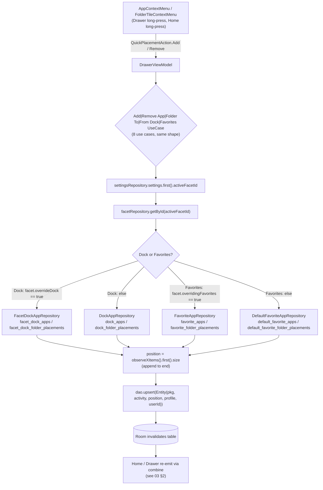
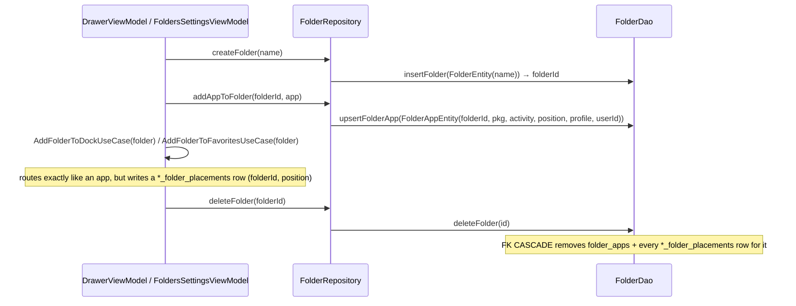
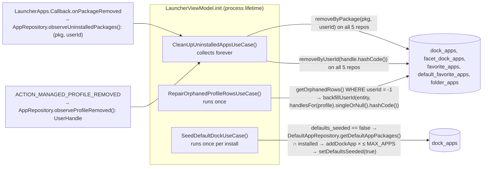

# 08 — Flow: Placements (Favorites, Dock, Folders) — add, remove, reorder, clean up

"Placement" is the app's word for *an app or folder pinned somewhere*: the Home app list
(favorites), the Home dock, or inside a folder. This flow covers every write to the eight
placement tables and the three background processes that keep them consistent with the OS.

## 1. The routing rule — global vs per-facet

Every add/remove goes through a `domain/` use case that decides which table pair to write,
based on the **active facet's override flag**. The composable and ViewModel never know which
table was hit.

- Capacity is enforced *before* the use case, in `ObserveQuickAddStateUseCase`
  (`HomeViewModel`): an `Add` action is only offered when `items.size < max`
  (`DockAppRepository.MAX_APPS` for dock, `AppListLimits.MAX_FAVORITES` for favorites); a
  `Remove` when the item is already a member. The context menu renders exactly what that state says.
- `userId` on the new row is `app.userHandle.hashCode()` — the same value the unique index and the
  hydration join use, so a Work-profile copy of an app is a distinct placement.

## 2. Reorder (drag)

Reordering is a whole-list replace, not a per-row position update:

| Surface (all use `ui/components/DragReorderState`) | ViewModel call | Repository | Mechanism |
|---|---|---|---|
| Dock settings (`DockSettingsScreen`) | `DockSettingsViewModel` → | `DockAppRepository.reorderDockItems(items)` / `FacetDockAppRepository.reorderDockItems(facetId, items)` | delete-all-for-scope + re-upsert with `position = index` |
| Home app list settings (`HomeAppsListSettingsScreen`) | `HomeAppsListSettingsViewModel` → | `FavoriteAppRepository.reorderFavoriteItems` / `DefaultFavoriteAppRepository.reorderItems` | same |
| Folder contents (`FolderDetailScreen`) | `FolderDetailViewModel` → | `FolderRepository.reorderFolderApps(folderId, apps)` | same |
| Onboarding (`OnboardingHomeSetupPage`) | `OnboardingViewModel.reorderDockApps / reorderFavorites` | global repos only (no facet exists yet) | same |
| Manage facets (`ManageFacetsScreen`) | `ManageFacetsViewModel.reorderFacets` | `FacetRepository.reorderFacets` | `update` per facet with new `position` |

Home itself has no drag-reorder of dock or app list — Home's drag gestures are the clock
handles (zone height / scale); reordering is always done from a settings screen.

Because `position` is rewritten for the whole scope, gaps and duplicates can't accumulate; the
cost is one transaction of N upserts per drag end.

## 3. Folders

A folder is one row in `folders`; membership is `folder_apps`; *where it appears* is a
placement row in one of the four `*_folder_placements` tables. Deleting the folder cascades
everywhere in SQLite. `FolderRepository.observeFolders()` hydrates members against the live app
list, so a folder whose apps are all uninstalled shows as empty, not missing.

## 4. Keeping placements honest — three background processes

| Process | Trigger | Effect | Why it exists |
|---|---|---|---|
| **Uninstall cleanup** | Per-package `onPackageRemoved` (not `onPackagesUnavailable` — a paused Work Profile must keep its rows) | Deletes the row from every placement table for that `(pkg, userId)` | Hydration already *hides* missing apps; this makes the removal permanent so the slot frees up and backups don't carry ghosts |
| **Profile removal sweep** | `ACTION_MANAGED_PROFILE_REMOVED` with `EXTRA_USER` | `removeByUserId` for that exact handle only | Unenrolling a Work Profile doesn't reliably fire per-package events; scoped to the handle so a clone profile in the same `AppProfile` category survives |
| **Orphan repair** | Once, at startup | Rows written before schema v20 have `userId = -1`; resolved from their `profile` if exactly one live handle matches that category | Without it, pre-v20 rows never join against the live list and vanish from Home |
| **Default dock seed** | Once, gated by `defaults_seeded` | Fills an empty dock with the OS-resolved browser/SMS/camera/mail/phone apps that are installed | A fresh install (and onboarding) shows a usable dock immediately, independent of the onboarding UI |

## 5. Invariants this flow guarantees

1. A component is placed at most once per scope per profile (unique indices include `userId`).
2. `position` is dense `0..n-1` within a scope after any reorder.
3. A placement row never outlives a *confirmed* uninstall or profile removal; it does survive a
   *temporary* absence (paused profile, app being updated) and shows again when the app returns.
4. Every write is routed through a use case that consults the active facet; nothing in `ui/`
   chooses a table.
