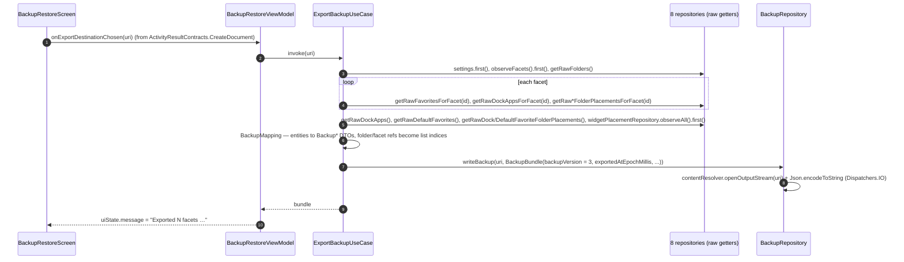
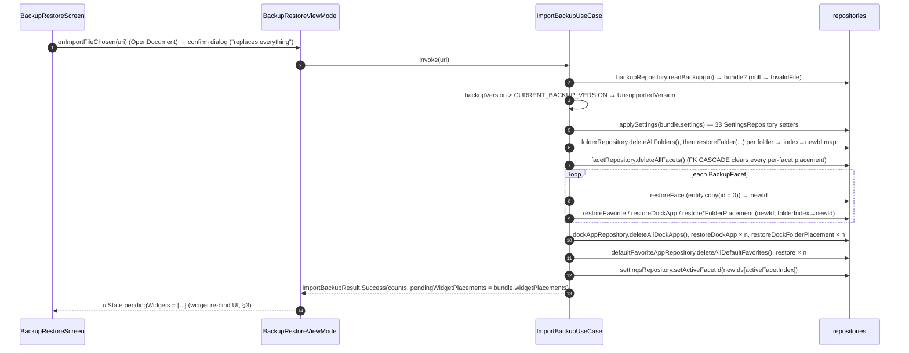
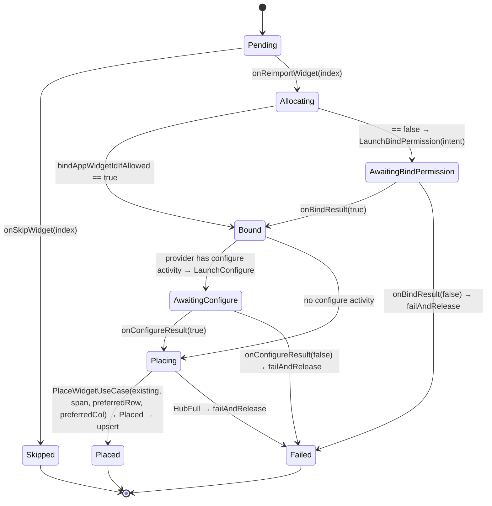

# 09 — Flow: Backup & Restore

Settings → Backup & Restore. Export writes one JSON file to a user-chosen location; import is a
**destructive full replace** (not a merge) followed by an interactive, one-widget-at-a-time
re-bind because widget ids cannot be restored.

## 1. Export

- **Raw, not hydrated.** Export reads `getRaw*()` (DAO `.first()`), so a placement whose app is
  currently uninstalled is still exported. Nothing is filtered against `LauncherApps`.
- **Ids are not exported.** Facets and folders are referenced by their index in the bundle's
  lists; `active_facet_id` becomes `activeFacetIndex`. Room ids are regenerated on import.
- What is *not* in the file: see [02 §6](02-persistence-room.md) (clock position/scale/date
  style, calendar selection/colors, permission and coach-mark flags — finding F11).

## 2. Import

- **Not transactional.** The use case's own doc says so: a failure mid-way leaves a partially
  restored database. The order (folders → facets → global dock → global favorites) is chosen so
  every FK target exists before its referrers.
- **`userId` on restored rows — defect (F13).** `BackupAppEntry` carries `profile` only;
  `BackupMapping` builds entities with the default `userId = -1`, and `restoreFavorite` /
  `restoreDockApp` / `restoreDefaultFavorite` / `restoreFolder` upsert them unchanged. The only
  code that resolves `-1` is `RepairOrphanedProfileRowsUseCase`, which runs once in
  `LauncherViewModel.init`. Until the launcher process restarts, every restored placement fails
  the hydration join (`userHandle.hashCode()` is `0` for the personal user, never `-1`) and Home
  shows an empty dock and app list. Fix: inject `RepairOrphanedProfileRowsUseCase` (or
  `AppRepository.handlesFor`) into `ImportBackupUseCase` and resolve `userId` before upserting.
- Result type: `ImportBackupResult.Success | InvalidFile | UnsupportedVersion(version)`.

## 3. Widget re-bind after import

Widget ids are allocated by the system `AppWidgetHost` and are meaningless on another device (or
after a data clear), so `widgetPlacements` are never auto-restored. The screen lists each pending
widget and re-runs the same bind/configure state machine the Hub picker uses
([10-flow-hub-widgets.md](10-flow-hub-widgets.md) §2), with the backup's `row/col/colSpan/rowSpan`
as the *preferred* slot:

`failAndRelease` always calls `appWidgetRepository.deleteAppWidgetId(id)` so a failed bind never
leaks a host allocation.

## 4. Versioning contract

`CURRENT_BACKUP_VERSION = 3`. Rules, as implemented: new fields get `@Serializable` defaults so
older files still parse (`folders` and the four `*FolderPlacements` lists default to empty); a
file whose `backupVersion` is *greater* than the current constant is refused with
`UnsupportedVersion`; the constant only bumps for a non-additive/breaking change — a purely
additive, defaulted, tolerant-reader field does **not** require a bump (established by
`fontScaleOption`, reused for `appListLayout`/`appListColumnAlignment`/`appListGridColumns`/
`appListGridDisplayMode`, `systemBarIconStyle`, and `iconShape` — see `BackupBundle.kt`'s own doc comment). `ExportBackupUseCaseTest` /
`ImportBackupUseCaseTest` round-trip the bundle and must be extended for every new field
(see F11 for the fields currently missing).
