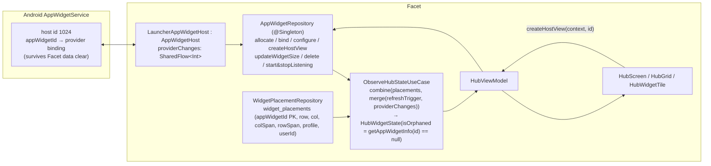
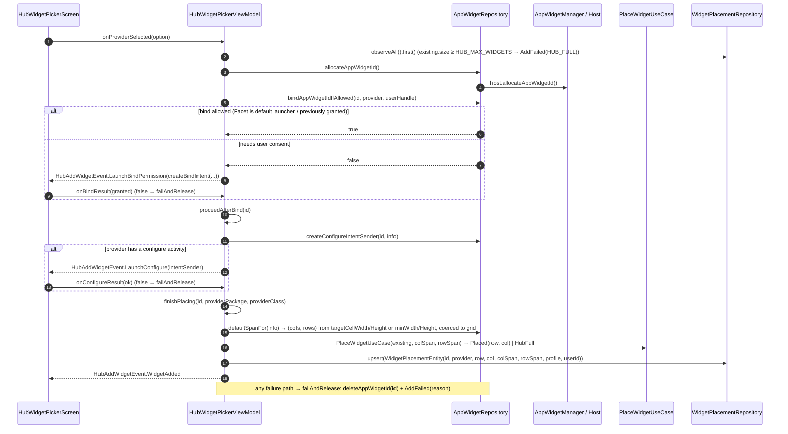
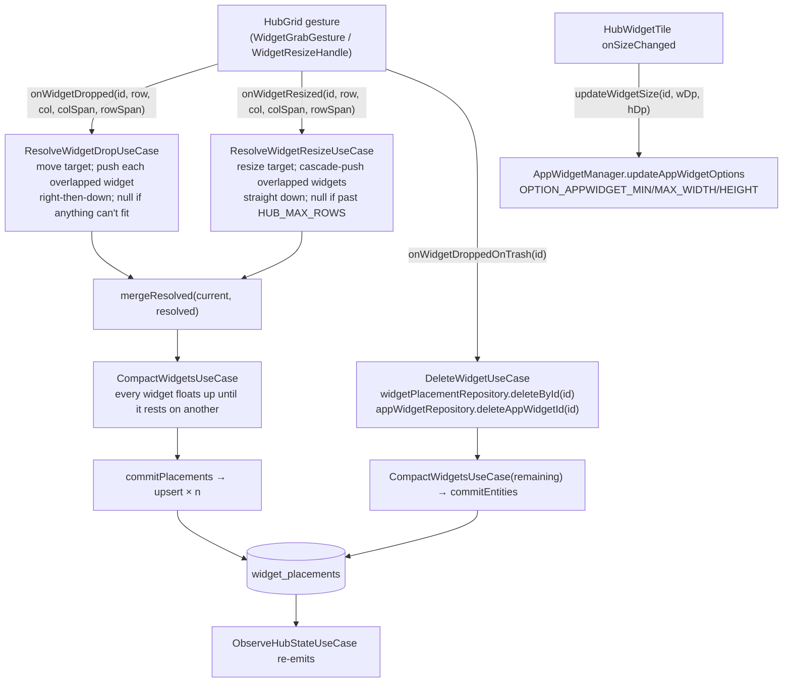

# 10 — Flow: Hub Widgets (host lifecycle, add, move, resize, delete, orphans)

The Hub is Facet's widget surface: a 5-column grid (`HUB_COLUMNS = 5`, `HUB_MAX_ROWS = 50`,
`HUB_MAX_WIDGETS = 20` in `domain/HubGridConstants.kt`) hosting real `AppWidgetHostView`s.
Two stores cooperate: the **system** `AppWidgetService` owns bindings (which `appWidgetId` maps to
which provider), Facet's Room `widget_placements` owns *where* each id sits.

## 1. Who owns what

- **Host listening** is tied to visibility, not process: `HomeDrawerRoute` calls
  `hubViewModel.onHubVisible()` → `host.startListening()` when the Hub opens and
  `onHubHidden()` → `stopListening()` in `onDispose`. Widgets don't receive updates while the Hub
  is closed.
- **Orphans**: a placement whose `appWidgetId` no longer has provider info (provider uninstalled,
  Work Profile removed, or bindings lost) is rendered as `OrphanedWidgetTile` with
  *Remove* (`DeleteWidgetUseCase`) / *Keep space* (`onKeepOrphanSpace` — no-op, the row stays).
- Providers are enumerated per profile
  (`userManager.userProfiles.flatMap { getInstalledProvidersForProfile(it) }`), so Work Profile
  widgets appear in the picker tagged with their `AppProfile`; `widget_placements.profile/userId`
  record which profile a placed widget came from.

## 2. Add a widget (`HubWidgetPickerViewModel`)

`PlaceWidgetUseCase` is pure: it scans rows top-down, columns left-right for the first
rectangle that doesn't overlap an existing placement; with `preferredRow/Col` (backup restore) it
tries that slot first.

## 3. Move, resize, delete (`HubViewModel`)

- A drop or resize that can't be resolved (`null` from the use case) is silently rejected — the
  tile snaps back; nothing is written.
- Every successful mutation ends with `CompactWidgetsUseCase` so the grid never keeps a gap
  above a widget.
- `updateWidgetSize` tells the provider its real rendered size so responsive widgets
  (`targetCellWidth` aware) lay out correctly.

## 4. Persistence & recovery matrix

| Event | System binding | `widget_placements` row | What the user sees |
|---|---|---|---|
| Add completes | created | created | tile |
| Add fails at bind/configure/placement | released (`deleteAppWidgetId`) | none | `AddFailed(reason)` snackbar |
| Delete (trash / orphan Remove) | released | deleted | gone |
| Provider app uninstalled | binding invalid | row kept | `OrphanedWidgetTile` (Remove / Keep space) |
| Work Profile removed | bindings gone | rows kept (`userId` still set) | orphan tiles |
| Facet data cleared / reinstalled | **kept** (host id 1024 is stable) | gone | nothing — the bindings leak until the system GCs them |
| Backup restore | new ids allocated per widget | re-created via the picker state machine | interactive re-bind list (see 09 §3) |
