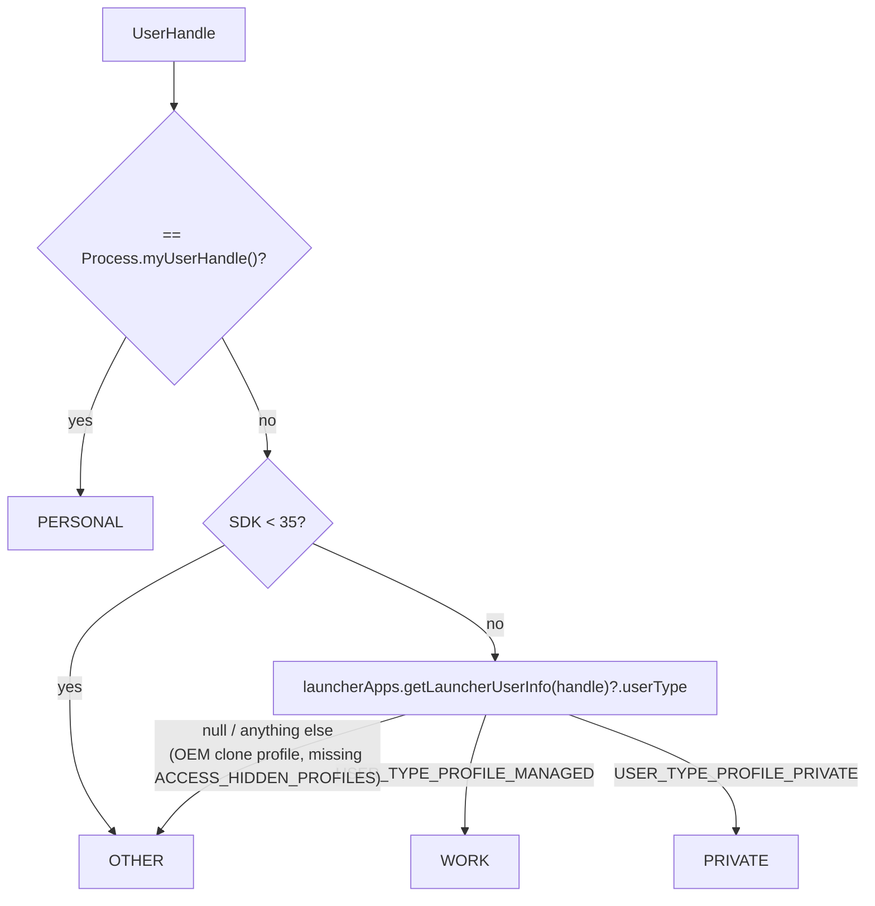
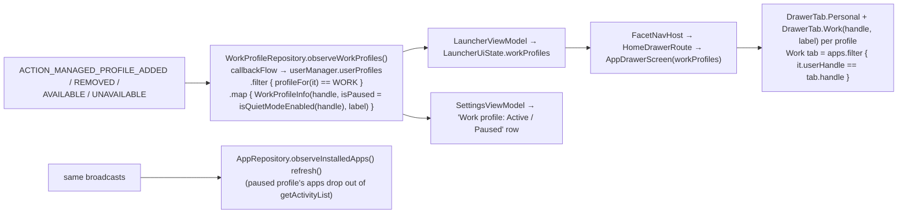
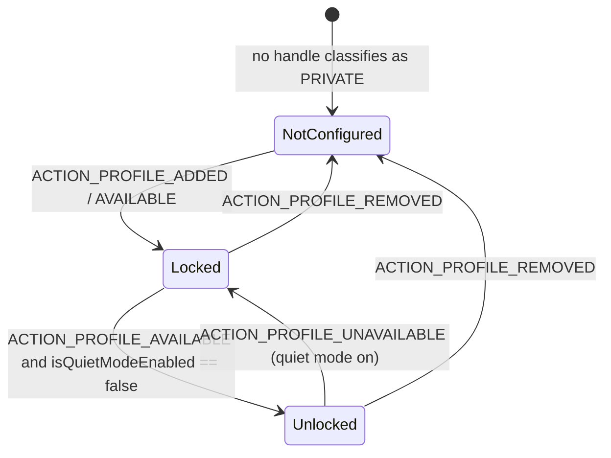

# 11 — Flow: Profiles & Spaces (Work Profile, Private Space, Secure Folder)

Every app Facet shows belongs to a `UserHandle`; Facet classifies handles into `AppProfile`
(`PERSONAL | WORK | PRIVATE | OTHER`) purely for *display* and keys all persistence on the
handle's identity (`userId = handle.hashCode()`). This doc covers how the three "other space"
features are detected, surfaced, launched into, and torn down.

## 1. Classification — one function, reused everywhere

`AppRepository.profileFor(handle)` is the single source of truth; `WorkProfileRepository`,
`PrivateSpaceRepository`, `AppWidgetRepository` and `RepairOrphanedProfileRowsUseCase` all go
through it (or `resolveUserHandle(profile)` / `handlesFor(profile)`). `OTHER` is the safe
fallback: such apps appear in the Personal tab with no badge, never behind a Work tab.

## 2. Work Profile

- **Read-only.** Facet never calls `requestQuietModeEnabled` for Work (its min SDK doesn't grant
  a launcher that API for managed profiles); pausing is done from system Settings and observed.
- **Paused ≠ removed.** `ACTION_MANAGED_PROFILE_UNAVAILABLE` makes the profile's apps vanish from
  `LauncherApps` (so the Work tab empties) but placement rows are kept —
  `CleanUpUninstalledAppsUseCase` only sweeps on `ACTION_MANAGED_PROFILE_REMOVED` with that exact
  `EXTRA_USER` handle ([08 §4](08-flow-placements.md)).
- **Launching** a Work app: `LauncherActivity.launchApp` sees `app.userHandle != myUserHandle()`
  and uses `launcherApps.startMainActivity(component, handle, null, null)` instead of a plain
  `Intent` — the only API that can start an activity in another profile.
- **Badges**: `AppIcon` draws the Work badge from `AppInfo.profile == WORK`.
- Widgets from the Work Profile are enumerated per handle and placed with `profile/userId`
  ([10](10-flow-hub-widgets.md) §1).

## 3. Private Space (Android 15+)

| Piece | Where | Behaviour |
|---|---|---|
| Detection | `PrivateSpaceRepository.observePrivateSpaceState()` — `callbackFlow` over `ACTION_PROFILE_*` (note: `PROFILE_*`, not `MANAGED_PROFILE_*`) mapped through `resolveUserHandle(PRIVATE)` + `isQuietModeEnabled` | emits `PrivateSpaceState.NotConfigured / Locked / Unlocked` |
| Permission | `ACCESS_HIDDEN_PROFILES` in the manifest | without it `getLauncherUserInfo` returns `null` and the space is invisible (classified `OTHER`, but its apps aren't listed anyway) |
| Entry point | Drawer bottom row (`showPrivateSpaceRow = state !is NotConfigured`) in `HomeDrawerRoute` | `Unlocked` → opens `PrivateSpaceScreen`; `Locked` → `drawerViewModel.requestUnlockPrivateSpace()` → `userManager.requestQuietModeEnabled(false, handle)` (system shows the lock UI); state flips to `Unlocked` on the resulting broadcast |
| App list | `PrivateSpaceRepository.observePrivateSpaceApps()` = `appRepository.observeAppsForProfile(PRIVATE)`; `PrivateSpaceViewModel` + `RankBySearchRelevanceUseCase` + `RecentlyInstalledAppsUseCase` + `SettingsRepository` | own screen with its own search and `PrivateSpaceTheme`; also gets its own independent "Recently installed" category, same global `recentlyInstalledPosition` setting as the main Drawer's (including `SHOW_LAST` placement) — see [12-flow-drawer-search-and-app-actions.md §1b](12-flow-drawer-search-and-app-actions.md) |
| Exclusion | `GetInstalledAppsUseCase` filters `profile == PRIVATE` out of both `invoke()` and `observe()` | Private apps never appear in the main drawer, pickers, favorites or dock — by design (Android's own launcher contract) |
| Persistence | none — Private Space apps can't be placed, so no rows carry `profile = PRIVATE` | |

## 4. Samsung Secure Folder

Not a profile Facet can enumerate (Samsung hides it from `LauncherApps`). `SecureFolderRepository`
exposes `launchIntent()` = `packageManager.getLaunchIntentForPackage("com.samsung.knox.securefolder")`
(`null` on non-Samsung devices); `DrawerViewModel` surfaces it as an entry row in the drawer
when non-null. Nothing else in the app knows Secure Folder exists.

## 5. Tear-down and repair (cross-reference)

| Event | Handler | Effect |
|---|---|---|
| Work Profile removed | `CleanUpUninstalledAppsUseCase` via `observeProfileRemoved()` | `removeByUserId(handle.hashCode())` on all five placement/folder repositories |
| Private Space removed | nothing to do | no persisted rows |
| Pre-v20 rows (`userId = -1`) | `RepairOrphanedProfileRowsUseCase` at startup | `backfillUserId` from `handlesFor(profile).singleOrNull()` — ambiguous (two handles in one category) rows stay `-1` and hidden |
| Restore from backup | *(should be)* the same repair — currently missing, see F13 | |
