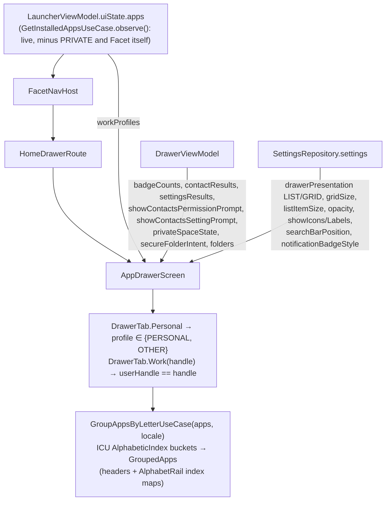
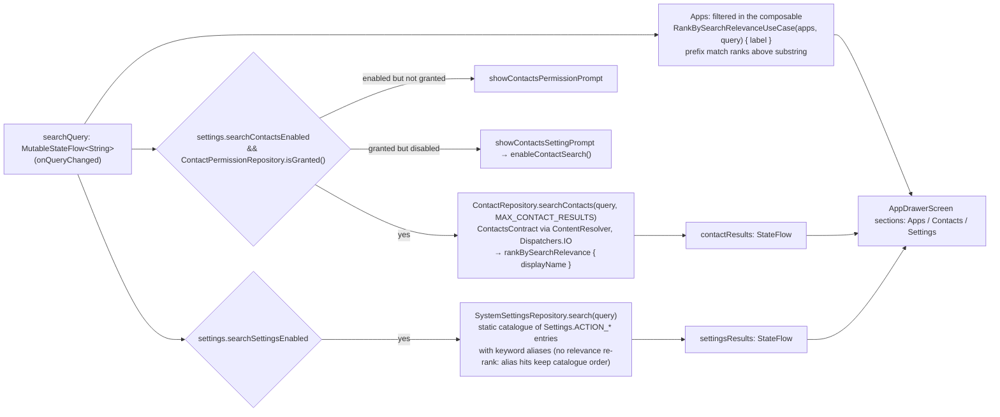

# 12 — Flow: App Drawer — search, tabs, and per-app actions

The drawer is the one surface that fans out to the most repositories (`DrawerViewModel` injects
11 repositories and 9 use cases). Its app list comes from *outside* (`FacetNavHost` passes
`LauncherUiState.apps`); the ViewModel owns search, tabs' supporting data, and every action.

## 1. Data in

## 2. Search pipeline

- Contacts and settings searches are `flatMapLatest` over `(query, enabled)` — a new keystroke
  cancels the in-flight `ContentResolver` query.
- Both prompts are gated by a `MutableStateFlow` "dismissed" flag so they show once per drawer
  session; `contacts_permission_requested` in DataStore records that the system dialog was
  shown at least once.
- Tapping a contact opens `ContactConnectionsSheet`; connections (phone/email/messaging apps
  registered for that contact) are fetched on open via `ContactRepository.getConnections(id)`.

## 3. Per-app actions (long-press → `AppContextMenu`)

| Action | Path | Notes |
|---|---|---|
| Launch | `onAppClick` → `LauncherActivity.launchApp` | other-profile apps via `LauncherApps.startMainActivity` |
| App shortcuts | `DrawerViewModel.getShortcuts(app)` → `AppShortcutRepository.getShortcuts(pkg, handle)` (`LauncherApps.getShortcuts`, `Dispatchers.Default`) → `launchShortcut` | fetched on menu open; profile-aware via the handle |
| Add/remove to Favorites / Dock | `QuickAddState` from `ObserveQuickAddStateUseCase` decides which action is offered; `DrawerViewModel.onFavoritesAction / onDockAction` → the 4 app use cases | routing in [08 §1](08-flow-placements.md) |
| Add to folder / create folder | `DrawerViewModel.createFolder(app, name)`, `addToFolder(app, folderId)` → `FolderRepository` | `folders` observed for the submenu |
| Notification dot/count | `badgeCounts` = `NotificationBadgeRepository.badgeCounts` gated by `notification_dots_enabled` | style from `notification_badge_style` |
| App info | `DrawerViewModel.openAppInfo(app)` → `AppRepository.openAppDetails` (`LauncherApps.startAppDetailsActivity`, profile-aware) | |
| Uninstall | composable fires `Intent(ACTION_DELETE, package:…)` (`REQUEST_DELETE_PACKAGES`) | the system dialog uninstalls; `CleanUpUninstalledAppsUseCase` then deletes any placements |

Folder tiles get the mirror menu (`FolderTileContextMenu`): rename, add/remove from
Favorites/Dock, delete.

## 4. Gestures & routing (why the drawer isn't a nav destination)

`HomeDrawerRoute` owns every follow-finger drag that starts on Home, on one axis at a time
(`Axis` resolution on the first frame):

| Drag on Home | Opens | Reverse gesture closes |
|---|---|---|
| up | Drawer | drag down on the drawer's list, only once scrolled to the top |
| right | Hub | drag left on the Hub |
| left | Facet carousel | drag right on the carousel (empty space or first card) |

Commit happens when the drag has travelled `COMMIT_TRAVEL_FRACTION` of the container *from where
that drag started*; anything short springs back. Because the transition tracks the finger, none
of these can be `NavHost` transitions — Home, Drawer, Hub and Carousel are composed together
under the single `HOME` destination, and the keyboard is dismissed on drawer close
(`KeyboardDismissalTest`). Everything else (settings, pickers, facet settings) is a real
`FacetDestinations` route.
