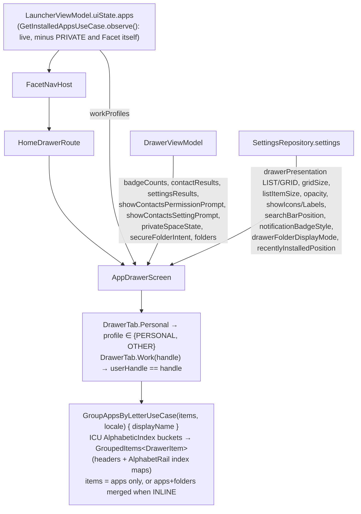
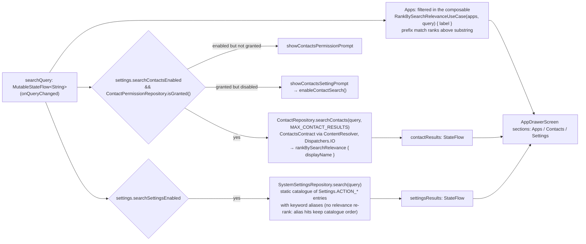

# 12 — Flow: App Drawer — search, tabs, and per-app actions

The drawer is the one surface that fans out to the most repositories (`DrawerViewModel` injects
11 repositories and 9 use cases). Its app list comes from *outside* (`FacetNavHost` passes
`LauncherUiState.apps`); the ViewModel owns search, tabs' supporting data, and every action.

## 1. Data in

### 1a. Folders in the drawer (`DrawerFolderDisplayMode`)

`AppDrawerScreen` wraps every app as `DrawerItem.AppEntry` regardless of mode, so `DrawerListContent`/`DrawerGridContent` render one item type throughout; only `groupedItems`' construction and an optional pinned section vary by mode:

- `DO_NOT_SHOW` (default): folders never render as drawer entries — `groupedItems` is apps-only, exactly the original behavior. Folders stay reachable via Dock/Favorites or `AppContextMenu`'s "Add to folder" row (`folderCandidates`, unaffected by this setting).
- `INLINE`: apps and `folderCandidates` are merged into one list, sorted by name (folders don't arrive pre-sorted the way `apps` does — see chat history for why a naive concatenation before grouping silently breaks interleaving), then grouped together — a folder tile/row sorts under its own leading letter, indistinguishable in position from an app.
- `SHOW_FIRST`/`SHOW_LAST`: `groupedItems` stays apps-only; every folder instead renders in its own pinned section (`drawerFolderSection`/`drawerFolderTiles`) before or after the lettered content — its own "Folders" header in List (Grid renders no headers at all, same as the lettered content).

The alphabet rail (`AlphabetRail`, `LetterJumpZone`) mirrors this: `RailFolderPosition.NONE` for `DO_NOT_SHOW`/`INLINE` (a folder is reachable by its own letter in `INLINE`, same as any app), `TOP`/`BOTTOM` for `SHOW_FIRST`/`SHOW_LAST` — which renders `RailFolderGlyph` as one more rail entry and makes `railSelectionAt` resolve a drag/touch there to `RailSelection.Folders` instead of a letter, scrolling to that section's own start index. `DrawerFolderRow`/`DrawerFolderTile` reuse `FolderTileGlyph`/`FolderContentsSheet`/`FolderTileContextMenu` (rename + Add to Favorites/Dock), mirroring `ui/home/HomeScreen.kt`'s `FolderRow`/`FolderDockIcon`. Search results never include folders — this is browse-mode only.

### 1b. "Recently installed" category (`RecentlyInstalledPosition`)

A single virtual item — not a real `Folder`/`FolderEntity` — positioned by
`LauncherSettings.recentlyInstalledPosition` (global-only `RecentlyInstalledPosition` enum:
`SHOW_FIRST` default, `SHOW_LAST`, or `DO_NOT_SHOW`; Settings → App Drawer → "Recently installed",
a `LabeledDropdownRow` mirroring `DrawerFolderDisplayMode`'s own dropdown). `SHOW_FIRST` places it
above everything, even a `SHOW_FIRST` folder section; `SHOW_LAST` places it below everything, even
a `SHOW_LAST` folder section — each independent of the other (a folder section and the category can
sit at opposite ends, or the same end, with the category always the outermost item at that end).
**List-only**: it has no grid-tile counterpart, so it disappears entirely when
`DrawerPresentation.GRID` is selected (`recentlyInstalledOffset`/`showRecentlyInstalledTrailing` are
both forced false whenever `presentation == GRID`). Computed live via `RecentlyInstalledAppsUseCase`
(`domain/`, pure/stateless — filters `AppInfo.firstInstallTime` within the last 72 hours, sorted
newest-first) over `tabScopedApps`, the *same* tab-filtered source the lettered list uses —
deliberately unlike pinned folders (which are **not** tab-filtered): the Personal tab shows only
Personal recently-installed apps, a Work tab only that profile's. Hidden entirely (not just an empty
state) whenever the computed list is empty or the position is `DO_NOT_SHOW`, so it never occupies a
dead tap target.

**Section header**: an icon-only header (`DrawerRecentlyInstalledHeader`, `RecencyIcon` tinted
`DrawerHeaderTextColor` at `labelSmall`'s font size, no text label) renders directly above the row
— same `header_$letter` treatment as a letter group's own header, minus the label — for both
`SHOW_FIRST` (leading) and `SHOW_LAST` (trailing) placement, in both `DrawerListContent` and
`PrivateSpaceScreen` (`PrivateSpaceRecentlyInstalledHeader`, `onSurfaceVariant` tint). Adds its own
lazy-list slot, so `recentlyInstalledOffset` is `2` (header + row), not `1`.

**Category glyph**: `DrawerRecentlyInstalledRow`'s leading icon is `RecentlyInstalledGlyph` — the
same 12dp-rounded-tile-with-inset-vignette container shape as `FolderTileGlyph`, but with its own
background (`Ink`, not `FolderGlyphBackground`) and icon tint (`InkInverted`) — deliberately
themed opposite to `FolderTileGlyph`'s fixed-dark tile, since `Ink`/`InkInverted` are exact
inverses of each other in both themes so this stays high-contrast in light and dark alike, unlike
a literal-white icon on a theme-invariant dark tile. `RecencyIcon` stands in for `FolderTileGlyph`'s
own folder icon (not a star — see chat history: a star read as generic/unrelated, so the category
glyph instead reuses the same "history" icon as each contained app's own badge, below).

Tapping it opens `FolderContentsSheet` via a synthetic `Folder(id = -1L, name = "Recently
installed", apps = recentlyInstalledApps)` — reused as-is since `Folder`/`FolderTileGlyph`/
`FolderContentsSheet` are plain-data/Room-decoupled at the UI layer (see `13-flow-facets-…md`'s
own note on this same reuse for Home's "look" preview cards). `FolderSheetHeaderAction` gained a
third case, `None`, so the sheet renders with no "Rename" trailing action on this non-editable
virtual folder. `DrawerRecentlyInstalledRow` has no long-press context menu (nothing to
rename/favorite/dock for a virtual item) — just tap-to-open. Each contained app also gets a small
recency badge (`RecencyBadge`, `FolderContentsSheet.kt`) at its icon's bottom-end corner —
`showRecencyBadge: Boolean` on `FolderContentsSheet`/`FolderContentsList`/`FolderContentsAppRow`,
`false` by default so real folders' contents are unaffected. The badge's (and category's) glyph is
a custom `ImageVector` built from a supplied Material Symbols "history" SVG path (`RecencyIcon` in
`FolderContentsSheet.kt`, `internal` for cross-file reuse) rather than
`androidx.compose.material.icons`' own (older, visually different) `History` icon — parsed via
`PathParser().parsePathString(...)`, then shifted into Compose's `[0, viewportHeight]` coordinate
space with a `group(translationY = 960f)` wrapper, since the source SVG's
`viewBox="0 -960 960 960"` has no direct Compose equivalent. The badge renders it as literal white
(`Color.White`, not a theme token) — its background (`IconTile`) is dark in both light and dark
theme, so a theme-aware tint would go dark-on-dark; the category glyph itself uses `InkInverted`
on `Ink` instead (see above), which stays high-contrast without needing a literal color.

**Alphabet rail entry**: `AlphabetRail`/`railSelectionAt` gained a `recentlyInstalledPosition:
RailFolderPosition` param (reusing the same `NONE`/`TOP`/`BOTTOM` type already used for the folder
glyph — mapped from the data-layer `RecentlyInstalledPosition` at the call site, and forced `NONE`
in Grid) and a third `RailSelection` case, `RecentlyInstalled`. Slot ordering in both the rail's
`Layout` and `railSelectionAt`'s touch-to-selection mapping mirrors the list's own render order:
Recently Installed then a `TOP` folder glyph at the top end, a `BOTTOM` folder glyph then Recently
Installed at the bottom end — so the category is always the outermost item at whichever end it's
on. Tapping/dragging onto it scrolls to index `0` when `SHOW_FIRST`, or to the very last index
(after any `SHOW_LAST` folder section) when `SHOW_LAST` — `onRailSelectionChanged`'s
`RailSelection.RecentlyInstalled` branch and `RailSelection.Folders`' `SHOW_LAST` branch now share
a local `afterLetteredContentIndex()` helper for that shared "index right after all lettered
content" computation.

A leading header+row shifts every absolute lazy-list index after it by 2 — `letterIndexOffset`
(used by the alphabet rail's letter-jump) and `onRailSelectionChanged`'s `RailSelection.Folders`
case (`SHOW_FIRST`'s fixed offset and `SHOW_LAST`'s summed index) add a `recentlyInstalledOffset`
(0 or 2, and always 0 in Grid or when the position is `SHOW_LAST`) to stay correct. A trailing
header+row needs no such offset — `DrawerListContent` renders it as the very last two `item`s
instead, gated on `recentlyInstalledPosition == SHOW_LAST`.

**Private Space's own copy**: `PrivateSpaceScreen`/`PrivateSpaceViewModel` get an independent
instance of the same feature — same `RecentlyInstalledAppsUseCase` class and the same global
`recentlyInstalledPosition` setting (including `SHOW_LAST` placement and its own icon-only
`PrivateSpaceRecentlyInstalledHeader`, via a `recentlyInstalledPosition` param on
`PrivateSpaceScreen` deciding whether its own leading/trailing header+row pair renders), but
computed separately over Private Space's own already-isolated app list
(`PrivateSpaceViewModel.recentlyInstalledApps`, a `combine(apps, query, settings)` `StateFlow`,
hidden while `query` is non-blank — mirroring the main Drawer's own search-hides-browse-mode-content
precedent). Not shared state with the main Drawer's version — no alphabet rail there to place it on
either, just the row's own position in its flat `LazyColumn`. The row there
(`PrivateSpaceRecentlyInstalledRow`) is styled through `PrivateSpaceTheme`'s own
`MaterialTheme.colorScheme.*` tokens, like every other Private Space row, not this app's usual
`Accent`/`Ink`, and also gets the sheet's recency badge (`showRecencyBadge = true`).

## 2. Search pipeline

- Contacts and settings searches are `flatMapLatest` over `(query, enabled)` — a new keystroke
  cancels the in-flight `ContentResolver` query.
- Both prompts are gated by a `MutableStateFlow` "dismissed" flag so they show once per drawer
  session; `contacts_permission_requested` in DataStore records that the system dialog was
  shown at least once.
- Tapping a contact opens `ContactConnectionsSheet`; connections (phone/email/messaging apps
  registered for that contact) are fetched on open via `ContactRepository.getConnections(id)`.

## 3. Per-app actions (long-press → `AppContextMenu`)

| Action | Path | Notes |
|---|---|---|
| Launch | `onAppClick` → `LauncherActivity.launchApp` | other-profile apps via `LauncherApps.startMainActivity` |
| App shortcuts | `DrawerViewModel.getShortcuts(app)` → `AppShortcutRepository.getShortcuts(pkg, handle)` (`LauncherApps.getShortcuts`, `Dispatchers.Default`) → `launchShortcut` | fetched on menu open; profile-aware via the handle |
| Add/remove to Favorites / Dock | `QuickAddState` from `ObserveQuickAddStateUseCase` decides which action is offered; `DrawerViewModel.onFavoritesAction / onDockAction` → the 4 app use cases | routing in [08 §1](08-flow-placements.md) |
| Add to folder / create folder | `DrawerViewModel.createFolder(app, name)`, `addToFolder(app, folderId)` → `FolderRepository` | `folders` observed for the submenu |
| Notification dot/count | `badgeCounts` = `NotificationBadgeRepository.badgeCounts` gated by `notification_dots_enabled` | style from `notification_badge_style` |
| App info | `DrawerViewModel.openAppInfo(app)` → `AppRepository.openAppDetails` (`LauncherApps.startAppDetailsActivity`, profile-aware) | |
| Uninstall | composable fires `Intent(ACTION_DELETE, package:…)` (`REQUEST_DELETE_PACKAGES`) | the system dialog uninstalls; `CleanUpUninstalledAppsUseCase` then deletes any placements |

Folder tiles get the mirror menu (`FolderTileContextMenu`): rename, add/remove from
Favorites/Dock, delete.

**Long-press timing:** the menu opens at the long-press threshold itself, not on release. Every
long-press row/tile across Home, Dock, and Drawer (`AppRow`, `SingleAppDockIcon`,
`FolderDockIcon`, `FolderRow`, `DrawerAppRow`, `DrawerFolderRow`, `DrawerGridTile`,
`DrawerFolderTile`) uses `Modifier.longPressReleaseClickable`
(`ui/components/LongPressReleaseGesture.kt`) in place of `combinedClickable` — a
`HapticFeedbackType.LongPress` tick and `menuExpanded = true` fire together the instant the
threshold (the platform default, `ViewConfiguration.getLongPressTimeout()` — 500ms) is met. The
tick is also wired into the Widget Hub's own long-press grab gesture, `WidgetGrabGesture.kt`, so
it's consistent across every long-press surface in the app. A prior version of this gating opened
the menu only on release, as deliberate prep for a future long-press-drag (reorder/merge-to-folder)
feature on these same rows; that feature never landed, and immediate-open-on-threshold is simpler,
so the release gating was removed. If that drag feature is picked up later, this timing will need
revisiting.

## 4. Gestures & routing (why the drawer isn't a nav destination)

`HomeDrawerRoute` owns every follow-finger drag that starts on Home, on one axis at a time
(`Axis` resolution on the first frame):

| Drag on Home | Opens | Reverse gesture closes |
|---|---|---|
| up | Drawer | drag down on the drawer's list, only once scrolled to the top |
| right | Hub | drag left on the Hub |
| left | Facet carousel | drag right on the carousel (empty space or first card) |

A drag locks to an axis only after 16dp of travel (`HOME_SWIPE_SLOP`), and counts as vertical only
if its vertical movement exceeds `VERTICAL_DOMINANCE` (1.2x) the horizontal — anything else is
horizontal. A touch that starts inside the app list's own region is still watched, but only a
horizontal-dominant drag is claimed (so Hub/carousel work over the list); a vertical one is left to the
list's own scroll, which hands leftover drag back via `appListNestedScrollConnection`. The list's bounds reach the route through a `snapshotFlow` in `HomeScreen`, not a `SideEffect` (which would report stale bounds — the layout state is written after layout and read nowhere in composition — so the drawer would claim drags that should scroll the list).

Commit happens when the drag has travelled `COMMIT_TRAVEL_FRACTION` (20%) of the container *from where
that drag started*, or released above `VELOCITY_THRESHOLD_PX` (1500 px/s); anything short springs back.
A downward drag from a closed drawer expands the notification shade on the same terms
(`SWIPE_DOWN_SHADE_FRACTION`, 20% of the height).

Every Home action menu — `AppContextMenu`, `FolderTileContextMenu`, the clock adjust menu and the one-time
"make Facet your home screen" prompt (`SetDefaultLauncherSheet`) — is a `ThemedModalBottomSheet` (`components/`): one themed M3 `ModalBottomSheet`, so the surface runs behind the
system bars and swipe-down and Back dismiss it the same way everywhere. While one is showing, Home's swipes
are off — otherwise the still-down finger that opened the sheet could go on to open the carousel or Hub
behind it. The wrapper calls `BlockHomeSwipesWhileShown()` (`HomeSwipeGate`, provided by
`LauncherActivity` via `LocalHomeSwipeGate`); `HomeDrawerRoute` skips its swipe detector and the app
list's scroll handoff while the gate is non-zero (clock *adjust mode*, with its drag handles and no sheet,
is gated separately on `clockAdjustMode`).
System back is unaffected.

**Adjust mode** (`ClockAdjustMode.ADJUST`, entered from the clock menu) has no sheet: the clock or hosted widget
gets corner resize handles, a full-width height handle (`ClockZoneHandle`, 48dp touch strip), and the
`ClockAdjustToolbar` — an "Alignment" pill with left / center / right. The toolbar sits *below* the height
handle (strip + `CLOCK_ADJUST_TOOLBAR_GAP`), not under the clock: the clock block is pinned only 24dp
(`HOME_CLOCK_MIN_GAP`) above the handle, too little room for it. It writes through
`HomeViewModel.onClockAlignmentCommit`, with the same facet-or-global ownership as height and scale
(`clockPositionOwningFacet`; all three sit behind `overrideClock`) — the Clock & Calendar Style screen writes the same
value. Changing alignment re-clamps an oversized clock through the existing `clockAlignment`-keyed effect. The
toolbar dims to 25% and its options are disabled while any handle or resize drag is active, and becomes usable again
~200ms after release, so a thumb coming off the handle can't tap it (it stays composed, so it doesn't pop in and out).
It swallows taps on its own surface even when disabled, because Home's root exits adjust mode on any tap that reaches
it unconsumed (empty space); there is no Done button — tapping the clock or empty space, Back and Home all exit.

**Pressing Home** (`LauncherActivity.onNewIntent` → `LauncherViewModel.homePressedEvent`) collapses
everything back to bare Home, where Back only peels off the top layer. `HomeDrawerRoute`'s collector clears
focus, resets the clock adjust sheet and the clock widget picker, and closes the Drawer, Hub and carousel
axes — each close in its own `launch`, never inline: a drag landing on the same `Animatable` throws a
`CancellationException`, and inline that escaped `collect` and unsubscribed the collector for good, so
Home silently stopped working until the app restarted (`HomeDrawerRouteTest`). Every sheet, dialog and
overlay that composes its own state subscribes with `DismissOnHomePress` — `ThemedModalBottomSheet` does it
for every action menu and for the facet automation rule editor (a settings sheet, so a Home press while it is
open closes it and drops the draft), and `FolderContentsSheet` and the contact connections sheet call it
directly; a new one must do the same.
Samsung's swipe-up gesture injects `KEYCODE_HOME` itself, so it reaches this path exactly like the button.

Because the transition tracks the finger, none
of these can be `NavHost` transitions — Home, Drawer, Hub and Carousel are composed together
under the single `HOME` destination, and the keyboard is dismissed on drawer close
(`KeyboardDismissalTest`). Everything else (settings, pickers, facet settings) is a real
`FacetDestinations` route.
