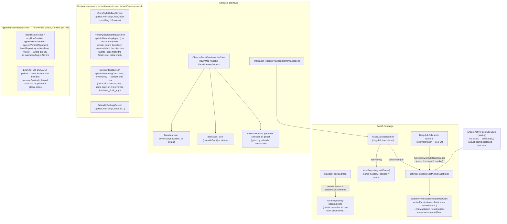
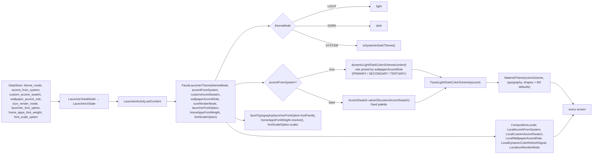
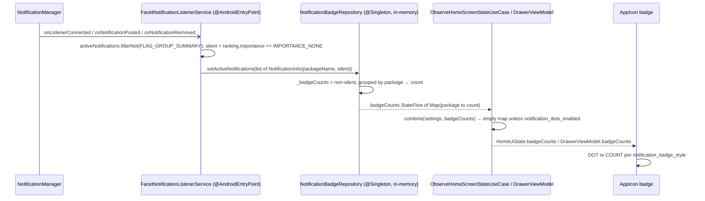
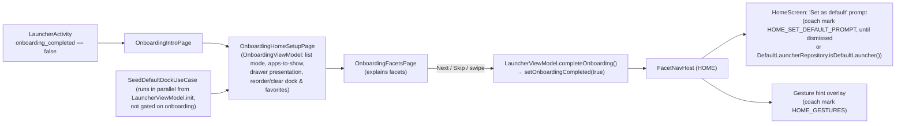

# 13 — Flows: Facets, Theme resolution, Notification badges, Onboarding

Four smaller flows that don't fit the earlier docs but are load-bearing for how Home looks.

## 1. Facets — create, switch, preview, override

A *facet* is a named Home configuration (`facets` row). Exactly one is active
(`active_facet_id` in DataStore). Each facet can inherit every setting from the global DataStore
defaults or override a whole block at a time.

- **`FacetSettingsScreen` is a plain nav list** — a Rename row plus one "HOME & APPS" card with
  Apps list / Dock / Appearance / Clock style / Calendars rows, mirroring `SettingsScreen`'s own
  layout. It no longer hosts any Inherit/Override switch itself; each destination screen owns its
  own (`InheritOverrideCard`, `controlsEnabled = !isFacetScoped || isOverriding`) so the toggle
  sits on the same screen as the controls it gates, and `setOverriding*` calls now live in that
  destination's own ViewModel rather than `FacetSettingsViewModel`. The "Appearance" row is the one
  exception — it navigates to `AppearanceSettingsScreen` (dual-mode, `facetId?`), which has no
  switch of its own (see the `LOOK` subgraph above).
- **`AppearanceSettingsScreen` is three separate cards**, not one — "DOCK & HOME" (the four
  `LOOK` fields above, always shown), then (global mode only) "CLOCK" (just the Clock style nav
  row) and "GENERAL" (theme/accent/icons/launcher font/app label color/size/weight). Row titles:
  `dockDisplayMode` → "Show Dock apps as", `appRowPosition` → "Home Apps Alignment",
  `appRowPresentation` → "Show Home apps as", `appListVerticalAlignment` → "Home Apps list
  position". Its preview card (`AppearancePreviewCard`) is scaled to a fraction of the real screen
  and density-scaled to match — the same technique `FacetCarouselScreen`'s own `FacetPreviewPage`
  uses for its carousel cards (`CAROUSEL_CARD_SCALE`/`APPEARANCE_PREVIEW_CARD_SCALE`, both `0.55f`)
  — reimplemented independently rather than shared, so a change to one can't regress the other.
  The calendar preview lives here now too (via `ClockBlock`'s own bundled `CalendarEventsBlock`),
  not on `ClockStyleGalleryScreen` — that screen dropped its own calendar-preview block entirely
  (see chat history). The preview's `favorites`/`dockItems`/`calendarEvents` are this scope's real,
  live content, not sampled installed apps or fixed sample events: `AppearanceSettingsViewModel`
  combines `FavoriteAppRepository`/`DefaultFavoriteAppRepository` and `FacetDockAppRepository`/
  `DockAppRepository`, resolved facet-or-global via `effectiveFavorites`/`effectiveDockItems`
  (`if (facet?.overrideApps == true) facetFavorites else globalFavorites`, same for dock) —
  identical to `HomeAppsListSettingsViewModel`/`DockSettingsViewModel`'s own resolution. Calendar
  events come from `CalendarRepository.getTodayEvents`, gated by `CalendarPermissionRepository
  .isGranted()` (empty when ungranted, never a sample fallback), with facet-or-global
  `showAllDayEvents`/`selectedCalendarIds` resolved the same way `ObserveHomeScreenStateUseCase`
  resolves them. The clock uses its own real system-default `Clock`, not a fixed reference instant.
- **Switching is one DataStore write.** Everything downstream is reactive:
  `ObserveHomeScreenStateUseCase` recomputes `activeFacet` from `combine(settings, facets)` and
  `flatMapLatest` tears down the previous facet's Room subscriptions.
- **Turning an override on copies the inherited list** (`replaceItems(facetId, defaultItems)`)
  so the card never goes blank — the per-facet table becomes an independent copy from that moment.
- **Turning it off does not delete the facet's rows**; they're just ignored until the flag is set
  again (and are still exported by backup).
- `FacetCarouselViewModel` exposes 14 `xxx(facetId)` resolvers that apply `resolveOverride` per
  facet so each card renders with its own effective clock/apps/dock styling (down from 18 before
  calendar/appearance styling consolidation removed the four calendar-specific resolvers).

## 2. Theme resolution — from DataStore to `MaterialTheme`

- The Activity renders an empty `Box` until `LauncherUiState.isLoading` clears, precisely so the
  first frame is never painted with default theme values that then flip.
- `LocalDynamicColorRefreshSignal` is bumped when the wallpaper changes so Material You colours
  re-resolve without a restart.
- Clock/app-label colours are *not* the M3 scheme directly: `ClockColorOption`
  (`THEME` / `ACCENT_PRIMARY` / …) resolves through `ui/theme/ClockColors.kt` against the current
  scheme. Clock's own colour is per-facet (`facets.clockColorOption`); the app-label colour
  (`app_label_color_option`) is global only.
- `ClockTemplates.kt`'s `NegativePanelTemplate` fills its panel with the resolved clock colour
  itself, so its digits/meridiem/accessory row can't reuse that same colour as their own — they're
  knocked out via `ui/theme/Color.kt`'s `contentColorFor(panelBackground)`, which derives the
  on-panel content colour from the panel's own luminance rather than a fixed `Surface` read. This
  is what makes the panel and its content flip together across `THEME`/`THEME_INVERTED` (a fixed
  `Surface` read stayed legible for one and went low-contrast for the other, since `THEME_INVERTED`
  deliberately lands the panel on `Surface`'s own end of the scale).
- Per-facet Private Space screens use `PrivateSpaceTheme`, a fixed override of the scheme.
- `facetTypography`'s `fontScale` multiplies every role's `fontSize`/`lineHeight` app-wide except
  the clock (`FacetType.clock`, defined outside `facetTypography`); `fontWeight` only overrides
  `bodyLarge`/`bodyMedium`/`bodySmall` — not `title*`/`label*`/`headline*`/`display*`, so dialog
  titles (`ConfirmDialog`/`RenameDialog`), context menus, and onboarding copy keep Material's own
  per-role weight rather than flattening app-wide. Home's own app-list/Dock labels apply
  `homeAppsFontWeight` a second time via their own explicit `.copy(fontWeight = ...)` (unchanged
  from before this reached `facetTypography`) — redundant with the global value but harmless, and
  what lets a `titleMedium`-styled label pick up the weight that body-only roles don't reach.
- **The calendar events strip is a direct consumer of this same resolved output, not a separate
  theming path**: `CalendarEventsBlock` (rendered inside `ClockBlock`) takes `launcherFontOption`
  (this section's own `launcher_font_option`, via `.fontFamily`), `homeAppsFontWeight` (via
  `.resolve()`), and `appLabelColorOption` (via `.resolve()`) straight from the same three
  DataStore keys shown above, plus `clockAlignment` (Room, per-facet) for its position — it has no
  design fields or theming path of its own any more (see chat history: calendar/appearance styling
  consolidation, which removed `calendarFontOption`/`calendarColorOption`/`calendarFontWeight`/
  `calendarAlignment`).

## 3. Notification badges

- Access is user-granted in system Settings; `NotificationAccessRepository.isGranted()` is read
  live, and `NotificationAccessExplanationScreen` explains the permission before deep-linking.
- Nothing about notifications is persisted; the map is rebuilt on every listener callback and is
  empty until the service connects after process start.
- Badge counts are keyed by package only — a Work-profile app shares its badge with the personal
  copy (the service can't see the profile of a notification without extra plumbing).

## 4. Onboarding & first run

- Onboarding is outside the nav graph (a top-level `when` branch in `LauncherActivity`), so Back
  can never pop into it and it never appears on the back stack.
- The dock the user sees on the setup page is already seeded — `SeedDefaultDockUseCase` runs at
  first launch regardless of onboarding, keyed on `defaults_seeded`.
- "Set as default launcher" is a system action (`DefaultLauncherRepository.requestDefaultLauncherIntent()`
  → `RoleManager` request); Facet only prompts, and stops prompting once
  `isDefaultLauncher()` is true or the coach mark is dismissed.
