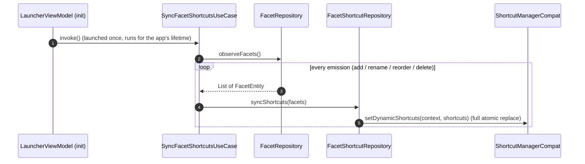
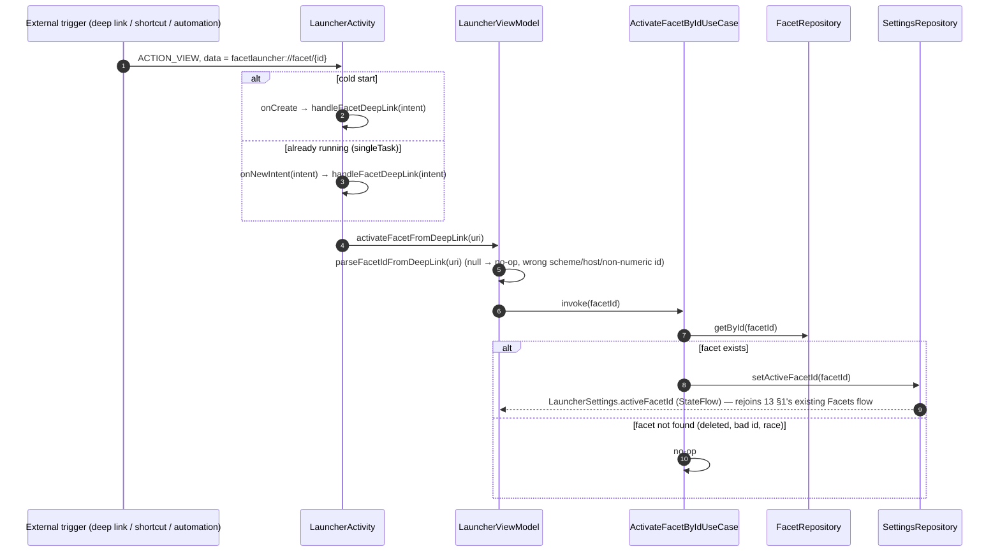

# 14 — Flow: Facet Deep Links & Dynamic Shortcuts

Lets an outside caller — another app, an automation tool (Samsung Modes & Routines, Tasker), or a
future in-app scheduler — switch the active facet without opening Facet's own UI first. Two
independent entry points feed one shared ingestion path; from there it rejoins the existing Facets
flow ([13 §1](13-flow-facets-theme-notifications-onboarding.md)) with no separate propagation
mechanism of its own.

## 1. Shortcut sync — kept in lockstep with `FacetRepository`

- **One `ShortcutInfoCompat` per facet**, id `"facet_<id>"`, `shortLabel`/`longLabel` =
  `"Switch to <facet's live name>"`, `rank` = facet position, launch intent = explicit `ACTION_VIEW`
  to `LauncherActivity` with `data = buildFacetDeepLinkUri(facet.id)`.
- **Display name and trigger key are different fields, never conflated.** What the OS picker shows
  is the label (`"Switch to <facet.name>"` — reads as an action, since that's how it appears listed
  alongside other apps' shortcuts in an automation picker); what actually fires the switch is the
  id, carried in the shortcut's own id string and the launch intent's `Uri` — never the name.
  Renaming a facet changes the label on the next sync without changing the shortcut id or its
  trigger `Uri`, so an already-configured automation rule keeps working and just shows the new name.
- **Full replace, not a diff.** `setDynamicShortcuts` republishes the entire set every emission
  rather than hand-rolled add/update/remove — simpler, and it can't drift from `FacetRepository`'s
  actual state. `FacetRepository.MAX_FACETS` (3) is well under `ShortcutManagerCompat`'s
  per-activity cap, so no eviction logic is needed.

## 2. Ingestion — deep link or shortcut, one shared path

- **Identifier = the facet's Room `id`, never its name.** Names can be renamed or (rare, but
  possible transiently) duplicated; the id is what `FacetRepository`/`SettingsRepository` already
  key on everywhere else in the app.
- **Manifest**: `LauncherActivity` carries a second `<intent-filter>` (`ACTION_VIEW`,
  `CATEGORY_DEFAULT`, `data android:scheme="facetlauncher" android:host="facet"`), alongside its
  existing `HOME` one — this is what lets an arbitrary external `Intent` (not just our own
  shortcuts, which target it explicitly by `ComponentName` regardless of any filter) reach the
  launcher.
- **No-op on an unknown/deleted facet id**, by design — `ActivateFacetByIdUseCase` checks
  `FacetRepository.getById` first, so a stale shortcut for a since-deleted facet, a hand-typed bad
  id, or a race with a delete does nothing rather than crashing or silently creating a facet.
- **A shortcut or deep-link switch is a manual switch.** `ActivateFacetByIdUseCase` defaults to
  `FacetSwitchSource.MANUAL`: the chosen facet becomes the facet-automation baseline and every rule
  active at that moment is suppressed until it ends, so an external automation app wins over the
  built-in rules ([02 §5.7](02-persistence-room.md)). Only the automation evaluator passes
  `FacetSwitchSource.AUTOMATION`, which changes the active facet and nothing else.
- **No new reactive plumbing.** Once `setActiveFacetId` is called, the switch propagates exactly the
  way `FacetCarouselViewModel.selectFacet` already does — [13 §1](13-flow-facets-theme-notifications-onboarding.md)'s
  `S1 → HOME` arrow — through `LauncherSettings.activeFacetId`'s `StateFlow` into
  `ObserveHomeScreenStateUseCase`/`HomeViewModel` and out to Compose.
- **Scheduled timers** (a future launcher-side scheduler) are out of scope here, but need no new
  entry point when built — a `WorkManager` job (or similar) can call `ActivateFacetByIdUseCase`
  directly, in-process, without round-tripping through an `Intent` at all.

## Where this lives

| Concern | File |
|---|---|
| Deep link `Uri` format (build + parse) | `data/model/FacetDeepLink.kt` |
| Shortcut publishing | `data/FacetShortcutRepository.kt` |
| Live shortcut/`FacetRepository` sync | `domain/SyncFacetShortcutsUseCase.kt` |
| Facet activation by id, with the no-op guard | `domain/ActivateFacetByIdUseCase.kt` |
| Manifest intent-filter + cold/warm-start ingestion | `AndroidManifest.xml`, `LauncherActivity.kt` |
| ViewModel entry point | `ui/launcher/LauncherViewModel.kt` (`activateFacetFromDeepLink`) |
