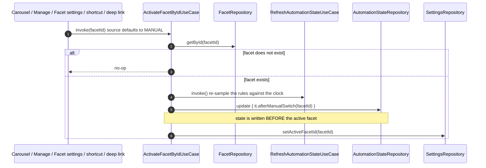
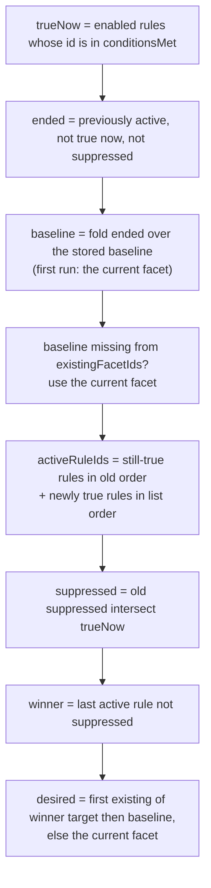
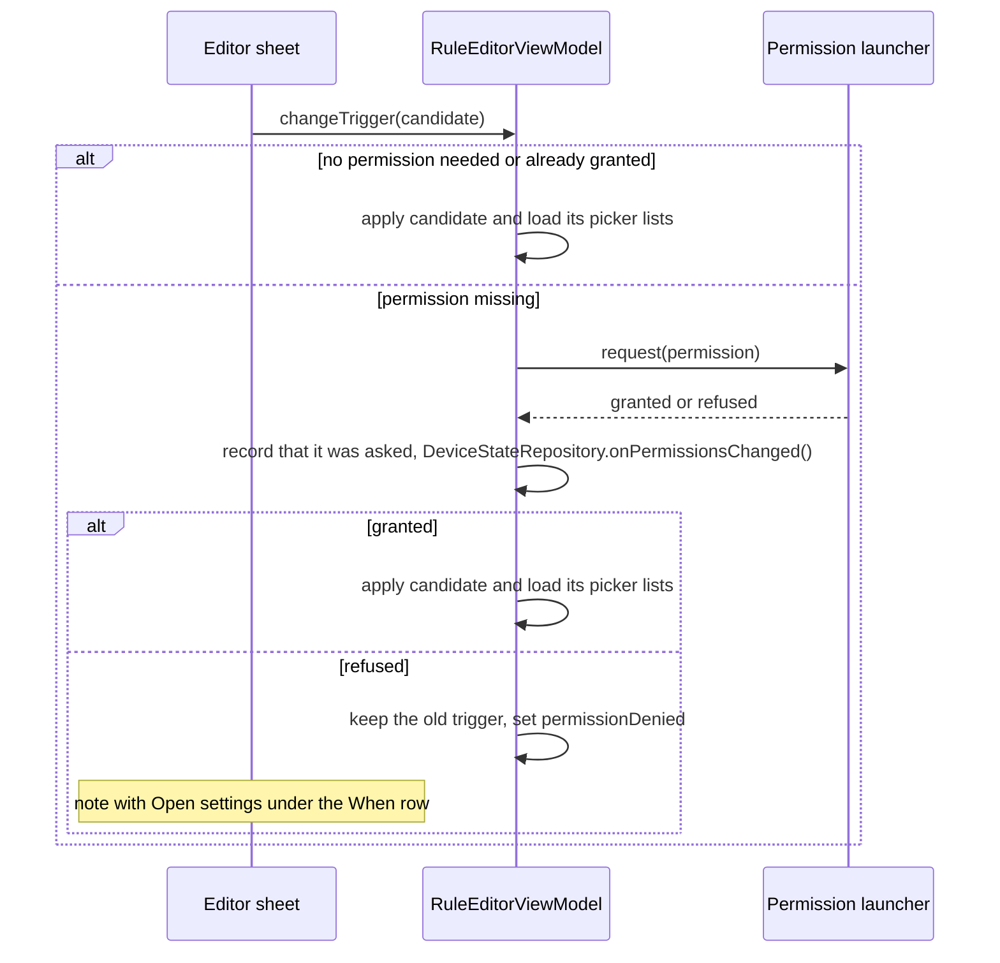
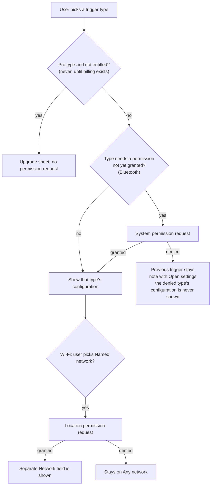

# 15 — Flow: Facet Automation (rules that switch the active facet)

How Facet switches the active facet on its own: a user defines **rules** ("on weekdays 9:00–18:00 show
Work"), and a pure evaluator decides which facet should be showing from the rules that currently hold,
the user's own choices, and a small persisted state. This doc describes the framework: the concepts, the
state model, the evaluation algorithm, the layers, and the invariants. Switching mechanics themselves
(`ActivateFacetByIdUseCase` → `setActiveFacetId` → Home) are in [13 §1](13-flow-facets-theme-notifications-onboarding.md)
and [14](14-flow-deep-links-and-shortcuts.md); persistence is in [02 §5.7](02-persistence-room.md).

> **Status.** This doc mixes what is built with what is designed but not yet built. Every section is
> labelled. The design source is `IMPLEMENTATION_PLAN.md` ("Facet automation rules") and the mockups in
> `Android launcher design planning/design_handoff_minimal_launcher/facet-automation.html`.

| Phase | Piece | Status |
|---|---|---|
| 1 | `EvaluateFacetAutomationUseCase`, `AutomationRule`, `RuleEndBehavior`, `AutomationState` | **Built**, unit-tested |
| 2 | `FacetSwitchSource`, manual-switch recording in `ActivateFacetByIdUseCase`, `AutomationStateRepository` | **Built**, unit-tested |
| 3 | `automation_rules` table (DB v26), `AutomationRuleDao`, `AutomationRuleRepository`, `AutomationTrigger`, `trigger` on `AutomationRule` | **Built**, unit-tested, migration tested on an emulator |
| 4 | Schedule truth, `WakeEventsRepository`, `RefreshAutomationStateUseCase`, `ApplyFacetAutomationUseCase`, `RunFacetAutomationUseCase` started from `LauncherViewModel.init`, and the manual-switch re-sample | **Built**, unit-tested, and the touched screens' instrumented tests run on an emulator |
| 5 | `DeviceState` and every trigger's truth (`isMetBy`), the Bluetooth, Wi-Fi, headphones and battery sources, `DeviceStateRepository`, `AutomationPermissionRepository`, the manifest permissions, and the picker lists | **Built**, unit-tested (Robolectric shadows for the Android glue); smoke-run on an emulator |
| 6 | `FacetAutomationScreen` (list, status line, shortcuts note), the rule editor sheet (schedule and all four device editors), the permission gate, unavailable-rule rows, the Settings entry row | **Built**, unit and emulator tested (§5d). The trigger picker is a dropdown in the editor, not a separate sheet; locked Pro rows come with phase 7 |
| 7 | `EntitlementRepository` (the one Pro seam, constant `true` until billing), `CanUseTriggerUseCase`, `SaveAutomationRuleUseCase`, the entitlement filter in `RefreshAutomationStateUseCase`, and the Pro states in the UI: pills, upgrade sheet, paused rows, free-plan strip (§5d, §6) | **Built**, unit and emulator tested. The upgrade sheet only explains; the purchase action and the 3→10 facet cap belong to the billing plan |

## 1. Concepts

| Term | Meaning |
|---|---|
| **Rule** | Target facet + trigger + end behavior + enabled flag. One trigger per rule; no AND/OR. |
| **Condition met** | The rule's trigger currently holds *and* the rule is usable (entitled, permission granted). The evaluator receives these as a set of rule ids. |
| **True rule** | An enabled rule whose id is in that set. Disabled rules are never true. |
| **End behavior** | What happens when a rule stops being true: `ReturnToBaseline` (default), `SwitchTo(facet)`, or `Stay`. |
| **Baseline** | The facet the user last chose by hand — what the launcher returns to when no rule applies. |
| **Active rules** | The last evaluated list of true rules, in activation order. The most recent non-suppressed one decides the facet. |
| **Suppressed rule** | An active rule the user overrode by hand. It is ignored until it stops being true. |
| **Manual switch** | Any switch not made by the evaluator: carousel, Manage facets, Facet settings "Apply", a shortcut, a deep link. |

The model in one sentence: **the baseline is the user's choice, the true rules are an overlay on top of
it, and a manual switch always wins over whatever overlay is active at that moment.**

## 2. Layers and components

Blue boxes are built; grey dashed boxes are planned (nothing is planned inside this framework any more; billing is a separate plan).

```mermaid
flowchart TB
    subgraph UI["ui/"]
        AUTO["FacetAutomationScreen\nFacetAutomationViewModel"]:::built
        EDIT["Rule editor sheet\nRuleEditorViewModel"]:::built
        SW["Carousel / Manage facets / Facet settings"]
    end
    subgraph DOM["domain/"]
        EVAL["EvaluateFacetAutomationUseCase\npure function"]:::built
        ACT["ActivateFacetByIdUseCase\nsource = MANUAL or AUTOMATION"]:::built
        CAN["CanUseTriggerUseCase\nPro gate"]:::built
        SAVE["SaveAutomationRuleUseCase\nPro gate then save"]:::built
        OBS["ObserveFacetAutomationUseCase\nrows, status, availability"]:::built
        REF["RefreshAutomationStateUseCase\nsample rules, persist state"]:::built
        APPLY["ApplyFacetAutomationUseCase\none pass"]:::built
        RUN["RunFacetAutomationUseCase\ncollector started by LauncherViewModel"]:::built
    end
    subgraph DATA["data/"]
        RR["AutomationRuleRepository\nRoom rules"]:::built
        SR["AutomationStateRepository\nDataStore facet_automation"]:::built
        WAKE["WakeEventsRepository\nscreen on, unlock, clock change"]:::built
        DEV["DeviceStateRepository\nbattery, headphones, Wi-Fi, Bluetooth"]:::built
        PERM["AutomationPermissionRepository\nBLUETOOTH_CONNECT, location"]:::built
        SET["SettingsRepository\nactive facet id"]
        ENT["EntitlementRepository\nisPro, constant true until billing"]:::built
    end
    SW --> ACT
    AUTO --> OBS
    AUTO --> RR
    EDIT --> RR
    EDIT --> PERM
    EDIT --> DEV
    RUN --> APPLY
    RUN --> WAKE
    RUN --> RR
    APPLY --> REF
    APPLY -- "AUTOMATION" --> ACT
    REF --> EVAL
    REF --> RR
    REF --> SR
    REF --> DEV
    REF --> PERM
    RUN --> DEV
    OBS --> RR
    OBS --> SR
    OBS --> PERM
    REF --> CAN
    REF --> ENT
    RUN --> ENT
    OBS --> CAN
    OBS --> ENT
    EDIT --> SAVE
    SAVE --> CAN
    SAVE --> RR
    EDIT --> ENT
    ACT -- "MANUAL: re-sample first" --> REF
    ACT -- "MANUAL: afterManualSwitch" --> SR
    ACT --> SET
    classDef built fill:#dbeafe,stroke:#2563eb,color:#0b1b3f
    classDef planned fill:#f3f4f6,stroke:#9ca3af,stroke-dasharray: 4 3,color:#374151
```

Layering follows `CLAUDE.md`: composables talk only to ViewModels; the evaluator is a `domain/` use
case with no Android dependencies; repositories own all DataStore and Room access.

## 3. State model (built)

`AutomationState` (`data/model/AutomationState.kt`) is the only state the framework keeps. It is
persisted by `AutomationStateRepository` in its own DataStore file, `facet_automation`.

| Field | Type | Role |
|---|---|---|
| `baselineFacetId` | `Long?` | The user's last manual choice. `null` until the first evaluation, which adopts the facet showing at that moment. |
| `activeRuleIds` | `List<Long>` | Last evaluated true rules, oldest activation first. Used to detect start/end transitions and to pick the winner (the last element). |
| `suppressedRuleIds` | `Set<Long>` | Active rules the user overrode. Always a subset of the true rules. |

`AutomationRule` (`data/model/AutomationRule.kt`) carries `id` (0 until saved), `targetFacetId`,
`trigger`, `endBehavior` and `enabled`. The trigger is evaluated outside the evaluator and arrives only
as "this id's condition is met"; the evaluator never reads it.

`AutomationTrigger` (`data/model/AutomationTrigger.kt`) is a sealed interface:

| Variant | Parameters |
|---|---|
| `Schedule` | `days: Set<DayOfWeek>`, `startMinute`, `endMinute` (minutes since midnight; see §3b for the exact window semantics) |
| `Bluetooth` | `deviceAddress`, `deviceName`, `negated` |
| `Wifi` | `ssid` (null = any network), `negated` |
| `Headphones` | `negated` |
| `Battery` | `whileCharging` (false = "Not charging"), required `level: BatteryLevelCondition`; `isMetBy(charging, levelPercent)` |

`BatteryLevelCondition` is `direction` (`BELOW` / `ABOVE`) plus `thresholdPercent`. `negated` on the other
device triggers means "while not connected / plugged in".

**Battery is a charging state plus a level, and the level works in both states.** The editor offers
Charging or Not charging, then Below or Above with a threshold slider. The level is always required, so
there are four combinations: not charging below, not charging above, charging below, charging above (for
example "not charging, below 20%" or "charging, above 80%"). A plain "when charging" rule with no level
is therefore not expressible; the closest are "charging, below 100%" (charging and not yet full) and
"charging, above 5%". Levels are **strict**: below 20% means 19% and under, below 5% means 1–4%, below
100% means "not full", and above 80% means 81% and over. The slider has 5% stops, 5–100% for Below and
5–95% for Above, because nothing is above 100%. `Battery.isMetBy(charging, levelPercent)` is true when
the charging state matches and the level satisfies the condition. In storage it is one row type,
`BATTERY`, with the existing `negated` (Not charging), `batteryThreshold` and `batteryDirection` columns;
a battery row missing a threshold or a known direction is skipped on read.

## 3a. Rule storage (built)

Rules live in the Room table `automation_rules` ([02 §1](02-persistence-room.md), DB v26), behind
`AutomationRuleRepository`, which maps rows to `AutomationRule`.

- **Flat columns, strings for the enums.** The trigger and end behavior are stored as plain strings
  with one set of parameter columns per trigger type (`scheduleDays` is a Monday-is-bit-0 bitmask).
  That avoids a `Converters` entry per enum, and `AutomationRuleMapping` parses leniently: a row with
  an unknown `triggerType`, or a missing required parameter, is **skipped**, not a crash.
- **Order is meaning.** `ORDER BY position, id` is both the list order in the UI and the evaluator's
  tie-break for rules that start together (the later one wins). `save()` inserts at the end and
  updates in place without moving the rule.
- **Two foreign keys to `facets`.** `targetFacetId` is `CASCADE`: deleting a facet deletes the rules
  that target it. `endFacetId` is `SET NULL`: deleting a "switch to" facet leaves the rule and the
  mapper degrades it to `ReturnToBaseline`.
- **Not in backups.** Import deletes all facets first, so the cascade removes every rule on restore;
  see [02 §6](02-persistence-room.md).

## 3b. Schedule semantics and validation (built)

`AutomationTrigger.Schedule.isActiveAt(at: LocalDateTime)` is the one definition of when a schedule is
true. It works to the minute:

- The **start minute is active from its first second**, and the **end minute through its last second**.
  A 9:00–18:00 schedule is active from 9:00:00 until 18:00:59, and inactive at 18:01:00.
- **`start == end` is valid and is exactly one minute**: 9:00–9:00 is active 9:00:00–9:00:59.
- **An end before the start runs overnight and belongs to the day it starts on.** Friday 22:00–06:00
  covers Friday from 22:00 and Saturday until 06:00:59, but not Saturday evening, and Sunday 22:00–06:00
  reaches into Monday.
- **A schedule with no days is never active.**
- The whole day is `0`–`1439` (00:00 to 23:59).

Validation is a pure check, `AutomationRule.validationErrors()` (`data/model/AutomationRuleValidation.kt`),
shared by the repository and the editor. It rejects:

| Error | Rule |
|---|---|
| `NO_SCHEDULE_DAYS` | A schedule with no days selected |
| `INVALID_SCHEDULE_MINUTE` | A schedule start or end outside 0..1439 |
| `BLANK_WIFI_NETWORK` | A named Wi-Fi network that is blank (a null name means "Any network" and is fine) |
| `NO_BLUETOOTH_DEVICE` | A Bluetooth rule whose device address or name is blank (a device is only ever picked from the paired list, and a nameless device is stored with its address as the name) |
| `INVALID_BATTERY_THRESHOLD` | A battery threshold that isn't one of the slider's stops for its direction: 5–100% for Below, 5–95% for Above, in 5% steps |

`AutomationRuleRepository.save()` returns one of three results and writes nothing unless it is `Saved`:

| Result | Meaning |
|---|---|
| `Saved(id)` | Inserted at the end of the list, or updated in place keeping its position |
| `Invalid(errors)` | The rule failed one of the checks above |
| `FacetMissing` | The target facet, or a "switch to" facet, no longer exists. A no-op, never an exception |

So a bad rule cannot be stored whatever calls it. Headphones has nothing to validate.
There are deliberately **no format or length checks** on Bluetooth addresses or network names, because
the user never types them: devices come from the paired list and networks from the current connection
and the latest scan. The consequence is that a Wi-Fi network can only be chosen while it is in range,
since Android does not expose a user's saved networks to apps. Duplicate rules, and a "switch to" ending
that points at the rule's own target facet, are allowed.

**Run-time counterpart of `FacetMissing`.** A switch to a deleted facet is also a no-op when it happens:
`ActivateFacetByIdUseCase` ignores an id that doesn't resolve (for the `AUTOMATION` source too), the
evaluator only ever picks a facet from `existingFacetIds`, and a stored "switch to" ending whose facet was
deleted is turned into `ReturnToBaseline` by the foreign key and the mapper.

### Rule limit (built and enforced)

`AutomationLimits.FREE_MAX_RULES = 2`, with `canAddRule(savedRuleCount, isPro)`. Every saved rule counts,
enabled or not, and editing an existing rule is never "adding". Pro has no cap yet. The repository does
not enforce it, because it knows nothing about entitlement: `SaveAutomationRuleUseCase` does (§6), and
"Add rule" opens the upgrade sheet at the limit.

## 4. Switch sources and the manual-wins rule (built)

Every user-initiated switch goes through `ActivateFacetByIdUseCase`, the single choke point:

- **MANUAL** (the default): the rules are re-sampled first, then `afterManualSwitch` sets
  `baselineFacetId = facetId` and `suppressedRuleIds = activeRuleIds.toSet()` — every rule active right
  now is overridden.
- **Why re-sample first.** Evaluation is lazy, so a rule can be true without having been observed yet
  (a schedule started while Home stayed visible). Without the re-sample it would not be suppressed, and
  the next evaluation would override the user's choice. Re-sampling closes that gap for every trigger.
- **AUTOMATION** (only the evaluator's runner passes it): changes the active facet and nothing else.
- **State is written first.** If an evaluation runs between the two writes it sees the override and
  settles on the user's facet; the other order could let it switch back to a stale rule target.
- **Shortcuts and deep links count as manual**, so an external automation app (Tasker, Samsung Modes
  and Routines) wins over the built-in rules. A *different* rule that becomes true later still applies;
  suppression covers only rules that were already active.
- **Deliberately not manual:** the two delete-the-active-facet fallbacks, `EnsureActiveFacetUseCase`
  (startup) and `ImportBackupUseCase` call `SettingsRepository.setActiveFacetId` directly. They repair
  state rather than express a choice; the evaluator tolerates the stale baseline this can leave.

## 5. The evaluator (built)

`EvaluateFacetAutomationUseCase.invoke(rules, conditionsMet, state, currentFacetId, existingFacetIds)`
returns `AutomationEvaluation(desiredFacetId, state)`. It is **level-based**: each call recomputes the
desired facet from the current truth, using the previous state only to detect which rules just started
or ended. The caller switches facets (as `AUTOMATION`) when `desiredFacetId != currentFacetId` and
persists the returned state.

End behavior is applied per ended rule, in activation order, to the running baseline:

| End behavior | Effect on the baseline |
|---|---|
| `ReturnToBaseline` | none — the facet falls back to the baseline |
| `SwitchTo(x)` | baseline becomes `x` if `x` still exists, otherwise unchanged |
| `Stay` | baseline becomes the facet showing now |
| rule deleted while active | treated as `ReturnToBaseline` |

A **suppressed** rule skips its end behavior entirely: the user already chose, so their facet stands.

### Worked timeline

Work rule weekdays 9:00–18:00 (target Work, `ReturnToBaseline`), baseline Personal:

| Time | Event | Shown | State after |
|---|---|---|---|
| 8:55 | evaluation, nothing true | Personal | baseline Personal |
| 9:02 | screen on, rule true | Work | active [Work rule] |
| 11:00 | user opens Travel | Travel | baseline Travel, suppressed {Work rule} |
| 11:05 | screen on, rule still true | Travel | unchanged (rule suppressed) |
| 18:05 | screen on, rule false | Travel | suppression cleared, end behavior skipped |
| next day 9:01 | rule true again | Work | active [Work rule] |

With no manual switch at 11:00, the 18:05 evaluation would return to Personal. With two rules
(Work, then Car over Bluetooth), the later activation wins, and when it ends the earlier one — if still
true — is shown again; this is why evaluation is level-based and not edge-triggered.

## 5b. The runner (built)

`RunFacetAutomationUseCase` is a long-running collector launched once from `LauncherViewModel.init`
([03 §4](03-reactive-data-flow.md)), passing in `homePressedEvent`. It merges four triggers and runs one
`ApplyFacetAutomationUseCase` pass for each:

| Trigger | Source |
|---|---|
| Screen on, unlock, manual time or timezone change | `WakeEventsRepository` (dynamic receiver, `RECEIVER_NOT_EXPORTED`) |
| Home press | `LauncherViewModel.homePressedEvent` |
| Any rule added, edited, toggled or deleted | `AutomationRuleRepository.observeRules()` |
| The active facet changed (also covers first launch, once a facet exists) | `SettingsRepository.settings` mapped to `activeFacetId`, distinct |

- **One sequential collector with `conflate()`**, so passes never overlap and a burst collapses into
  one pending pass. That makes a lock unnecessary; the atomic state `update` covers the state file.
- **A pass** (`ApplyFacetAutomationUseCase`): `RefreshAutomationStateUseCase` reads the active facet,
  the existing facets, the rules and the clock, runs the pure evaluator inside the atomic state update
  and returns what the rules want. If that differs from what is showing, and the user has not switched
  by hand in the meantime, it calls `ActivateFacetByIdUseCase(…, AUTOMATION)`.
- **No valid active facet yet** (a fresh install before the first facet exists) means the pass does
  nothing and writes nothing; the active-facet trigger re-runs it once a facet exists.
- **Rule truth today.** A schedule is true when `Schedule.isActiveAt(now)` for the injected `Clock`. The
  other trigger types are never met until their sources exist (phase 5).
- **No alarms.** A schedule is applied when the user looks at the phone, never underneath them: a 9:00
  rule that applies at 9:03 on unlock is indistinguishable from exact timing.

## 5c. Device triggers (built)

Every trigger's truth is one pure function, `AutomationTrigger.isMetBy(state: DeviceState, now)`
(`data/model/DeviceState.kt`), over a snapshot of the device:

| `DeviceState` field | Source | Notes |
|---|---|---|
| `battery: BatteryStatus?` | `BatteryRepository` (sticky `ACTION_BATTERY_CHANGED`) | percent and charging; `FULL` counts as charging |
| `headphonesPluggedIn` | `HeadphonesRepository` (`AudioDeviceCallback`) | wired headphones/headset, USB headset, Bluetooth A2DP/SCO, BLE headset. Android can't tell headphones from other Bluetooth audio, so a car stereo counts too; a Bluetooth rule matches one device precisely |
| `wifi: WifiState` | `WifiRepository` (network callbacks with location info) | connected flag, and the network name when readable |
| `connectedBluetoothAddresses: Set<String>?` | `BluetoothRepository` | **null until the first query answers**; see below |

**Missing readings never fire a rule, negated or not.** An unknown Bluetooth state, a battery with no
reading, and a *named* Wi-Fi network whose name is unreadable (no location permission, or location
off) all make the rule "not met", even for "while not connected". A "not connected" rule therefore can't
fire on a guess at startup. An empty Bluetooth set is a real answer, so a "not connected" rule is met.

- **Wi-Fi** reads the current networks synchronously first, so there is no false "disconnected" at
  startup, then follows network callbacks. The name has Android's quotes stripped, and the
  `<unknown ssid>` placeholder is treated as unreadable. Names match exactly.
- **Bluetooth** has no public "is this device connected" call, so it combines connect and disconnect
  broadcasts (`ACTION_ACL_*`, registered dynamically while the process lives, which sidesteps the
  manifest-registration question), a one-time query of the A2DP and headset profiles plus GATT, and a
  1.5 s timeout after which the set is treated as known. Turning Bluetooth off clears it. Without
  `BLUETOOTH_CONNECT` it stays unknown.
- **Battery** rules need no source of their own: `Battery.isMetBy(charging, levelPercent)` over the
  existing battery reading. There is no hysteresis; with strict thresholds and the level only moving
  one percent at a time it isn't needed.
- **Permissions.** The Bluetooth and Location rows on Settings → Permissions explain why each is needed and grant it (with an "asked before" flag each, so a permanent denial sends the user to App Info), and wake the sources after a grant. `AutomationPermissionRepository.isUsable(trigger)` reads the grant live on every
  pass; a rule whose permission is missing is never met. `AutomationTrigger.requiredPermission()` maps
  Bluetooth to `BLUETOOTH_CONNECT` and a *named* Wi-Fi network to `ACCESS_FINE_LOCATION` (the other
  triggers need none). The manifest declares `BLUETOOTH_CONNECT`, `ACCESS_FINE_LOCATION`,
  `ACCESS_NETWORK_STATE` and `ACCESS_WIFI_STATE`, and still no `INTERNET`.
- **`DeviceStateRepository`** combines the four sources into one hot `StateFlow<DeviceState>`, shared
  with `WhileSubscribed`. `RunFacetAutomationUseCase` collects it for the whole process (and treats every
  change as a trigger), so `current()` is a cheap read and a manual switch samples real device state.
  Wi-Fi and Bluetooth check their permission when they subscribe, so `onPermissionsChanged()`
  re-subscribes them after a grant; the phase 6 permission gate calls it.
- **Picker data.** `WifiRepository.nearbyNetworkNames(current)` lists the current network first, then
  the latest scan by signal strength (empty without location), and `BluetoothRepository.pairedDevices()`
  lists paired devices by name, falling back to the address. The user only ever picks from these lists.

## 5d. The UI (built)

Settings → Facets → **Facet automation** (`FacetAutomationScreen`, route `facetAutomation`) is the only entry.
The editor is a sheet inside that screen, not a route, so closing it never touches the back stack.

| Piece | What it does |
|---|---|
| `ObserveFacetAutomationUseCase` | Combines rules, `AutomationState`, facets, the active facet and live permission grants into `FacetAutomationScreenState`: one row per rule (target and "switch to" facet names, `RuleAvailability`), the status line, and `canAddRule`. A refresh tick re-reads grants, which have no change callback, so the screen bumps it on every resume. |
| Status line | `Driving` when the winning running rule's facet is showing; `ManualOverride` when the user's own choice has paused a running rule. It mirrors the evaluator's own winner rule and replaces the toast we decided against. |
| `FacetAutomationViewModel` | The list: `uiState` (null until the first emission, so the empty state never flashes), `refresh()`, `setEnabled()`. |
| `RuleEditorViewModel` | The draft (`RuleEditorState`): open new or existing, edit, save (`SaveRuleResult` → inline errors), delete; the permission gate; the picker lists (`DeviceChoices`). The sheet is `ThemedModalBottomSheet`, so Home press closes it ([12 §4](12-flow-drawer-search-and-app-actions.md)). |
| `RuleEditorState` | Pure and immutable. `edited { }` clears the last save's errors and any permission refusal, so a message never outlives the field it was about. `withKind` starts a type from its defaults (a blank Bluetooth device and a blank named network are deliberately invalid until picked). |
| Device pickers | Bluetooth devices come from `BluetoothRepository.pairedDevices()` and Wi-Fi networks from `WifiRepository.nearbyNetworkNames()`, both `suspend` on `Dispatchers.IO`. The user never types a name or address. |

**Permission gate.** A trigger change goes through `RuleEditorViewModel.changeTrigger(candidate, request)`.
The candidate is built purely in `RuleEditorState`; the ViewModel asks `candidate.trigger.requiredPermission()`:

Location is requested together with approximate location (`RequestMultiplePermissions`), because Android 12+ silently ignores a request for precise location alone; only precise counts as granted, since an approximate fix cannot read a network name. The launcher is a Compose `ActivityResultLauncher` (`rememberPermissionRequest`), passed in as a plain
callback so the ViewModel stays free of Activity types. A refusal keeps the trigger the rule already had
(Schedule for a new rule), so the rest of the rule is never opened for a trigger that cannot run. An
unavailable row in the list requests its permission when tapped; only a refusal opens the editor.

**Pro states (free user).** `ObserveFacetAutomationUseCase` marks rules outside
`CanUseTriggerUseCase.entitledRuleIds` as `NEEDS_PRO` (ahead of a missing permission): the row is dimmed
with a lock and "Paused. Needs Pro", its switch is off, and tapping it opens the upgrade sheet. The *When*
dropdown shows a Pro pill on each device trigger; picking one sets `RuleEditorState.proRequired` instead of
asking for a permission. At the free limit the "Add rule" row carries a Pro pill and opens the same sheet,
and a dashed strip under the Rules card ("Free includes 2 schedule rules…" + See Pro) shows for the free
plan. `ProUpgradeSheet` (shared with the facet limits) is a `ThemedModalBottomSheet`; it explains and dismisses, and the billing plan adds
the purchase action.

**Not built yet:** a "Device not found" row for a Bluetooth rule whose device was unpaired.

## 6. Triggers, gating and the Pro seam

Every piece below is built; the status of the Pro purchase flow is the billing plan's.

**Rule usability.** A rule is met only when it is usable and its condition holds. The permission half of
usability is built (§5c) and so is the Pro half (entitlement, below). An unusable rule is simply never true.

| Trigger | Condition | Permission (requested when the type is chosen) |
|---|---|---|
| Schedule (free) | day of week and time window, to the minute (§3b); an Until before From means overnight | none |
| Bluetooth device | connected, or not connected | `BLUETOOTH_CONNECT` (runtime, asked when chosen) |
| Wi-Fi | "Any network" or "Named network" (a separate Network field picks it); connected or not | `ACCESS_NETWORK_STATE` (normal, no prompt) for any network; location, requested on choosing "Named network", to read and pick a network name |
| Headphones | plugged in or not | none |
| Battery | a charging state (Charging or Not charging) plus a strict above / below level that works in either state (5% stops; level and charging state come from the battery broadcast) | none |

**When evaluation runs.** Lazily, when Home is about to be seen: screen on, unlock, Home press, app
start. No alarms and no `SCHEDULE_EXACT_ALARM`; a 9:00 rule applying at 9:03 on unlock is
indistinguishable from exact timing, and nothing switches under the user mid-use. Device state
(Bluetooth, charging) is also read at startup because a killed process misses broadcasts. The cost is
sampling: a connection that came and went while the screen was off is never seen.

**Pro gating (built).** `EntitlementRepository.isPro` is the single seam, a constant `true` until the billing
plan replaces it. Free users get schedule rules only, and at most 2 rules in total (`AutomationLimits`,
§3b); device triggers and more rules are Pro.

| Where | What it does |
|---|---|
| `CanUseTriggerUseCase` | `invoke(trigger, isPro)`: schedule is free, every device trigger is Pro. `entitledRuleIds(rules, isPro)`: Pro keeps every rule; free keeps the first two *schedule* rules in list order. |
| `RefreshAutomationStateUseCase` | A rule is in `conditionsMet` only if it is entitled, its permission is granted, and its condition holds. A paused rule is therefore treated by the evaluator like a rule that stopped being true (its end behavior runs), never deleted. |
| `RunFacetAutomationUseCase` | Runs a pass when `isPro` changes, so a lapse or purchase takes effect without waiting for a wake event. |
| `SaveAutomationRuleUseCase` | Refuses a Pro trigger for a free user (`ProRequired(TRIGGER)`), then a *new* rule past the free limit (`ProRequired(RULE_LIMIT)`); only then validates and writes. Editing never counts as adding. |
| `ObserveFacetAutomationUseCase` / `RuleEditorViewModel` | Mark rows `NEEDS_PRO`, show pills, and route a refused pick or save to the upgrade sheet (§5d). |

**Permission gate.** A trigger change goes through `RuleEditorViewModel.changeTrigger(candidate, request)`.
The candidate is built purely in `RuleEditorState`; the ViewModel asks `candidate.trigger.requiredPermission()`:

The launcher is a Compose `ActivityResultLauncher` (`rememberPermissionRequest`), passed in as a plain
callback so the ViewModel stays free of Activity types. A refusal keeps the trigger the rule already had
(Schedule for a new rule), so the rest of the rule is never opened for a trigger that cannot run. An
unavailable row in the list requests its permission when tapped; only a refusal opens the editor.

**Pro states (free user).** `ObserveFacetAutomationUseCase` marks rules outside
`CanUseTriggerUseCase.entitledRuleIds` as `NEEDS_PRO` (ahead of a missing permission): the row is dimmed
with a lock and "Paused. Needs Pro", its switch is off, and tapping it opens the upgrade sheet. The *When*
dropdown shows a Pro pill on each device trigger; picking one sets `RuleEditorState.proRequired` instead of
asking for a permission. At the free limit the "Add rule" row carries a Pro pill and opens the same sheet,
and a dashed strip under the Rules card ("Free includes 2 schedule rules…" + See Pro) shows for the free
plan. `ProUpgradeSheet` (shared with the facet limits) is a `ThemedModalBottomSheet`; it explains and dismisses, and the billing plan adds
the purchase action.

**Not built yet:** a "Device not found" row for a Bluetooth rule whose device was unpaired.

## 6. Triggers, gating and the Pro seam

The schedule trigger, the runner (§5b), the device triggers (§5c) and the UI (§5d) are built; the Pro
seam below is not.

**Rule usability.** A rule is met only when it is usable and its condition holds. The permission half of
usability is built (§5c); the Pro half arrives with phase 7. An unusable rule is simply never true.

| Trigger | Condition | Permission (requested when the type is chosen) |
|---|---|---|
| Schedule (free) | day of week and time window, to the minute (§3b); an Until before From means overnight | none |
| Bluetooth device | connected, or not connected | `BLUETOOTH_CONNECT` (runtime, asked when chosen) |
| Wi-Fi | "Any network" or "Named network" (a separate Network field picks it); connected or not | `ACCESS_NETWORK_STATE` (normal, no prompt) for any network; location, requested on choosing "Named network", to read and pick a network name |
| Headphones | plugged in or not | none |
| Battery | a charging state (Charging or Not charging) plus a strict above / below level that works in either state (5% stops; level and charging state come from the battery broadcast) | none |

**When evaluation runs.** Lazily, when Home is about to be seen: screen on, unlock, Home press, app
start. No alarms and no `SCHEDULE_EXACT_ALARM`; a 9:00 rule applying at 9:03 on unlock is
indistinguishable from exact timing, and nothing switches under the user mid-use. Device state
(Bluetooth, charging) is also read at startup because a killed process misses broadcasts. The cost is
sampling: a connection that came and went while the screen was off is never seen.

**Pro gating (built).** `EntitlementRepository.isPro` is the single seam; everything else reads it. `CanUseTriggerUseCase` and the rule limit decide what it allows. Free users get
schedule rules only, and at most 2 rules in total (`AutomationLimits`, §3b); device triggers and more
rules are Pro. Both return "allowed" until billing exists. When entitlement is lost, Pro-trigger rules
and rules beyond the free 2 are paused (shown dimmed, never deleted) because the runner filters them out
of `conditionsMet`; the proposal is that the first two by list order stay active.

**Permission gate.** The permission is requested at the moment the user makes the choice that needs it
(after the Pro check), so a rule can never be configured without it. For Bluetooth that is choosing the
type; for Wi-Fi it is choosing "Named network", because "Any network" needs only the normal
`ACCESS_NETWORK_STATE`:

A refusal always shows a one-line note with an "Open settings" action (the system shows no prompt
once a permission is permanently denied), so it is never silent.

A permission revoked later in system settings leaves the saved rule in place but unavailable: the runner
drops it from `conditionsMet`, and the list row reads "Needs Bluetooth access". Tapping that row requests
the permission first; the editor is never opened in an unpermitted state.

### Adding a trigger type (checklist)

1. Add the `AutomationTrigger` variant, its parameter columns on `AutomationRuleEntity` (+ a `Migration` and a bumped `FacetDatabase.VERSION`), and both directions in `AutomationRuleMapping`; add the round-trip case to `AutomationRuleRepositoryTest`.
2. Add a source repository that exposes its reading as a `Flow` (emitting the current value on subscribe), add the field to `DeviceState` and the combine in `DeviceStateRepository`, and decide what "unknown" means for it.
3. Add its branch to `AutomationTrigger.isMetBy` (a missing reading must not fire a rule, negated or not) and, if it needs a permission, to `requiredPermission()` and `AutomationPermissionRepository`. Add the cases to `DeviceStateTest`, and a scenario to `ApplyFacetAutomationUseCaseTest`.
4. Add its `TriggerKind`, default (`RuleEditorState.defaultTrigger`) and label, and its fields in `TriggerFields.kt`; if it needs a permission, `requiredPermission()` already routes it through the gate in `RuleEditorViewModel.changeTrigger`.
5. Add evaluator-level scenario tests only if it introduces new *semantics*; most triggers need only source tests, since the evaluator sees a rule id and a boolean.

## 7. Invariants

These hold for the built code and are covered by `CanUseTriggerUseCaseTest`, `SaveAutomationRuleUseCaseTest`, `EvaluateFacetAutomationUseCaseTest`,
`AutomationStateTest`, `ActivateFacetByIdUseCaseTest` and `AutomationStateRepositoryTest`.

1. A manual switch is never undone by a rule that was already active when it happened.
2. A suppressed rule never applies its end behavior.
3. `suppressedRuleIds` is always a subset of the true rules; suppression disappears when a rule stops being true.
4. The desired facet is always one that exists: a missing winner target or baseline falls back, ultimately to the facet already showing.
5. A rule that is disabled or deleted while active is treated as ended.
6. The evaluator is a pure function: same inputs, same outputs; no I/O, no clock, no Android types.
7. Only a `MANUAL` switch touches the baseline or the suppressed set.
8. A schedule's start minute is active from its first second and its end minute through its last; `start == end` is one minute; an overnight window belongs to the day it starts on.
9. A reading that can't be known yet never fires a rule: unknown Bluetooth, no battery reading, or an unreadable named Wi-Fi network is "not met", negated or not. A rule whose permission is missing is never met.
10. A rule that can never work is never saved: a schedule with no days or minutes outside 0..1439, a named Wi-Fi network with no name, a Bluetooth rule with no device, a battery threshold off the 5% grid (and no "above 100%"). A rule for a facet that no longer exists is a no-op, not an error.
11. Deleting a rule's target facet deletes the rule; deleting its "switch to" facet turns the ending into `ReturnToBaseline`. A stored rule this build can't interpret is skipped, never fatal.

12. A free user never has a Pro rule running: `conditionsMet` only contains entitled rules, so lapsing from Pro pauses device rules and any schedule rule beyond the first two (list order) without deleting them, and regaining Pro resumes them.
13. A save that the free plan refuses writes nothing: the trigger check runs before the limit check, and both run before validation.

## Where this lives

| Concern | File |
|---|---|
| Pure evaluation | `domain/EvaluateFacetAutomationUseCase.kt` |
| Trigger truth, `DeviceState`, required permissions | `data/model/DeviceState.kt` |
| Device sources | `data/HeadphonesRepository.kt`, `data/WifiRepository.kt`, `data/BluetoothRepository.kt`, `data/BatteryRepository.kt`, `data/DeviceStateRepository.kt`, `data/AutomationPermissionRepository.kt` |
| Rule, end-behavior and trigger types, schedule window logic | `data/model/AutomationRule.kt`, `data/model/AutomationTrigger.kt` |
| Validation and save result | `data/model/AutomationRuleValidation.kt` |
| Rule storage | `data/local/AutomationRuleEntity.kt`, `data/local/AutomationRuleDao.kt`, `data/AutomationRuleRepository.kt`, `data/AutomationRuleMapping.kt`, `Migrations.MIGRATION_25_26` |
| Persisted state and `afterManualSwitch` | `data/model/AutomationState.kt` |
| Who is switching | `data/model/FacetSwitchSource.kt` |
| Pro gate | `data/EntitlementRepository.kt`, `domain/CanUseTriggerUseCase.kt`, `domain/SaveAutomationRuleUseCase.kt`, `ProReason` / `SaveRuleResult.ProRequired` in `data/model/AutomationRuleValidation.kt` |
| UI | `ui/settings/automation/` (`FacetAutomationScreen`, `RuleEditorSheet`, `RuleEditorState`, `RuleEditorViewModel`, `TriggerFields`, `ScheduleFields`, `ProUpgradeSheet` and `ProPill` in `ui/components/`), `domain/ObserveFacetAutomationUseCase.kt`, `ui/navigation/FacetNavHost.kt` (`FACET_AUTOMATION`) |
| Single switch choke point | `domain/ActivateFacetByIdUseCase.kt` |
| State persistence | `data/AutomationStateRepository.kt`, `data/di/DataStoreModule.kt`, `data/di/AutomationDataStore.kt` |
| Tests | `domain/EvaluateFacetAutomationUseCaseTest.kt`, `data/model/AutomationStateTest.kt`, `domain/ActivateFacetByIdUseCaseTest.kt`, `data/AutomationStateRepositoryTest.kt`, `data/AutomationRuleRepositoryTest.kt`, `data/local/AutomationRuleDaoTest.kt`, `data/model/AutomationTriggerTest.kt`, `data/model/AutomationRuleValidationTest.kt`, `data/model/DeviceStateTest.kt`, `data/HeadphonesRepositoryTest.kt`, `data/WifiRepositoryTest.kt`, `data/BluetoothRepositoryTest.kt`, `data/DeviceStateRepositoryTest.kt`, `data/AutomationPermissionRepositoryTest.kt`, instrumented `FacetDatabaseMigrationTest.migration25To26…` |
| Design and phased plan | `IMPLEMENTATION_PLAN.md` ("Facet automation rules"), `…/design_handoff_minimal_launcher/facet-automation.html` |
