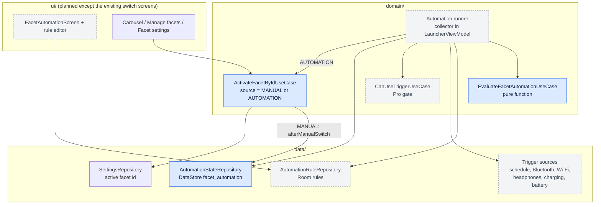
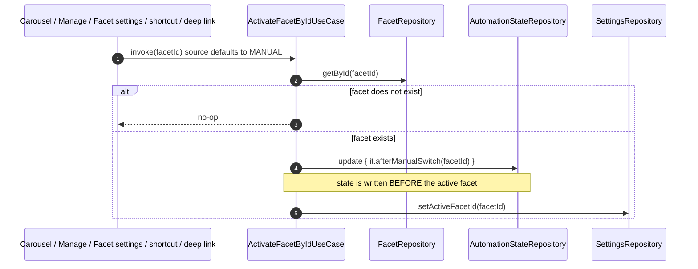
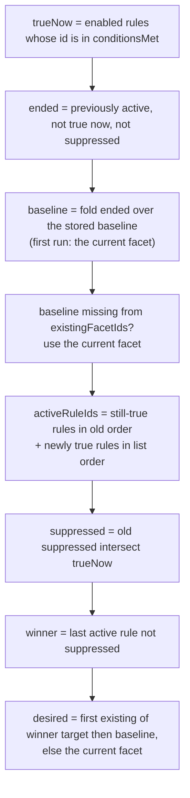

# 15 — Flow: Facet Automation (rules that switch the active facet)

How Facet switches the active facet on its own: a user defines **rules** ("on weekdays 9:00–18:00 show
Work"), and a pure evaluator decides which facet should be showing from the rules that currently hold,
the user's own choices, and a small persisted state. This doc describes the framework: the concepts, the
state model, the evaluation algorithm, the layers, and the invariants. Switching mechanics themselves
(`ActivateFacetByIdUseCase` → `setActiveFacetId` → Home) are in [13 §1](13-flow-facets-theme-notifications-onboarding.md)
and [14](14-flow-deep-links-and-shortcuts.md); persistence is in [02 §5.7](02-persistence-room.md).

> **Status.** This doc mixes what is built with what is designed but not yet built. Every section is
> labelled. The design source is `IMPLEMENTATION_PLAN.md` ("Facet automation rules") and the mockups in
> `Android launcher design planning/design_handoff_minimal_launcher/facet-automation.html`.

| Phase | Piece | Status |
|---|---|---|
| 1 | `EvaluateFacetAutomationUseCase`, `AutomationRule`, `RuleEndBehavior`, `AutomationState` | **Built**, unit-tested |
| 2 | `FacetSwitchSource`, manual-switch recording in `ActivateFacetByIdUseCase`, `AutomationStateRepository` | **Built**, unit-tested |
| 3 | Rule entity/DAO/repository, `trigger` on `AutomationRule` | Planned |
| 4 | Schedule trigger source + the collector that runs the evaluator | Planned |
| 5 | Device trigger sources (Bluetooth, Wi-Fi, headphones, charging, battery) | Planned |
| 6 | Automation screen, rule editor, trigger picker | Planned |
| 7 | Pro gating seam (`CanUseTriggerUseCase`) | Planned |

## 1. Concepts

| Term | Meaning |
|---|---|
| **Rule** | Target facet + trigger + end behavior + enabled flag. One trigger per rule; no AND/OR. |
| **Condition met** | The rule's trigger currently holds *and* the rule is usable (entitled, permission granted). The evaluator receives these as a set of rule ids. |
| **True rule** | An enabled rule whose id is in that set. Disabled rules are never true. |
| **End behavior** | What happens when a rule stops being true: `ReturnToBaseline` (default), `SwitchTo(facet)`, or `Stay`. |
| **Baseline** | The facet the user last chose by hand — what the launcher returns to when no rule applies. |
| **Active rules** | The last evaluated list of true rules, in activation order. The most recent non-suppressed one decides the facet. |
| **Suppressed rule** | An active rule the user overrode by hand. It is ignored until it stops being true. |
| **Manual switch** | Any switch not made by the evaluator: carousel, Manage facets, Facet settings "Apply", a shortcut, a deep link. |

The model in one sentence: **the baseline is the user's choice, the true rules are an overlay on top of
it, and a manual switch always wins over whatever overlay is active at that moment.**

## 2. Layers and components

Blue boxes are built; grey dashed boxes are planned.

Layering follows `CLAUDE.md`: composables talk only to ViewModels; the evaluator is a `domain/` use
case with no Android dependencies; repositories own all DataStore and Room access.

## 3. State model (built)

`AutomationState` (`data/model/AutomationState.kt`) is the only state the framework keeps. It is
persisted by `AutomationStateRepository` in its own DataStore file, `facet_automation`.

| Field | Type | Role |
|---|---|---|
| `baselineFacetId` | `Long?` | The user's last manual choice. `null` until the first evaluation, which adopts the facet showing at that moment. |
| `activeRuleIds` | `List<Long>` | Last evaluated true rules, oldest activation first. Used to detect start/end transitions and to pick the winner (the last element). |
| `suppressedRuleIds` | `Set<Long>` | Active rules the user overrode. Always a subset of the true rules. |

`AutomationRule` (`data/model/AutomationRule.kt`) currently carries `id`, `targetFacetId`,
`endBehavior`, `enabled`. The trigger is evaluated outside the evaluator and arrives only as "this id's
condition is met"; phase 3 adds a `trigger` field to the rule without changing the evaluator.

## 4. Switch sources and the manual-wins rule (built)

Every user-initiated switch goes through `ActivateFacetByIdUseCase`, the single choke point:

- **MANUAL** (the default): `afterManualSwitch` sets `baselineFacetId = facetId` and
  `suppressedRuleIds = activeRuleIds.toSet()` — every rule active right now is overridden.
- **AUTOMATION** (only the evaluator's runner passes it): changes the active facet and nothing else.
- **State is written first.** If an evaluation runs between the two writes it sees the override and
  settles on the user's facet; the other order could let it switch back to a stale rule target.
- **Shortcuts and deep links count as manual**, so an external automation app (Tasker, Samsung Modes
  and Routines) wins over the built-in rules. A *different* rule that becomes true later still applies;
  suppression covers only rules that were already active.
- **Deliberately not manual:** the two delete-the-active-facet fallbacks, `EnsureActiveFacetUseCase`
  (startup) and `ImportBackupUseCase` call `SettingsRepository.setActiveFacetId` directly. They repair
  state rather than express a choice; the evaluator tolerates the stale baseline this can leave.

## 5. The evaluator (built)

`EvaluateFacetAutomationUseCase.invoke(rules, conditionsMet, state, currentFacetId, existingFacetIds)`
returns `AutomationEvaluation(desiredFacetId, state)`. It is **level-based**: each call recomputes the
desired facet from the current truth, using the previous state only to detect which rules just started
or ended. The caller switches facets (as `AUTOMATION`) when `desiredFacetId != currentFacetId` and
persists the returned state.

End behavior is applied per ended rule, in activation order, to the running baseline:

| End behavior | Effect on the baseline |
|---|---|
| `ReturnToBaseline` | none — the facet falls back to the baseline |
| `SwitchTo(x)` | baseline becomes `x` if `x` still exists, otherwise unchanged |
| `Stay` | baseline becomes the facet showing now |
| rule deleted while active | treated as `ReturnToBaseline` |

A **suppressed** rule skips its end behavior entirely: the user already chose, so their facet stands.

### Worked timeline

Work rule weekdays 9:00–18:00 (target Work, `ReturnToBaseline`), baseline Personal:

| Time | Event | Shown | State after |
|---|---|---|---|
| 8:55 | evaluation, nothing true | Personal | baseline Personal |
| 9:02 | screen on, rule true | Work | active [Work rule] |
| 11:00 | user opens Travel | Travel | baseline Travel, suppressed {Work rule} |
| 11:05 | screen on, rule still true | Travel | unchanged (rule suppressed) |
| 18:05 | screen on, rule false | Travel | suppression cleared, end behavior skipped |
| next day 9:01 | rule true again | Work | active [Work rule] |

With no manual switch at 11:00, the 18:05 evaluation would return to Personal. With two rules
(Work, then Car over Bluetooth), the later activation wins, and when it ends the earlier one — if still
true — is shown again; this is why evaluation is level-based and not edge-triggered.

## 6. Planned: rules, triggers, and the runner

Not built yet; recorded here so the framework reads end to end.

**Rule storage (phase 3).** A Room entity with a foreign key to `facets` (cascade on delete), a DAO, and
`AutomationRuleRepository`; `FacetDatabase.VERSION` bump plus a `Migration` ([02 §4](02-persistence-room.md)).

**Trigger sources (phases 4–5).** Each trigger type is a `Flow` or one-shot read of "does this condition
hold now". The runner combines them into the `conditionsMet` set, dropping rules that are not usable
(Pro-gated, or permission missing) — an unusable rule is simply never true.

| Trigger | Condition | Permission |
|---|---|---|
| Schedule (free) | day of week and time window; an Until before From means overnight | none |
| Bluetooth device | connected, or not connected | `BLUETOOTH_CONNECT` (runtime, asked when chosen) |
| Wi-Fi | any network, or a named network; connected or not | `ACCESS_NETWORK_STATE`; location only to read a network name |
| Headphones | plugged in or not | none |
| Charging | plugged in or not | none |
| Low battery | below a threshold, with hysteresis (ends on charge or a few points above) | none |

**When evaluation runs.** Lazily, when Home is about to be seen: screen on, unlock, Home press, app
start. No alarms and no `SCHEDULE_EXACT_ALARM`; a 9:00 rule applying at 9:03 on unlock is
indistinguishable from exact timing, and nothing switches under the user mid-use. Device state
(Bluetooth, charging) is also read at startup because a killed process misses broadcasts. The cost is
sampling: a connection that came and went while the screen was off is never seen.

**The runner.** A collector started from `LauncherViewModel.init` (so it belongs in the startup
sequence, [03 §4](03-reactive-data-flow.md)): on each trigger event it gathers rules and condition
truth, calls the evaluator, persists the new state, and calls `ActivateFacetByIdUseCase` with
`AUTOMATION` when the desired facet differs. Evaluations must be serialized (a `Mutex`), because the
atomic `update` on the state protects the state file but not the read-evaluate-write sequence.

**Pro gating.** `CanUseTriggerUseCase(type)` is the single seam. Schedule rules are free; device
triggers are Pro. It returns `true` until billing exists. When entitlement is lost, Pro-trigger rules
are paused (shown dimmed, never deleted) because the runner filters them out of `conditionsMet`.

**Permissions.** Requested only when the user picks the trigger that needs them. A rule whose
permission is later revoked renders as unavailable in the list and is not evaluated until fixed.

### Adding a trigger type (checklist, once phases 3–5 land)

1. Add the trigger variant to the rule's trigger type and its parameters to the entity (+ migration if a column changes).
2. Add a source that exposes "does it hold now" as a `Flow`, reading initial state at startup.
3. Include it in the runner's `conditionsMet` computation, behind `CanUseTriggerUseCase` and the permission check.
4. Add it to the trigger picker and rule editor, with the permission strip if it needs one.
5. Add evaluator-level scenario tests only if it introduces new *semantics*; most triggers need only source tests, since the evaluator sees a rule id and a boolean.

## 7. Invariants

These hold for the built code and are covered by `EvaluateFacetAutomationUseCaseTest`,
`AutomationStateTest`, `ActivateFacetByIdUseCaseTest` and `AutomationStateRepositoryTest`.

1. A manual switch is never undone by a rule that was already active when it happened.
2. A suppressed rule never applies its end behavior.
3. `suppressedRuleIds` is always a subset of the true rules; suppression disappears when a rule stops being true.
4. The desired facet is always one that exists: a missing winner target or baseline falls back, ultimately to the facet already showing.
5. A rule that is disabled or deleted while active is treated as ended.
6. The evaluator is a pure function: same inputs, same outputs; no I/O, no clock, no Android types.
7. Only a `MANUAL` switch touches the baseline or the suppressed set.

## Where this lives

| Concern | File |
|---|---|
| Pure evaluation | `domain/EvaluateFacetAutomationUseCase.kt` |
| Rule and end-behavior types | `data/model/AutomationRule.kt` |
| Persisted state and `afterManualSwitch` | `data/model/AutomationState.kt` |
| Who is switching | `data/model/FacetSwitchSource.kt` |
| Single switch choke point | `domain/ActivateFacetByIdUseCase.kt` |
| State persistence | `data/AutomationStateRepository.kt`, `data/di/DataStoreModule.kt`, `data/di/AutomationDataStore.kt` |
| Tests | `domain/EvaluateFacetAutomationUseCaseTest.kt`, `data/model/AutomationStateTest.kt`, `domain/ActivateFacetByIdUseCaseTest.kt`, `data/AutomationStateRepositoryTest.kt` |
| Design and phased plan | `IMPLEMENTATION_PLAN.md` ("Facet automation rules"), `…/design_handoff_minimal_launcher/facet-automation.html` |
