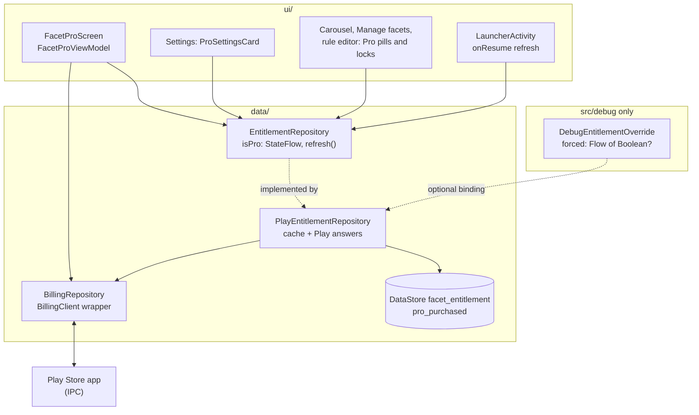
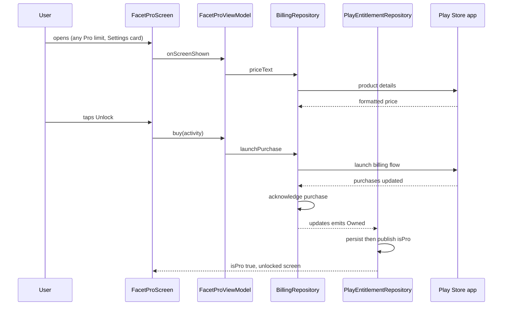

# 16 — Flow: Billing and Facet Pro (one-time Google Play purchase)

How a user becomes Pro, how the app remembers it, and what changes when they are not. There is one
non-consumable product, `facet_pro`, bought once through Google Play. No subscription, no backend, and no
`INTERNET` permission. The price is never in the code: it is a Play Console setting and the app shows what
Play returns. What Pro unlocks is in [13 §1a](13-flow-facets-theme-notifications-onboarding.md) (10 facets
instead of 3) and [15](15-flow-facet-automation.md) (device triggers, more than 2 rules).

## 1. Layers

| Class | Role |
|---|---|
| `BillingRepository` (`open`) | Thin wrapper over `BillingClient`: `queryPro()`, `priceText()`, `launchPurchase(activity)`, and an `updates` flow for purchases that finish outside a query. Acknowledges unacknowledged purchases. Pending purchases are enabled. Never decides who is Pro. |
| `EntitlementRepository` (`open`) | The one Pro seam. The base class answers "everyone is Pro" (tests, previews). |
| `PlayEntitlementRepository` | The real one, bound by `EntitlementModule`. Caches the last Play answer and publishes `isPro`. |
| `FacetProViewModel` | Buy and Restore for the Facet Pro screen. Asks the entitlement to refresh; never sets it. |
| `EntitlementOverride` | Optional Hilt binding (`@BindsOptionalOf`). Only `src/debug` provides one, so release and benchmark builds contain none of it. |

## 2. The entitlement rules

`PlayEntitlementRepository` turns Play's answer (`ProQueryResult`) into `isPro`:

| Play says | Effect |
|---|---|
| `Owned` | Pro on |
| `NotOwned` | Pro off (never bought, refunded, revoked, or a different Google account) |
| `Pending` | No change (payment not complete) |
| `Unavailable` | No change (offline, Play missing or slow) |

**Only an explicit answer changes it.** An unreachable Play must never read as "not owned", so Pro works
offline. With nothing cached and no answer yet, the user is Free. The new value is persisted in the
`facet_entitlement` DataStore first and published second, so what the app shows is always what survives a
restart. `awaitLoaded()` lets a cold start wait for the stored value before deciding anything from a
placeholder.

Purchases are not signature-verified: there is no backend, and one low-priced product does not justify
embedding a key that a determined user could patch around.

## 3. Flows

| Flow | Trigger | What happens |
|---|---|---|
| Startup | `PlayEntitlementRepository.init` | Reads the cache, marks loaded, then `refresh()`. |
| Resume | `LauncherActivity.onResume` | `refresh()`: a refund, a purchase on another device or a redeemed code appears without a restart. |
| Buy | Unlock button | `launchPurchase`; the result arrives on `updates`, not as a return value. Unavailable Play shows a message. |
| Restore | "Restore purchases" under the Unlock button | `entitlementRepository.refresh()`, then a message: restored, no purchase found, pending, or Play unavailable. |
| Pending | Slow payment method | `updates` emits `Pending`: the screen says so; nothing unlocks until it completes. |
| Already owned | Buy on an owning account | Play replies `ITEM_ALREADY_OWNED`; the repository queries instead of guessing. |

## 4. When Pro is lost

A lapse is only a refund, a revocation or a different Google account; it cannot be expiry.

| Area | Behaviour |
|---|---|
| Facets | Every facet is kept. The first 3 in list order stay selectable; the rest are disabled (lock, tap opens the Facet Pro screen) until the count is 3 or Pro returns. A disabled facet can still be deleted. See [13 §1a](13-flow-facets-theme-notifications-onboarding.md). |
| Automation | Pro-trigger rules and rules beyond the first two schedule rules pause (dimmed, never deleted). `RunFacetAutomationUseCase` runs a pass when `isPro` changes, so it takes effect at once. See [15](15-flow-facet-automation.md). |
| Custom clock widget | The "Use custom widget" row in the clock adjust sheet is Pro (`ClockWidgetFacetController.isPro`, `ProReason.CUSTOM_WIDGET`): free users get a Pro pill and the Facet Pro screen. A facet that already hosts a widget keeps it, with its size, after a lapse. They just can't pick another, and "Switch to launcher clock" stays free. Hub widgets are free. |
| Backup import | Imports every facet as it is; the rule above handles a free user who imports more than 3. |

## 5. Screens

| Entry | Where it goes |
|---|---|
| Settings `ProSettingsCard` | Free: the dark upsell card ("You're on the Free plan", Upgrade to Pro). Pro: one "Pro is active" row with a live summary. Both open `facetPro/ABOUT`. |
| A Pro limit (add facet at 3, locked facet, device trigger, third rule) | `facetPro/{reason}`; the screen shows a reason line. Every limit goes straight to the screen; there is no intermediate sheet. |
| `FacetProScreen` | Free: `UpgradeScreen` (hero, feature rows, bottom bar with price, Unlock and Restore purchases). Pro: `UnlockedScreen` with shortcuts to set up a trigger or add a facet. |

Buttons are pills like every other button in the app (`ProGradientButton`, the Settings card's Upgrade chip); `TriggerPill` is a chip, so it uses M3's small shape (8dp). The Settings `ProSettingsCard` uses the 28dp extra-large shape, matching the `SettingsCard`s below it.

## 6. No `INTERNET`

The billing library pulls `INTERNET` in through its telemetry dependency. `AndroidManifest.xml` removes it
(`tools:node="remove"`) and the `verifyNoInternetPermission` Gradle task, part of `check` and the release
build, fails if it ever returns. Play Billing talks to the Play Store app over IPC, so purchases should not
need it; confirming that on a real Play account is part of the release checklist.

## 7. Testing

| Level | What |
|---|---|
| JVM | `PlayEntitlementRepositoryTest` (cache, the four answers, offline, persist-then-publish), `FacetProViewModelTest`, `FacetLimits`, `SelectableFacetsUseCase`, `AddFacetUseCase`, and the automation gate tests. |
| Compose | `FacetProContentTest` (both states, buy, restore, busy, messages), `SettingsScreenTest` (the card), the carousel, Manage facets and rule editor Pro states. |
| Debug build | The "DEBUG" block in Settings forces Free or Pro (`DebugEntitlementOverride`, tested in `src/testDebug`), so every state can be seen on the emulator without Play. |
| Real device | Needs a Play-certified device, an uploaded build on a testing track, and a licence tester: price shown, buy, persistence, restore after reinstall, offline, pending, refund. The emulator's Play has no in-app billing. |
